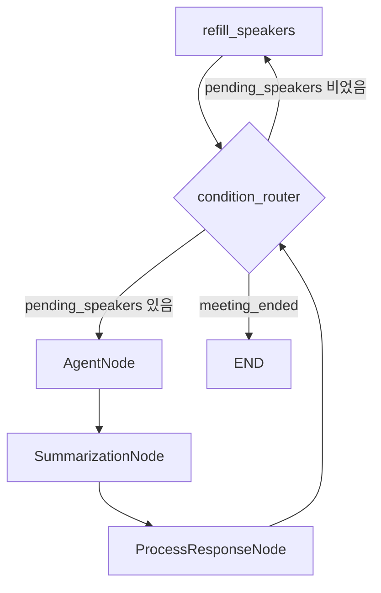

# TheTable 시스템 아키텍처

> 작성일: 2026-02-10
> 버전: 1.0

---

## 목차

- [프로젝트 개요](#프로젝트-개요)
- [패키지 구조](#패키지-구조)
- [실행 흐름](#실행-흐름)
- [상세 문서](#상세-문서)

---

## 프로젝트 개요

### 목적

**TheTable**은 LLM 기반 AI 에이전트들이 회의를 진행하는 멀티 에이전트 시스템입니다.

### 핵심 특징

- **LangGraph 기반 워크플로우**: 노드-엣지 구조의 상태 머신으로 회의 진행 제어
- **플러그인 아키텍처**: 노드 레지스트리 패턴으로 확장 가능한 구조
- **2-Tier LLM 전략**: Main LLM(에이전트 응답) + Task LLM(유틸리티 작업) 분리로 비용 최적화
- **MCP 통합**: Model Context Protocol 기반 외부 도구(GitHub 등) 실시간 연동
- **설정 기반 동작**: 코드 변경 없이 YAML/JSON 설정으로 에이전트 및 안건 커스터마이징

### 기술 스택

- **프레임워크**: LangChain, LangGraph (상태 머신 워크플로우)
- **LLM Provider**: OpenAI 호환 API (OpenAI, OpenRouter, Ollama 등)
- **데이터 모델**: Pydantic v2
- **외부 통합**: MCP (Model Context Protocol)
- **설정 관리**: pydantic-settings, PyYAML

---

## 패키지 구조

TheTable은 **6개 핵심 패키지**로 구성됩니다.

```
thetable/
├── config/           # 설정 관리 (Settings, LLM Factory)
├── core/             # 데이터 모델 (AgentProfile, Agenda)
├── agents/           # 에이전트 로직 (BaseAgent, MCP tool-calling)
├── graph/            # LangGraph 워크플로우 (노드, 상태, 라우팅)
│   └── nodes/        # 노드 구현 (agent, process, refill, router, summarize)
├── mcp/              # MCP 통합 (서버 로드, 도구 수집)
└── interfaces/       # CLI/API 진입점
```

### 패키지 역할

| 패키지 | 역할 | 주요 파일 |
|--------|------|----------|
| **config** | 환경변수 관리, LLM 생성 | `settings.py`, `llm_factory.py` |
| **core** | 에이전트/안건 데이터 모델 | `profile.py`, `agenda.py` |
| **agents** | MCP tool-calling 로직 | `base_agent.py` |
| **graph** | 워크플로우 구성 및 노드 실행 | `workflow.py`, `state.py`, `nodes/` |
| **mcp** | MCP 서버 설정 로드 및 도구 수집 | `__init__.py` |
| **interfaces** | CLI 진입점 | `cli.py` |

### 패키지 의존 관계

```mermaid
graph TD
  interfaces --> graph
  interfaces --> config
  graph --> agents
  graph --> mcp
  graph --> config
  agents --> core
  core --> config
```

**의존 방향**:
- `interfaces` → `graph`, `config` (진입점)
- `graph` → `agents`, `mcp`, `config` (워크플로우 구성)
- `agents` → `core` (에이전트 프로필 사용)
- `core` → `config` (설정 로드)

---

## 실행 흐름

### 1. 진입점 (`interfaces/cli.py`)

```
CLI 시작 → Settings 로드 → load_agent_profiles() → load_agendas()
→ create_meeting_workflow() 호출
```

### 2. MCP 초기화

```
load_mcp_config(config/mcp_servers.json)
→ MultiServerMCPClient 생성 (stdio/http transport)
→ collect_tools_by_server() → {github: [tools]}
```

- 환경변수 치환 (`${GITHUB_PERSONAL_ACCESS_TOKEN}`)
- 서버별 도구 수집 및 에이전트별 필터링 준비

### 3. 워크플로우 생성 (`graph/workflow.py`)

```
StateGraph(MeetingState) 생성
→ 노드 추가 (refill, router, summarize, process, agents)
→ 엣지 연결 (refill → router, agent → summarize → process → router)
→ compile(recursion_limit)
```

**노드 타입**:
- **AGENT**: Host, PM, TechLead (AI 에이전트)
- **UTILITY**: refill_speakers, process_response, summarize
- **ROUTING**: condition_router (조건부 라우팅)

### 4. 워크플로우 실행 사이클



**단계별 설명**:

1. **refill_speakers**: 안건의 `required_speakers`에서 미발언자를 `pending_speakers`에 추가
2. **condition_router**:
   - `meeting_ended` → END
   - `turn_count >= max_turns` → END
   - `pending_speakers[0]` → 해당 에이전트 노드
3. **AgentNode**:
   - BaseAgent 호출 → LLM 응답 생성 (MCP 도구 사용 가능)
   - AIMessage 반환
4. **SummarizationNode**:
   - 메시지 개수 > `max_messages_before_summary` → LLM 요약 생성
5. **ProcessResponseNode**:
   - 발언자를 `pending_speakers`에서 제거
   - 멘션 추출 (LLM) → `pending_speakers`에 추가
   - 안건 완료 감지 (Host 발언의 키워드 분석)
   - 회의 종료 감지 (키워드 + LLM 분석)
   - 안건 동적 업데이트 (LLM)
   - `turn_count` 증가

---

## 상세 문서

### 워크플로우 및 LLM

- [workflow.md](./workflow.md) - LangGraph 워크플로우 상세, 노드별 로직, 안건 관리 시스템
- [llm-architecture.md](./llm-architecture.md) - 2-Tier LLM 구조, 비용 최적화 전략, 팩토리 패턴

### 통합 및 설정

- [mcp-integration.md](./mcp-integration.md) - MCP 도구 통합, 에이전트-도구 바인딩, tool-calling 루프
- [configuration.md](./configuration.md) - 환경변수, 설정 파일, Settings 클래스 가이드

### 로드맵 및 확장

- [future-direction.md](./future-direction.md) - 기술 제안, 확장 가능 영역별 제안
- [roadmap.md](./roadmap.md) - 제품 로드맵, 마일스톤 기반 단계별 계획

### 심층 분석 (참고용)

- [architecture-analysis.md](../architecture-analysis.md) - 전체 아키텍처 상세 분석 (researcher-arch 작성)

---

## 디렉토리 구조 (전체)

```
thetable/
├── config/                       # 설정 파일
│   ├── agent_profiles.yaml       # 에이전트 프로필 정의
│   ├── agendas.yaml              # 회의 안건 정의
│   └── mcp_servers.json          # MCP 서버 설정
├── thetable/                     # 메인 패키지
│   ├── agents/                   # 에이전트 구현
│   │   └── base_agent.py         # BaseAgent (MCP tool-calling)
│   ├── config/                   # 설정 관리
│   │   ├── llm_factory.py        # create_main_llm, create_task_llm
│   │   └── settings.py           # Settings 클래스
│   ├── core/                     # 핵심 데이터 모델
│   │   ├── agenda.py             # load_agendas
│   │   └── profile.py            # AgentProfile, load_agent_profiles
│   ├── graph/                    # LangGraph 워크플로우
│   │   ├── agenda_manager.py     # extract_agenda_updates
│   │   ├── state.py              # MeetingState, Agenda
│   │   ├── workflow.py           # create_meeting_workflow
│   │   └── nodes/                # 노드 구현
│   │       ├── base.py           # BaseNode, NodeType
│   │       ├── registry.py       # NodeRegistry, @register_node
│   │       ├── agent.py          # AgentNode
│   │       ├── process.py        # ProcessResponseNode
│   │       ├── refill.py         # RefillSpeakersNode
│   │       ├── router.py         # condition_router
│   │       └── summarize.py      # SummarizationNode
│   ├── interfaces/               # CLI/API 인터페이스
│   │   └── cli.py                # CLI 진입점
│   └── mcp/                      # MCP 통합
│       └── __init__.py           # load_mcp_config, collect_tools_by_server
├── tests/                        # 테스트 코드
├── .env                          # 환경변수 (API 키 등)
├── pyproject.toml                # 프로젝트 설정 (uv)
└── README.md
```

---

## 핵심 파일별 역할

| 파일 | 역할 | 핵심 클래스/함수 |
|------|------|------------------|
| `graph/workflow.py` | 워크플로우 생성 | `create_meeting_workflow` |
| `graph/state.py` | 상태 정의 | `MeetingState`, `Agenda` |
| `graph/nodes/base.py` | 노드 추상화 | `BaseNode`, `NodeType` |
| `graph/nodes/registry.py` | 노드 레지스트리 | `NodeRegistry`, `@register_node` |
| `graph/nodes/agent.py` | AI 에이전트 노드 | `AgentNode` |
| `graph/nodes/process.py` | 응답 처리 | `ProcessResponseNode` |
| `graph/nodes/refill.py` | 발언자 큐 관리 | `RefillSpeakersNode` |
| `graph/nodes/router.py` | 라우팅 | `condition_router` |
| `graph/nodes/summarize.py` | 대화 요약 | `SummarizationNode` |
| `graph/agenda_manager.py` | 동적 안건 관리 | `extract_agenda_updates` |
| `agents/base_agent.py` | 에이전트 로직 | `BaseAgent`, `invoke_with_tools` |
| `config/llm_factory.py` | LLM 생성 | `create_main_llm`, `create_task_llm` |
| `config/settings.py` | 환경 설정 | `Settings`, `get_settings` |
| `core/profile.py` | 프로필 관리 | `AgentProfile`, `load_agent_profiles` |
| `core/agenda.py` | 안건 관리 | `load_agendas` |
| `mcp/__init__.py` | MCP 통합 | `load_mcp_config`, `collect_tools_by_server` |
| `interfaces/cli.py` | CLI 진입점 | `main` |
