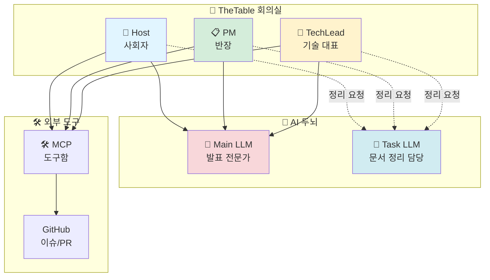
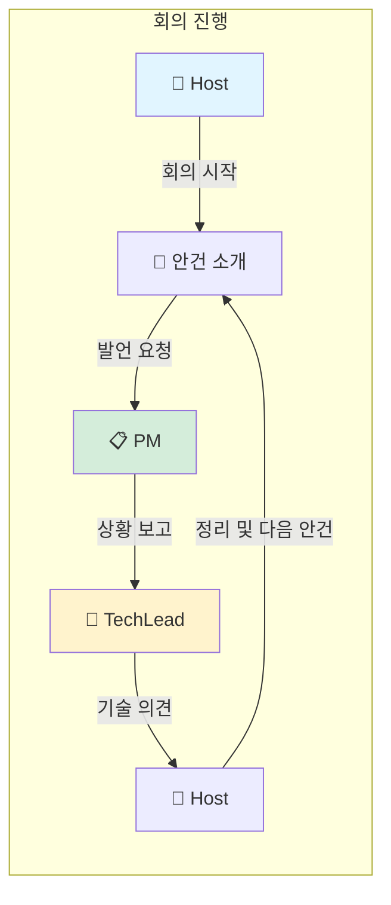

# TheTable 시스템 소개

> TheTable은 AI 에이전트들이 모여서 회의하는 가상 회의실이에요.

---

## 이 문서를 읽는 순서

1. **지금 보고 있는 문서** (architecture.md): TheTable이 무엇인지 전체적으로 알아봐요
2. [workflow.md](./workflow.md): 회의가 어떻게 진행되는지 단계별로 봐요
3. [llm-architecture.md](./llm-architecture.md): AI 두뇌가 어떻게 일하는지 알아봐요
4. [mcp-integration.md](./mcp-integration.md): 외부 도구를 어떻게 사용하는지 봐요
5. [configuration.md](./configuration.md): 설정 파일을 어떻게 조정하는지 배워요
6. [future-direction.md](./future-direction.md): 앞으로 어떤 기능이 추가될지 봐요
7. [roadmap.md](./roadmap.md): 개발 일정과 계획을 확인해요

---

## TheTable이 뭔가요?

**TheTable**은 여러 AI 에이전트들이 회의실에 모여서 회의하는 시스템이에요.

마치 학교 학급 회의처럼, AI들이 각자 역할을 맡아서 안건을 논의하고 결정을 내려요.

> 💡 **쉽게 말하면...**
> TheTable은 AI들이 모여서 회의하는 가상 회의실이에요. LangGraph라는 회의 진행표를 보고, 정해진 순서대로 발언하면서 안건을 처리해요.

---

## 3명의 회의 참여자

TheTable에는 기본적으로 3명의 AI 참여자가 있어요. 학급 임원들처럼 각자 역할이 달라요.

### 🎤 Host (사회자)
- **비유**: 학급 회장처럼 회의를 이끄는 사람
- **하는 일**:
  - 회의를 시작하고 안건을 소개해요
  - 다른 참여자들에게 발언 기회를 줘요
  - 회의를 정리하고 마무리해요
  - 회의 흐름을 관리해요

### 📋 PM (프로젝트 관리자)
- **비유**: 반장처럼 일정과 상황을 챙기는 사람
- **하는 일**:
  - 프로젝트 일정을 보고해요
  - 진행 상황을 체크해요
  - 문제가 생기면 알려줘요
  - 다음 계획을 제안해요

### 🔧 TechLead (기술 리더)
- **비유**: 학습반장처럼 기술 문제를 해결하는 사람
- **하는 일**:
  - 기술적인 문제를 분석해요
  - 해결 방법을 제안해요
  - 코드나 시스템을 검토해요
  - 기술적인 의견을 제시해요

---

## 회의는 어떻게 진행되나요?

회의는 **5단계**로 진행돼요. 마치 학급 회의처럼 순서대로 진행해요.

1. **안건 준비**: 오늘 논의할 주제 카드를 꺼내요
2. **발언자 선택**: 누가 다음에 말할지 결정해요
3. **발언 생성**: AI가 역할에 맞게 발언해요
4. **내용 정리**: 발언 내용을 요약하고 기록해요
5. **다음 단계**: 안건이 끝났는지 확인하고 다음으로 넘어가요

> 🤔 **이해했나요?**
> Q: TheTable이 회의 진행 순서를 어떻게 기억할까요?
> A: LangGraph라는 회의 진행표를 보고 따라가요. 여기에 누가 언제 무엇을 할지 다 적혀 있어요.

---

## AI 두뇌는 2개에요

TheTable은 **2개의 AI 두뇌**를 사용해요. 역할이 다르기 때문이에요.

### 🧠 Main LLM (대화용 AI)
- **비유**: 발표 전문가처럼 회의 발언을 잘 만드는 AI
- **하는 일**: 참여자들의 창의적인 발언을 생성해요
- **특징**: 다양하고 자연스러운 말을 해요

### 🤖 Task LLM (분석용 AI)
- **비유**: 문서 정리 담당처럼 간단한 일을 하는 AI
- **하는 일**: 요약, 멘션 찾기, 안건 분석 같은 단순 작업을 해요
- **특징**: 빠르고 일관되게 결과를 내놔요

> 💡 **쉽게 말하면...**
> 대화용 AI는 창의적인 발언을 만들고, 분석용 AI는 정리 작업을 해요. 이렇게 나누면 비용이 약 70% 절약돼요!

---

## 외부 도구를 사용할 수 있어요

AI들은 **MCP (도구 사용 설명서)**를 통해 외부 도구를 사용할 수 있어요.

### 🛠️ MCP란?
- **비유**: 도구 사용 설명서
- **역할**: AI가 GitHub 같은 외부 서비스를 사용할 수 있게 해줘요

### 예를 들어
- GitHub의 이슈 목록을 확인해요
- PR(Pull Request) 상태를 조회해요
- 실제 데이터를 보고 발언해요
- 추측이 아닌 정확한 정보를 사용해요

---

## 시스템 구조 한눈에 보기

---

## 참여자 역할 상세

---

## 6개 패키지의 역할

TheTable은 6개의 패키지로 나뉘어 있어요. 각 패키지는 특정 역할을 담당해요.

### 📦 config (설정 관리)
- 환경 설정을 읽어와요
- AI 두뇌를 만들어줘요
- API 키를 관리해요

### 📦 core (핵심 데이터)
- 참여자 정보를 저장해요
- 안건 목록을 관리해요
- 기본 데이터 구조를 정의해요

### 📦 agents (참여자 로직)
- 각 참여자의 행동을 정의해요
- 외부 도구를 사용하는 방법을 알려줘요
- AI 두뇌와 연결해요

### 📦 graph (회의 진행 흐름)
- 회의 진행 순서를 관리해요
- 다음에 누가 말할지 결정해요
- 회의록을 기록해요

### 📦 mcp (도구 통합)
- 외부 도구를 연결해요
- GitHub 같은 서비스를 사용할 수 있게 해줘요
- 도구 목록을 수집해요

### 📦 interfaces (진입점)
- 명령줄에서 실행할 수 있게 해줘요
- 사용자 입력을 받아요
- 회의를 시작하고 종료해요

> 🤔 **이해했나요?**
> Q: 6개 패키지는 왜 나눠져 있나요?
> A: 각 패키지가 하나의 역할만 담당해서, 나중에 수정하거나 추가할 때 편해요.

---

## 다른 문서 보기

### 회의 진행 방식 알아보기
- [workflow.md](./workflow.md): 회의가 단계별로 어떻게 진행되는지 자세히 설명해요

### AI 기술 자세히 보기
- [llm-architecture.md](./llm-architecture.md): 2개의 AI 두뇌가 어떻게 협력하는지 알아봐요
- [mcp-integration.md](./mcp-integration.md): 외부 도구 사용 방법을 배워요

### 설정하고 확장하기
- [configuration.md](./configuration.md): 설정 파일을 수정하는 방법을 봐요
- [future-direction.md](./future-direction.md): 앞으로 추가될 기능들을 살펴봐요
- [roadmap.md](./roadmap.md): 개발 일정을 확인해요

---

> 💡 **핵심 정리**
>
> - TheTable은 AI들이 모여서 회의하는 가상 회의실이에요
> - Host, PM, TechLead 3명이 각자 역할을 맡아요
> - 2개의 AI 두뇌를 사용해서 비용을 절약해요
> - 외부 도구(GitHub 등)를 사용할 수 있어요
> - 6개 패키지가 각자 역할을 분담해요
