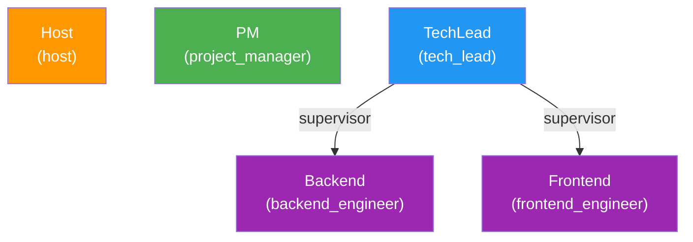
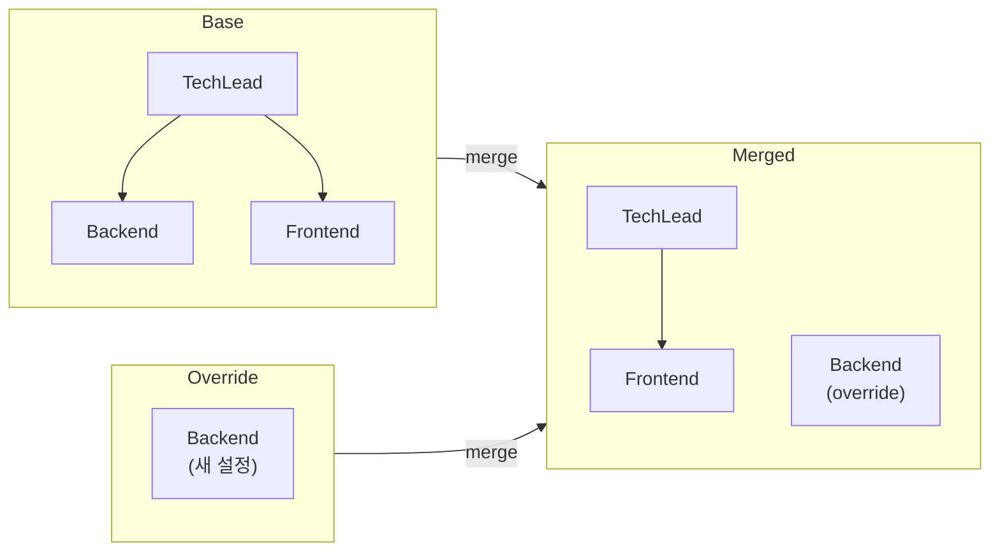

# 에이전트 프로필 시스템

Doorae의 AI 에이전트들은 각각 고유한 역할, 책임, 전문성을 가집니다. 이 문서에서는 에이전트의 정체성을 정의하는 프로필 시스템이 어떻게 설계되었고, 내부적으로 어떻게 동작하는지를 설명합니다.

## 프로필이 필요한 이유

AI 회의에서 모든 에이전트가 동일한 프롬프트로 동작하면, 발언이 획일화되고 역할 분담이 무너집니다. 프로필 시스템은 다음 문제를 해결합니다:

- **역할 분리**: PM은 일정을, TechLead는 기술 결정을, Host는 진행을 담당
- **전문성 반영**: 각 에이전트가 자신의 전문 분야에 기반한 발언을 생성
- **계층적 구조**: TechLead 아래에 Backend, Frontend 엔지니어를 배치하는 supervisor/sub-agent 패턴
- **도구 접근 제어**: 에이전트별로 사용 가능한 MCP 도구를 제한

## AgentProfile 모델

`doorae/core/profile.py`에 정의된 `AgentProfile`은 Pydantic `BaseModel`을 확장합니다.

```python
class AgentProfile(BaseModel):
    name: str                                    # 고유 이름 (예: "PM", "TechLead")
    role: str                                    # 역할 식별자 (예: "project_manager")
    responsibilities: List[str]                  # 책임 목록
    expertise: List[str]                         # 전문 분야
    phase_triggers: Dict[str, str] = {}          # 단계별 자동 발언 트리거
    agents: Optional[List["AgentProfile"]] = None  # 하위 에이전트 (재귀적)
    is_human: bool = False                       # 실제 사용자 여부
    mcp_tools: List[str] = []                    # MCP 서버 이름 목록
    metadata: Dict[str, Any] = {}                # 추가 메타데이터
    llm: Optional[AgentLLMConfig] = None         # 에이전트별 LLM 설정
```

### 필드별 역할

| 필드 | 용도 | 사용처 |
|------|------|--------|
| `name` | 에이전트 식별, `@멘션` 대상 | 라우팅, 멘션 추출, 로그 |
| `role` | 시스템 프롬프트에서 역할 명시 | `AgentNodeExecutor._build_agent_prompt()` |
| `responsibilities` | 에이전트 발언의 범위를 한정 | 시스템 프롬프트 "책임" 섹션 |
| `expertise` | 전문 분야 기반 발언 유도 | 시스템 프롬프트 "전문 분야" 섹션 |
| `phase_triggers` | 특정 단계에서 자동 발언 트리거 | `matches_phase()` 메서드 |
| `agents` | 하위 에이전트 정의 (재귀) | supervisor 패턴, sub-agent tool |
| `is_human` | 사용자 참여자 구분 | `DispatchNode`, `HumanNodeExecutor` |
| `mcp_tools` | 사용할 MCP 서버 목록 | 에이전트 도구 바인딩 |
| `metadata` | 자유 형식 컨텍스트 정보 | 프롬프트의 "Context Metadata" 섹션 |
| `llm` | 에이전트별 LLM 오버라이드 | `create_agent_llm()` |

## YAML에서 프로필 로드

프로필은 `config/agent_profiles.yaml` 파일에서 로드됩니다.

```yaml
agents:
  - name: Host
    role: host
    responsibilities:
      - 회의 시작 인사 및 안건 소개
      - 안건 진행 상황 관리
      - 토론 중재 및 의견 요청
    expertise:
      - 회의 퍼실리테이션
      - 시간 관리

  - name: TechLead
    role: tech_lead
    responsibilities:
      - 기술 의사결정
      - 아키텍처 설계
    expertise:
      - 시스템 설계
      - 성능 최적화
    mcp_tools:
      - github
    agents:                          # 하위 에이전트
      - name: Backend
        role: backend_engineer
        responsibilities:
          - API 설계 및 구현
        expertise:
          - Python
          - FastAPI
      - name: Frontend
        role: frontend_engineer
        responsibilities:
          - UI 컴포넌트 구현
        expertise:
          - React
          - TypeScript
```

`load_agent_profiles()` 함수가 이 YAML을 파싱합니다:

```python
def load_agent_profiles(yaml_path: str) -> Dict[str, AgentProfile]:
    with open(yaml_path, 'r', encoding='utf-8') as f:
        data = yaml.safe_load(f)

    profiles = {}
    for agent_data in data.get('agents', []):
        payload = dict(agent_data)
        # is_human=true인 에이전트는 하위 에이전트를 가질 수 없음
        if payload.get("is_human") and payload.get("agents"):
            payload.pop("agents", None)
        profile = AgentProfile(**payload)
        profiles[profile.name] = profile

    validate_no_cycles(profiles)  # 순환 참조 검증
    return profiles
```

!!! warning "is_human과 agents의 상호 배제"
    `is_human: true`인 프로필에 `agents` 필드가 있으면 경고 로그와 함께 `agents`가 무시됩니다. 실제 사용자가 하위 에이전트를 거느리는 것은 지원되지 않습니다.

## 계층적 에이전트 구조

Doorae의 프로필 시스템은 **supervisor/sub-agent 패턴**을 지원합니다.



### Supervisor 판별

```python
def is_supervisor(self) -> bool:
    """하위 에이전트가 있으면 supervisor"""
    return self.agents is not None and len(self.agents) > 0
```

Supervisor 에이전트(예: TechLead)는 회의에서 직접 발언하면서, 필요에 따라 하위 에이전트(Backend, Frontend)에게 작업을 위임할 수 있습니다. 하위 에이전트는 `create_sub_agent_tool()`을 통해 도구(tool)로 변환되어 supervisor에게 바인딩됩니다.

!!! info "Top-level vs Sub-agent"
    회의의 `pending_speakers` 큐에는 top-level 에이전트만 들어갑니다. 하위 에이전트는 독립적으로 발언하지 않고, supervisor가 도구 호출을 통해 간접적으로 활용합니다.

## 검증 메커니즘

### 순환 참조 방지

```python
def validate_no_cycles(profiles: Dict[str, AgentProfile]) -> None:
    def dfs(profile: AgentProfile, path: List[str]) -> None:
        if profile.name in path:
            cycle_path = " -> ".join(path + [profile.name])
            raise ValueError(f"Agent cycle detected: {cycle_path}")
        next_path = path + [profile.name]
        for child in profile.agents or []:
            dfs(child, next_path)

    for profile in profiles.values():
        dfs(profile, [])
```

DFS(깊이 우선 탐색)로 에이전트 트리를 순회하며 순환 참조를 감지합니다. `A -> B -> C -> A` 같은 구조가 발견되면 `ValueError`를 발생시킵니다.

### 이름 중복 방지

```python
def flatten_all_profiles(profiles: Dict[str, AgentProfile]) -> Dict[str, AgentProfile]:
    flat = {}
    def walk(profile: AgentProfile) -> None:
        if profile.name in flat:
            raise ValueError(f"Duplicate agent name detected: {profile.name}")
        flat[profile.name] = profile
        for child in profile.agents or []:
            walk(child)
    for profile in profiles.values():
        walk(profile)
    return flat
```

모든 계층을 평탄화(flatten)하면서 이름 중복을 체크합니다. 에이전트 이름은 `@멘션`의 대상이므로 전체 시스템에서 고유해야 합니다.

## 런타임 오버라이드

`merge_profiles_with_overrides()` 함수를 통해 기본 프로필에 런타임 변경을 적용할 수 있습니다.

```python
def merge_profiles_with_overrides(
    base_profiles: Dict[str, AgentProfile],
    override_profiles: Dict[str, AgentProfile] | None = None,
) -> Dict[str, AgentProfile]:
```

이 함수의 동작 방식:

1. override에 같은 이름의 프로필이 있으면 base를 **대체**합니다.
2. base의 하위 에이전트 중 override에 같은 이름이 있으면 **shadow 처리**됩니다 (하위에서 제거되고 top-level로 승격).



이 메커니즘은 CLI에서 특정 에이전트의 역할이나 설정을 일시적으로 변경하거나, 사용자 참여자를 동적으로 추가할 때 사용됩니다.

## 에이전트별 LLM 설정

`AgentLLMConfig`를 통해 에이전트마다 다른 LLM을 사용할 수 있습니다.

```python
class AgentLLMConfig(BaseModel):
    model: Optional[str] = None
    api_key: Optional[str] = None
    base_url: Optional[str] = None
    temperature: Optional[float] = None
    max_tokens: Optional[int] = None

    @model_validator(mode="after")
    def resolve_env_vars(self) -> "AgentLLMConfig":
        self.model = _resolve_env_var(self.model)
        self.api_key = _resolve_env_var(self.api_key)
        self.base_url = _resolve_env_var(self.base_url)
        return self
```

모든 필드는 Optional이며, `None`인 필드는 글로벌 Main LLM 설정으로 fallback됩니다. `${VAR}` 패턴은 `@model_validator`에 의해 환경변수 값으로 자동 치환됩니다.

!!! tip "활용 예시"
    PM은 빠른 응답이 필요하므로 가벼운 모델을, TechLead는 정교한 기술 분석이 필요하므로 고성능 모델을 사용하는 식으로 에이전트별 최적화가 가능합니다.

## 프로필이 시스템 프롬프트가 되기까지

프로필 데이터는 `AgentNodeExecutor._build_agent_prompt()`에서 시스템 프롬프트로 변환됩니다:

```
당신은 {name}, {role}입니다.

## 책임
- {responsibilities[0]}
- {responsibilities[1]}
...

## 전문 분야
- {expertise[0]}
- {expertise[1]}
...

## 회의 참여자
다른 참여자: PM, TechLead*, Host
(* 표시는 실제 사용자입니다)

## Context Metadata (metadata 필드 존재 시)
- target_repository: myorg/myrepo
...

간결하고 전문적으로 한국어로 응답하세요.
```

Host 에이전트에는 추가로 **회의 중재 지침**, **회의 종료 프로토콜**, **토론 현황 분석** 섹션이 붙습니다.

## 프로필 설계 가이드

### 좋은 프로필 작성 원칙

1. **responsibilities는 구체적으로**: "프로젝트 관리" 대신 "프로젝트 일정 관리", "마일스톤 관리" 등으로 분리
2. **expertise는 발언 영역을 한정**: 에이전트가 어떤 주제에 대해 발언할지 결정하는 기준
3. **mcp_tools는 최소한으로**: 필요한 도구만 할당하여 불필요한 도구 호출 방지
4. **metadata로 컨텍스트 제공**: `target_repository`, `additional_instructions` 등을 활용
5. **하위 에이전트는 전문 분야가 명확할 때만**: Backend/Frontend처럼 역할이 확실히 분리될 때 사용
