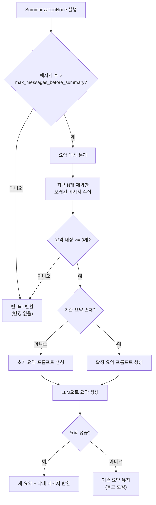
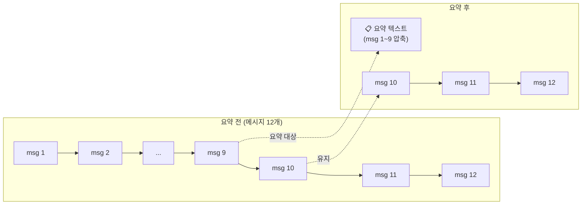

# 대화 요약 시스템

AI 회의가 길어지면 메시지가 누적되어 LLM의 context window를 초과하거나, 오래된 맥락이 응답 품질을 저하시킬 수 있습니다. Doorae는 **SummarizationNode**를 통해 오래된 대화를 자동으로 압축하고, 최근 메시지만 유지하는 방식으로 이 문제를 해결합니다.

## 왜 대화 요약이 필요한가

회의에서 여러 에이전트가 안건별로 발언하면 메시지 수가 빠르게 증가합니다. LLM은 매 턴마다 전체 메시지 히스토리를 입력으로 받기 때문에, 메시지가 많아질수록 두 가지 문제가 발생합니다:

| 문제 | 설명 |
|------|------|
| **비용 증가** | 입력 토큰 수에 비례하여 API 호출 비용이 증가 |
| **컨텍스트 초과** | 모델의 context window 한계를 넘으면 오래된 메시지가 잘림 |
| **응답 품질 저하** | 과도한 히스토리가 모델의 주의력(attention)을 분산시킴 |

!!! info "설정 기본값"
    요약은 메시지가 **8개**를 초과할 때 트리거되며, 요약 후에는 최근 **3개** 메시지만 유지합니다. 요약 자체의 최대 토큰은 **3,000**으로 제한됩니다. 이 값들은 `.env` 파일에서 조정할 수 있습니다.

## 요약 트리거 조건

요약은 매 턴마다 자동으로 평가되지 않고, LangGraph 워크플로우 내에서 `summarize_conversation` 노드가 실행될 때 판단됩니다.

```python
# doorae/graph/nodes/summarize.py
if len(messages) <= settings.max_messages_before_summary:
    return {}  # 변경 없음 - 아직 요약 불필요
```

트리거 로직은 단순합니다:

1. 현재 state의 `messages` 개수를 확인
2. `max_messages_before_summary` (기본값: 8) 이하이면 **아무것도 하지 않음**
3. 초과하면 요약 프로세스를 시작

!!! warning "최소 메시지 안전장치"
    요약 대상 메시지(최근 N개를 제외한 나머지)가 3개 미만이면 요약을 건너뜁니다. 너무 적은 메시지로 요약을 생성하면 품질이 낮아지기 때문입니다.

## 요약 생성 흐름



### 단계별 상세 동작

**1단계: 메시지 분리**

전체 메시지 리스트에서 `keep_recent_messages` (기본값: 3)개를 보존하고, 나머지를 요약 대상으로 분류합니다.

```python
messages_to_summarize = messages[:-settings.keep_recent_messages]
```

**2단계: 프롬프트 구성**

기존 요약의 존재 여부에 따라 두 가지 프롬프트를 사용합니다:

=== "초기 요약 (기존 요약 없음)"

    ```
    지금까지의 회의 내용을 요약하세요.

    요약 시 포함할 내용:
    - 회의 주제 및 목적
    - 주요 논의 사항
    - 결정 사항 및 담당자
    - 각 참여자의 핵심 의견(개조식)
    ```

=== "확장 요약 (기존 요약 있음)"

    ```
    ## 기존 회의 요약
    {current_summary}

    ## 새로운 대화 내용
    위 대화 내용을 고려하여 기존 요약을 확장하세요.

    요약 시 포함할 내용:
    - 주요 논의 사항
    - 결정 사항 및 담당자
    - 각 참여자의 핵심 의견(개조식)
    - 진행 중인 안건
    ```

각 메시지는 `[발언자]: 내용` 형태로 포맷팅되어 LLM에 전달됩니다.

**3단계: LLM 호출**

요약 생성 시 `max_tokens`를 `summary_max_tokens` (기본값: 3,000)으로 제한하여 요약이 지나치게 길어지는 것을 방지합니다.

```python
summary_model = self.model.bind(max_tokens=settings.summary_max_tokens)
response = await summary_model.ainvoke(formatted_messages)
```

**4단계: 오래된 메시지 삭제**

LangGraph의 `RemoveMessage`를 사용하여 요약 대상이었던 메시지들을 state에서 제거합니다.

```python
delete_messages = [
    RemoveMessage(id=m.id)
    for m in messages[:-settings.keep_recent_messages]
    if hasattr(m, "id") and m.id
]
```

## State에 요약이 저장되는 방식

`MeetingState`에는 `summary` 필드가 존재합니다:

```python
class MeetingState(MessagesState):
    # ...
    summary: Any = None  # 대화 요약 텍스트
```

SummarizationNode는 두 가지 키를 반환하여 state를 갱신합니다:

| 반환 키 | 값 | 효과 |
|---------|---|------|
| `summary` | 새로 생성된 요약 텍스트 | 기존 요약을 덮어씀 |
| `messages` | `RemoveMessage` 리스트 | LangGraph가 해당 메시지를 state에서 제거 |

!!! tip "점진적 요약 (Rolling Summary)"
    요약은 한 번 생성된 후 버려지는 것이 아니라, 다음 요약 시 **기존 요약을 확장**하는 방식으로 동작합니다. 이를 통해 회의 전체의 맥락을 잃지 않으면서도 메시지 수를 일정 수준으로 유지할 수 있습니다.

## 토큰 관리 전략

요약 시스템은 세 가지 설정값으로 토큰 사용량을 제어합니다:

```bash
# .env 설정
MAX_MESSAGES_BEFORE_SUMMARY=8   # 요약 트리거 임계값
KEEP_RECENT_MESSAGES=3          # 요약 후 유지할 메시지 수
SUMMARY_MAX_TOKENS=3000         # 요약 텍스트 최대 토큰
```

이 세 값의 관계를 시각화하면:



## 에러 처리

요약 생성이 실패해도 회의 진행이 중단되지 않습니다:

```python
except Exception as e:
    logger.warning(f"요약 생성 실패: {e}")
    new_summary = current_summary  # 기존 요약 유지
```

이 경우 기존 요약이 그대로 유지되며, 메시지 삭제도 발생하지 않습니다. 다음 턴에서 다시 요약을 시도합니다.

## 노드 등록과 워크플로우 통합

SummarizationNode는 `@register_node` 데코레이터를 통해 노드 레지스트리에 등록됩니다:

```python
@register_node("summarize_conversation", category="utility")
class SummarizationNode(BaseNode):
    node_type = NodeType.UTILITY
    requires_llm = True
```

`requires_llm = True`로 선언되어 있어, 워크플로우 빌드 시 LLM 인스턴스가 자동으로 주입됩니다. LangGraph 워크플로우 내에서 다른 노드들과 함께 실행 순서가 결정됩니다.

## 관련 파일

| 파일 | 역할 |
|------|------|
| `doorae/graph/nodes/summarize.py` | SummarizationNode 구현 |
| `doorae/graph/state.py` | `MeetingState.summary` 필드 정의 |
| `doorae/graph/nodes/base.py` | `BaseNode` 추상 클래스, `NodeType.UTILITY` |
| `.env` | 요약 관련 설정값 (`MAX_MESSAGES_BEFORE_SUMMARY` 등) |
