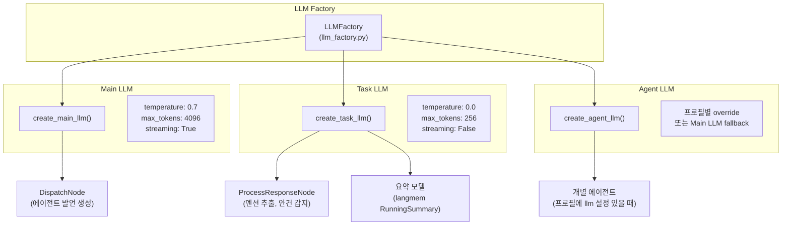
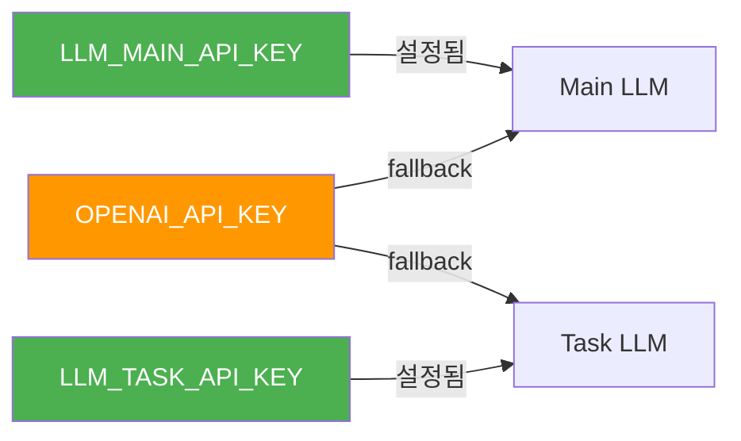

# Dual LLM 전략

Doorae는 단일 LLM에 모든 작업을 맡기는 대신, **Main LLM**과 **Task LLM** 두 가지 모델을 목적에 따라 분리 운용합니다. 이 문서에서는 왜 이러한 설계를 선택했는지, 내부적으로 어떻게 동작하는지를 설명합니다.

## 왜 LLM을 분리하는가

AI 회의 시스템에서 LLM이 수행하는 작업은 크게 두 종류로 나뉩니다:

| 작업 유형 | 특성 | 예시 |
|-----------|------|------|
| **창의적 생성** | 높은 temperature, 긴 응답, 맥락 이해 필요 | 에이전트 발언, 토론 참여, 의견 제시 |
| **구조적 분석** | 낮은 temperature, 짧은 응답, 정확성 중시 | 멘션 추출, 종료 감지, 안건 결론 요약 |

이 두 가지를 같은 모델 설정으로 처리하면 비효율이 발생합니다. 예를 들어 `@PM` 멘션을 추출하는 작업에 4096 토큰짜리 고온(temperature=0.7) 모델을 호출하는 것은 비용과 지연 시간 양쪽에서 낭비입니다.

!!! info "비용 최적화 효과"
    Task LLM의 `max_tokens`을 256으로 제한함으로써, 멘션 추출이나 종료 감지 같은 유틸리티 호출 비용을 Main LLM 대비 약 **70%** 절감할 수 있습니다. 실제 절감 폭은 모델 가격 정책과 호출 빈도에 따라 달라집니다.

## 아키텍처 개요



## 세 가지 팩토리 함수

`doorae/config/llm_factory.py`에 정의된 세 가지 함수가 LLM 인스턴스를 생성합니다.

### `create_main_llm()`

회의 에이전트의 발언 생성에 사용됩니다.

```python
def create_main_llm(streaming: bool = False) -> BaseChatModel:
    settings = get_settings()
    kwargs = {
        "model": settings.llm_main_model,          # gpt-4o-mini
        "temperature": settings.llm_main_temperature, # 0.7
        "max_tokens": settings.llm_main_max_tokens,   # 4096
        "api_key": settings.main_api_key,
        "timeout": settings.llm_timeout,
        "max_retries": settings.llm_max_retries,
    }
    if streaming:
        kwargs["streaming"] = True
    return ChatOpenAI(**kwargs)
```

!!! note "Streaming 지원"
    Main LLM은 TUI에서 실시간 타이핑 효과를 위해 `streaming=True`로 생성됩니다. Task LLM은 짧은 응답만 처리하므로 streaming을 사용하지 않습니다.

### `create_task_llm()`

멘션 추출, 안건 완료 감지, 대화 요약 등 구조적 분석 작업에 사용됩니다.

```python
def create_task_llm() -> BaseChatModel:
    settings = get_settings()
    kwargs = {
        "model": settings.llm_task_model,          # gpt-4o-mini
        "temperature": settings.llm_task_temperature, # 0.0
        "max_tokens": settings.llm_task_max_tokens,   # 256
    }
    return ChatOpenAI(**kwargs)
```

`temperature: 0.0`은 동일 입력에 대해 항상 동일한 결과를 반환하도록 보장합니다. `@PM`을 추출하는 작업에서 창의성은 필요 없기 때문입니다.

### `create_agent_llm()`

개별 에이전트가 `agent_profiles.yaml`에서 자체 LLM 설정을 가질 때 사용됩니다.

```python
def create_agent_llm(profile: AgentProfile, ...) -> BaseChatModel:
    llm_config = profile.llm
    kwargs = {
        "model": llm_config.model or settings.llm_main_model,
        "temperature": llm_config.temperature or settings.llm_main_temperature,
        "max_tokens": llm_config.max_tokens or settings.llm_main_max_tokens,
        # ...
    }
    return ChatOpenAI(**kwargs)
```

!!! tip "에이전트별 모델 오버라이드"
    `AgentLLMConfig`의 각 필드는 Optional입니다. 설정되지 않은 필드는 자동으로 Main LLM 설정으로 fallback됩니다. 이를 통해 특정 에이전트만 다른 모델(예: Claude, Gemini)이나 다른 provider를 사용할 수 있습니다.

## 설정 체계

`doorae/config/settings.py`의 `Settings` 클래스에서 모든 LLM 파라미터를 중앙 관리합니다.

### 환경 변수 매핑

```bash
# .env 파일 예시

# === 공통 Fallback ===
OPENAI_API_KEY=sk-...          # Main/Task 모두에 적용
OPENAI_BASE_URL=               # 선택적 (커스텀 엔드포인트)

# === Main LLM (에이전트 발언) ===
LLM_MAIN_API_KEY=              # 미설정 시 OPENAI_API_KEY 사용
LLM_MAIN_MODEL=gpt-4o-mini
LLM_MAIN_TEMPERATURE=0.7
LLM_MAIN_MAX_TOKENS=4096

# === Task LLM (유틸리티 작업) ===
LLM_TASK_API_KEY=              # 미설정 시 OPENAI_API_KEY 사용
LLM_TASK_MODEL=gpt-4o-mini
LLM_TASK_TEMPERATURE=0.0
LLM_TASK_MAX_TOKENS=256
```

### API Key Fallback 구조



`Settings` 클래스의 `@property` 메서드들이 fallback 로직을 처리합니다:

- `main_api_key`: `LLM_MAIN_API_KEY` > `OPENAI_API_KEY`
- `task_api_key`: `LLM_TASK_API_KEY` > `OPENAI_API_KEY`
- 둘 다 미설정 시 `ValueError` 발생

이 구조 덕분에 **하나의 API 키만으로 시작**하되, 나중에 Main과 Task를 서로 다른 provider로 분리하는 것도 가능합니다.

## 워크플로우에서의 사용

`create_meeting_workflow()` 함수에서 각 LLM이 어떻게 할당되는지 살펴봅니다.

```python
# doorae/graph/workflow.py

main_model = create_main_llm(streaming=True)   # 에이전트 발언용
task_model = create_task_llm()                  # 유틸리티용

# 에이전트별 모델 결정
for name, profile in profiles.items():
    if profile.llm is None:
        agent_models[name] = main_model         # Main LLM 공유
    else:
        agent_models[name] = create_agent_llm(  # 개별 LLM 생성
            profile=profile, ...
        )
```

### 각 노드별 LLM 사용

| 노드 | 사용 LLM | 용도 |
|------|----------|------|
| `DispatchNode` > `AgentNodeExecutor` | Main LLM (또는 Agent LLM) | 에이전트 발언 생성 |
| `AgentNodeExecutor._get_summary_model()` | Task LLM | langmem 대화 요약 |
| `ProcessResponseNode` | Task LLM | 멘션 추출, 안건 완료 감지, 결론 추출 |
| `RefillSpeakersNode` | 없음 (LLM 미사용) | 상태 기반 로직만 수행 |

!!! warning "요약 모델의 lazy 생성"
    `AgentNodeExecutor`의 요약 모델은 `_get_summary_model()`에서 lazy하게 생성됩니다. 첫 호출 시에만 `create_task_llm()`을 실행하고, 이후에는 캐싱된 인스턴스를 재사용합니다.

## 파라미터 비교

| 파라미터 | Main LLM | Task LLM | 이유 |
|----------|----------|----------|------|
| `temperature` | 0.7 | 0.0 | 창의적 발언 vs 결정적 분석 |
| `max_tokens` | 4096 | 256 | 긴 토론 발언 vs 짧은 분류 결과 |
| `streaming` | True | False | TUI 실시간 출력 vs 내부 처리 |
| `timeout` | 60s | 60s | 공통 |
| `max_retries` | 3 | 3 | 공통 |

## 확장 시나리오

### 시나리오 1: Task LLM을 더 저렴한 모델로 교체

```bash
LLM_TASK_MODEL=gpt-3.5-turbo
```

멘션 추출이나 종료 감지 같은 단순 작업은 더 작은 모델로도 충분합니다.

### 시나리오 2: 특정 에이전트만 다른 provider 사용

```yaml
# agent_profiles.yaml
- name: TechLead
  llm:
    model: "${TECHLEAD_MODEL}"
    api_key: "${TECHLEAD_API_KEY}"
    base_url: "${TECHLEAD_BASE_URL}"
    temperature: 0.5
```

`AgentLLMConfig`의 `@model_validator`가 `${VAR}` 패턴을 환경변수로 자동 치환합니다.

### 시나리오 3: Main/Task를 서로 다른 엔드포인트로 분리

```bash
LLM_MAIN_BASE_URL=https://api.openai.com/v1
LLM_TASK_BASE_URL=https://my-local-server.com/v1
```

Task LLM을 로컬 모델 서버로 전환하면 비용을 더욱 절감할 수 있습니다.
