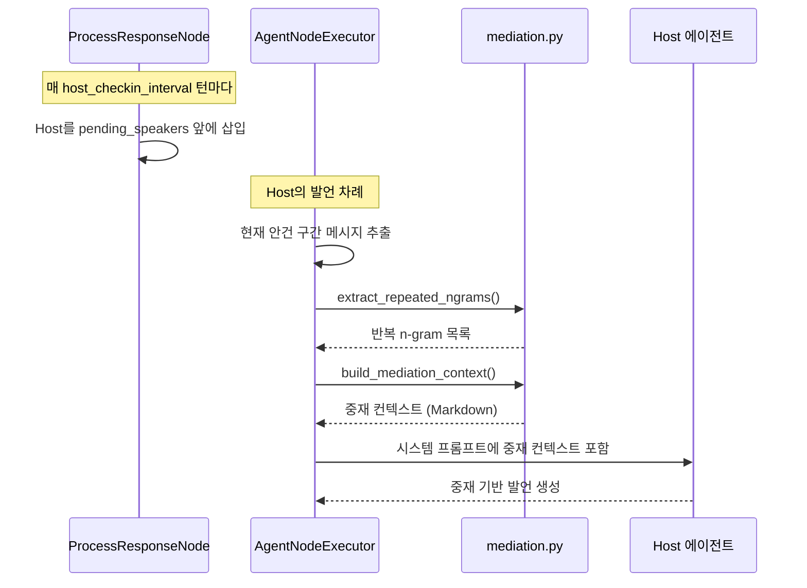
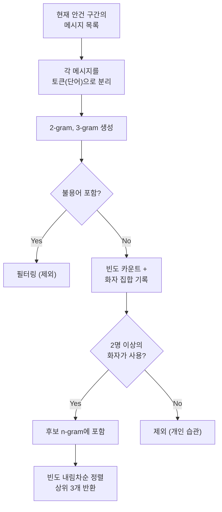
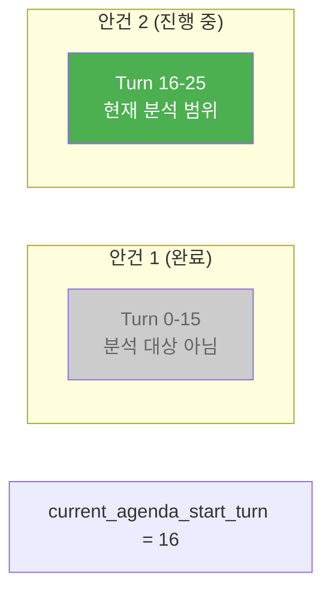
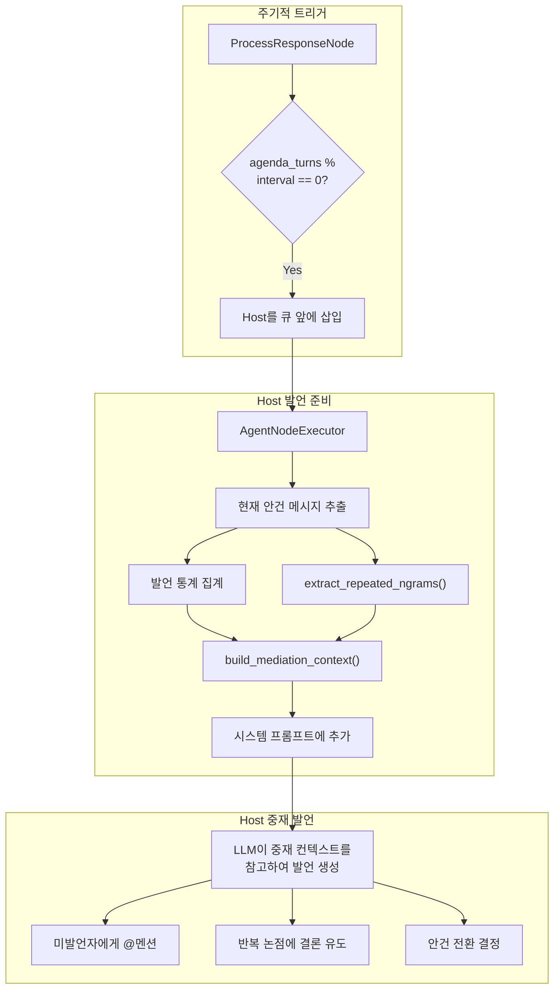

# Host 중재 메커니즘

AI 회의에서 에이전트들이 같은 주장을 반복하거나 특정 참여자가 소외되는 상황은 흔히 발생합니다. Doorae의 Host 중재 메커니즘은 이러한 문제를 감지하고 개입하여 회의를 건설적인 방향으로 이끕니다.

## 왜 중재가 필요한가

LLM 기반 에이전트들은 다음과 같은 패턴에 빠지기 쉽습니다:

- **반복 루프**: 두 에이전트가 비슷한 주장을 주고받으며 논의가 진전되지 않음
- **발언 독점**: 특정 에이전트만 계속 발언하고 다른 에이전트는 기회를 얻지 못함
- **논점 표류**: 현재 안건과 무관한 주제로 토론이 흘러감

!!! info "사람 회의와의 유사성"
    이 문제들은 사람끼리의 회의에서도 자주 발생합니다. 좋은 퍼실리테이터가 "이 부분은 이미 합의된 것 같으니 넘어갈까요?"라고 개입하듯, Host 에이전트가 데이터에 기반한 중재를 수행합니다.

## 중재 시스템 개요



## 중재 트리거: Host 체크인

Host 중재는 `host_checkin_interval`(기본 10턴) 주기로 트리거됩니다.

```python
# doorae/graph/nodes/process.py
interval = settings.host_checkin_interval

if (interval > 0
    and agenda_turns > 0
    and agenda_turns % interval == 0
    and speaker_name != HOST_ROLE_NAME
    and HOST_ROLE_NAME not in new_pending):
    new_pending.insert(0, HOST_ROLE_NAME)
```

10턴마다 Host가 `pending_speakers` 큐 **맨 앞에** 삽입됩니다. 이미 Host의 발언이거나 큐에 Host가 있는 경우에는 삽입하지 않아 중복을 방지합니다.

!!! tip "체크인 주기 조정"
    `.env` 파일에서 `HOST_CHECKIN_INTERVAL=5`로 설정하면 5턴마다 체크인합니다. `0`으로 설정하면 체크인을 비활성화합니다. 참여자가 많은 회의에서는 주기를 늘리는 것이 좋습니다.

## N-gram 패턴 분석

`doorae/graph/mediation.py`의 `extract_repeated_ngrams()` 함수는 대화에서 반복되는 표현을 통계적으로 감지합니다.

### 알고리즘 동작 방식



### 핵심 파라미터

```python
def extract_repeated_ngrams(
    messages: Sequence[BaseMessage],
    n_range: tuple[int, int] = (2, 3),     # 2-gram과 3-gram
    min_speakers: int = 2,                  # 최소 2명의 화자
    top_k: int = 3,                         # 상위 3개
) -> list[tuple[str, int]]:
```

| 파라미터 | 기본값 | 의미 |
|----------|--------|------|
| `n_range` | `(2, 3)` | 2단어, 3단어 조합을 분석 |
| `min_speakers` | `2` | 최소 2명의 다른 화자가 사용해야 "반복"으로 간주 |
| `top_k` | `3` | 가장 빈번한 상위 3개만 반환 |

### 불용어 필터링

한국어 조사, 접속사, 일반적인 회의 표현은 n-gram 분석에서 제외됩니다.

```python
_STOPWORDS = frozenset({
    "그리고", "하지만", "그래서", "따라서",    # 접속사
    "합니다", "입니다", "있습니다",            # 종결어미
    "대한", "통해", "위해",                    # 조사
    "의견", "부탁", "감사", "드립니다",        # 회의 관용표현
    # ...
})
```

불용어가 **하나라도** 포함된 n-gram은 제외됩니다. 이는 "합니다 그리고"처럼 의미 없는 조합이 상위에 올라오는 것을 방지합니다.

### min_speakers 조건의 의미

`min_speakers=2`는 핵심적인 필터입니다. 한 사람만 반복 사용하는 표현은 개인의 말버릇일 수 있지만, **2명 이상**이 반복하는 표현은 논의가 같은 지점에서 맴돌고 있다는 신호입니다.

```python
# ngram별 화자 집합 추적
ngram_speakers: dict[str, set[str]] = defaultdict(set)

# 2명 이상의 화자가 사용한 n-gram만 필터
filtered = [
    (phrase, count)
    for phrase, count in ngram_counts.items()
    if len(ngram_speakers.get(phrase, set())) >= min_speakers
]
```

## 중재 컨텍스트 생성

`build_mediation_context()` 함수는 Host에게 제공할 토론 분석 보고서를 Markdown으로 생성합니다.

### 입력 데이터

```python
def build_mediation_context(
    agenda_turn_count: int,            # 현재 안건 진행 턴 수
    agenda_speaker_counts: dict,       # 화자별 발언 횟수
    agenda_max_turns: int,             # 체크인 주기 (참고)
    repeated_ngrams: list,             # 반복 n-gram 목록
    all_speaker_names: Sequence[str],  # 전체 참여자 이름
) -> str:
```

### 출력 형식

생성되는 Markdown 보고서의 구조:

```markdown
## 토론 현황 분석

### 발언 통계
| 참여자 | 발언 횟수 |
|--------|----------|
| Host | 3 |
| PM | 5 |
| TechLead | 4 |
| Designer | 0 |

### 미발언자
- Designer

### 반복 논점 감지
다음 구문이 여러 참여자에 의해 반복되고 있습니다:
1. "마이크로서비스 전환" (6회)
2. "성능 병목" (4회)

반복 논점이 감지되었습니다.
합의가 형성되었다면 결론을 내리고,
이견이 있다면 쟁점을 명확히 하여 논의를 전진시켜 주세요.
```

### 세 가지 분석 영역

**1. 발언 통계**: 모든 참여자의 발언 횟수를 표로 제공합니다. Host는 이를 통해 발언이 편중된 참여자를 파악할 수 있습니다.

**2. 미발언자 감지**: `speaker_counts`가 0인 참여자를 명시합니다. Host는 이들에게 `@멘션`으로 의견을 요청하도록 유도됩니다.

**3. 반복 논점 감지**: `extract_repeated_ngrams()`의 결과를 기반으로, 같은 표현이 여러 화자에 의해 반복되고 있음을 알립니다. Host에게 합의 유도 또는 쟁점 정리를 요청합니다.

## Host 중재 지침

중재 컨텍스트와 함께, Host의 시스템 프롬프트에는 중재 행동 지침이 포함됩니다.

```python
# AgentNodeExecutor._build_agent_prompt() 에서 Host에게만 추가
host_mediation_section = """
## 회의 중재 지침

1. **반복 논점 차단**: '반복 논점 감지' 섹션에 표시된 구문이 있으면,
   합의 여부를 확인하고 결론을 유도하세요.
2. **미발언자 참여 유도**: 발언이 적은 참여자에게 @멘션으로 의견을 요청하세요.
3. **피드백 루프 차단**: 동일한 2명이 계속 대화를 주고받고 있다면,
   다른 참여자의 의견을 구하거나 논점을 정리하세요.
4. **논의 전진**: 충분히 논의된 사항은 결론을 내리고 다음 주제로 넘어가세요.
"""
```

이 지침은 Host가 중재 컨텍스트의 데이터를 **어떻게 활용할지** 안내합니다. 예를 들어 반복 n-gram이 감지되면, Host는 "이 부분은 충분히 논의된 것 같습니다. 결론을 정리하겠습니다"와 같은 발언을 생성합니다.

## 현재 안건 범위 제한

중재 분석은 **현재 안건 구간의 메시지만** 대상으로 합니다.

```python
# AgentNodeExecutor.execute()에서 Host 발언 시
agenda_start = state.get("current_agenda_start_turn", 0)
turn_count = state.get("turn_count", 0)
agenda_turn_count = turn_count - agenda_start

# 현재 안건 시작 이후 메시지만 추출
agenda_messages = messages[-(agenda_turn_count):] if agenda_turn_count > 0 else []
```

이전 안건에서의 발언은 분석 대상에서 제외됩니다. 안건이 전환되면 `current_agenda_start_turn`이 갱신되어 새로운 분석 구간이 시작됩니다.



## 중재 흐름 전체도



## 설정 가이드

| 설정 | 환경변수 | 기본값 | 권장 범위 |
|------|----------|--------|-----------|
| 체크인 주기 | `HOST_CHECKIN_INTERVAL` | 10 | 5-20 |

!!! warning "체크인 주기가 너무 짧으면"
    주기가 3-4턴처럼 매우 짧으면 Host가 너무 자주 개입하여 다른 에이전트의 충분한 토론을 방해할 수 있습니다. 참여자 수가 3-4명이면 기본값 10이 적절하며, 참여자가 많을수록(6명 이상) 주기를 15-20으로 늘리는 것을 권장합니다.

## 한계와 향후 개선

현재 n-gram 분석은 **띄어쓰기 기반 토큰 분리**를 사용합니다. 한국어의 교착어 특성상 "마이크로서비스를"과 "마이크로서비스가"가 다른 토큰으로 인식됩니다. 향후 형태소 분석기를 도입하면 더 정확한 반복 감지가 가능해질 것입니다.

불용어 목록도 현재는 하드코딩되어 있어, 도메인 특화 회의(법률, 의료 등)에서는 추가적인 불용어 정의가 필요할 수 있습니다.
