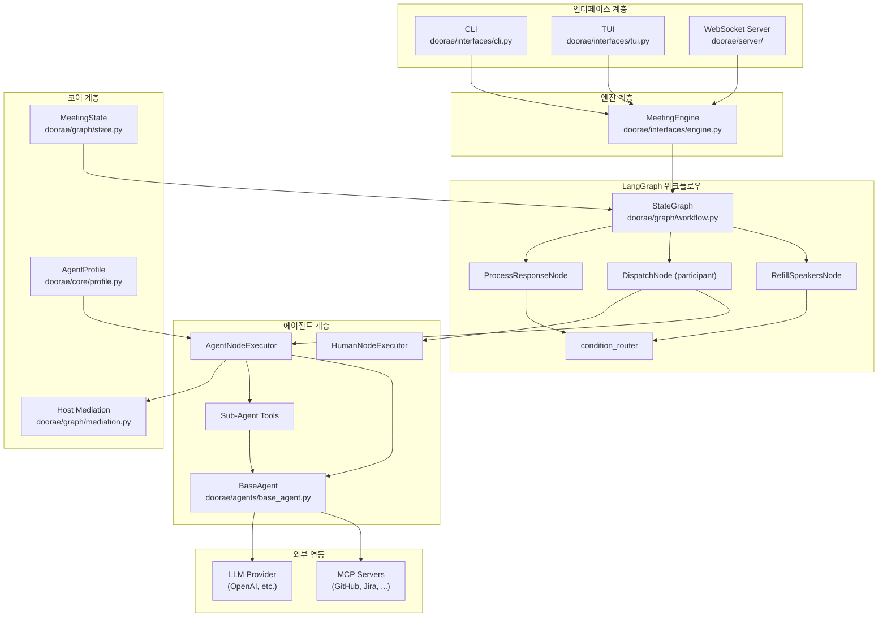

# Architecture Overview

Doorae는 **AI 에이전트가 참여하는 구조화된 회의**를 운영하는 시스템이다. 사용자(Human)와 AI 에이전트가 안건(Agenda) 중심으로 토론하고, Host가 진행을 중재하며, MCP 도구를 통해 외부 데이터를 실시간으로 조회한다.

## 시스템 전체 구조

## 문서 읽기 가이드

이 아키텍처 문서는 시스템의 서로 다른 측면을 다루는 13개의 문서로 구성되어 있다. 관심 분야에 따라 아래 순서를 참고하라.

### 전체 흐름 이해 (Top-Down)

1. **[System Overview](system-overview.md)** -- 사용자 입력부터 AI 응답까지의 전체 데이터 흐름
2. **[LangGraph Workflow](langgraph-workflow.md)** -- StateGraph 구성과 실행 모델
3. **[Node System](node-system.md)** -- 각 노드의 역할과 상태 변이

### 핵심 메커니즘 (Deep Dive)

4. **[Dual LLM Architecture](dual-llm.md)** -- Main LLM과 Task LLM의 분리 전략
5. **[Speaker Routing](speaker-routing.md)** -- pending_speakers 큐 기반 라우팅
6. **[Host Mediation](host-mediation.md)** -- N-gram 분석 기반 회의 중재
7. **[Conversation Summary](conversation-summary.md)** -- langmem 인라인 요약

### 에이전트 시스템

8. **[Agent Profile System](agent-profile-system.md)** -- 재귀적 프로필 구조와 프롬프트 생성
9. **[MCP Integration](mcp-integration.md)** -- 외부 도구 연동과 캐싱

### 인터페이스와 인프라

10. **[Meeting Engine](meeting-engine.md)** -- CLI/TUI/Server가 공유하는 엔진 패턴
11. **[Server & WebSocket](server-websocket.md)** -- FastAPI 서버, Room 생명주기, 이벤트 브로드캐스팅
12. **[Project Scaffolding](project-scaffolding.md)** -- Workspace 초기화와 프로젝트 생성

### 핵심 설계 원칙

| 원칙 | 설명 |
|------|------|
| **Agenda-Driven** | 모든 토론은 안건(Agenda) 단위로 구조화된다 |
| **Queue-Based Routing** | `pending_speakers` 큐로 LLM 호출 없이 다음 발언자를 결정한다 |
| **Dual LLM** | 대화용(Main)과 추출/분석용(Task) LLM을 분리하여 비용을 최적화한다 |
| **Interface-Agnostic Engine** | MeetingEngine이 CLI/TUI/Server 어댑터와 독립적으로 동작한다 |
| **Inline Summarization** | 별도 요약 노드 대신 에이전트 내부에서 langmem으로 인라인 요약한다 |
