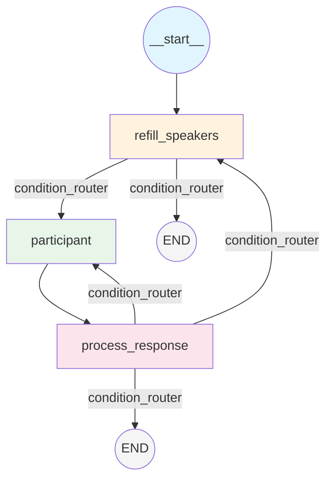

# LangGraph Workflow

이 문서는 `doorae/graph/workflow.py`의 `create_meeting_workflow()` 함수가 어떻게 LangGraph `StateGraph`를 구성하고 컴파일하는지 설명한다.

## 왜 LangGraph인가

Doorae의 회의 워크플로우는 본질적으로 **상태 머신(state machine)**이다. 발언자 큐가 비면 채우고, 채우면 발언하고, 발언 후 응답을 처리하고, 조건에 따라 종료하거나 반복한다. LangGraph의 `StateGraph`는 이러한 패턴을 노드-엣지 그래프로 선언적으로 표현할 수 있게 해준다.

## 그래프 구조



## StateGraph 구성 단계

`create_meeting_workflow()` (line 32-150)는 다음 10단계를 거친다.

### 1단계: LLM 인스턴스 생성 (line 57-63)

```python
main_model = create_main_llm(streaming=True)   # 에이전트 응답용
task_model = create_task_llm()                  # 유틸리티 작업용
```

Main LLM은 스트리밍이 활성화되어 있어 실시간 토큰 전달이 가능하다. Task LLM은 멘션 추출, 결론 요약 등 짧은 작업에 사용된다.

### 2단계: 프로필 로드 (line 68-76)

```python
profiles = merge_profiles_with_overrides(
    load_agent_profiles(profiles_path),
    profiles_override,
)
```

YAML에서 기본 프로필을 로드하고, 런타임 오버라이드(예: WebSocket에서 접속한 사용자 프로필)를 병합한다. `ParticipantRegistry`에 모든 프로필을 등록한다.

### 3단계: StateGraph 생성 (line 78)

```python
workflow = StateGraph(MeetingState)
```

`MeetingState`는 `MessagesState`를 확장한 TypedDict로, 안건 목록, 발언자 큐, 턴 카운트 등을 포함한다.

### 4-5단계: 노드 추가 (line 80-119)

| 노드 이름 | 클래스 | LLM | 역할 |
|-----------|--------|-----|------|
| `refill_speakers` | `RefillSpeakersNode` | main_model | pending_speakers 큐 채우기 |
| `process_response` | `ProcessResponseNode` | task_model | 멘션 추출, 안건 전환, 종료 감지 |
| `participant` | `DispatchNode` | agent별 모델 | 현재 발언자의 턴 실행 |

`participant` 노드는 `NodeRegistry.create("dispatch", ...)`로 생성되며, 내부에서 `DispatchNode`가 `pending_speakers[0]`를 조회하여 적절한 executor를 호출한다.

### 6단계: 진입점 설정 (line 122)

```python
workflow.set_entry_point("refill_speakers")
```

워크플로우는 항상 `refill_speakers`에서 시작한다. 초기 상태의 `pending_speakers`가 비어있으므로, 안건의 `required_speakers`를 기반으로 첫 발언자를 결정한다.

### 7단계: 직선 엣지 (line 125)

```python
workflow.add_edge("participant", "process_response")
```

`participant` 노드의 출력은 항상 `process_response`로 전달된다. 이것은 조건 없는 직선 구조다.

### 8-9단계: 조건부 엣지 (line 128-145)

```python
available_targets = {
    "participant": "participant",
    "refill_speakers": "refill_speakers",
    END: END,
}
workflow.add_conditional_edges("process_response", condition_router, available_targets)
workflow.add_conditional_edges("refill_speakers", condition_router, available_targets)
```

`condition_router` 함수가 상태를 검사하여 다음 노드를 결정한다. `process_response`와 `refill_speakers` 모두 동일한 라우터를 사용한다.

### 10단계: 컴파일 (line 148-150)

```python
compiled_workflow = workflow.compile()
setattr(compiled_workflow, "participant_registry", participant_registry)
return compiled_workflow
```

컴파일된 그래프에 `participant_registry`를 어태치하여 런타임에서 참여자 목록을 동적으로 조회할 수 있게 한다.

## 초기 상태 (`build_initial_state`)

`build_initial_state()` (line 153-190)는 회의의 초기 상태를 구성한다.

| 필드 | 초기값 | 설명 |
|------|--------|------|
| `messages` | `[HumanMessage(initial_message)]` | 첫 메시지 |
| `agendas` | YAML에서 로드, 첫 안건 `in_progress` | 안건 목록 |
| `pending_speakers` | `[]` | refill_speakers가 채움 |
| `max_turns` | `settings.max_turns` (기본 1000) | 무한루프 방지 |
| `meeting_ended` | `False` | Host 종료 커맨드로 전환 |
| `summary` | `None` | langmem RunningSummary |

특이점: 모든 안건의 `required_speakers`에 human 사용자가 자동으로 추가된다 (line 168-172). 이는 사용자가 모든 안건에서 발언 기회를 갖도록 보장한다.

## 실행 모델

컴파일된 워크플로우는 `astream_events()` (v2)로 실행된다.

```python
async for event in workflow.astream_events(
    initial_state,
    config={"recursion_limit": settings.recursion_limit},
    version="v2",
):
    # 이벤트 처리
```

이벤트 종류:
- `on_chain_start/end`: 노드 진입/종료
- `on_chat_model_start/stream/end`: LLM 호출 시작/스트리밍/종료
- `on_tool_start/end`: 도구 호출 시작/종료

`MeetingEngine`은 이 이벤트 스트림을 `MeetingEngineCallback` Protocol 메서드로 매핑하여 인터페이스 계층에 전달한다.
