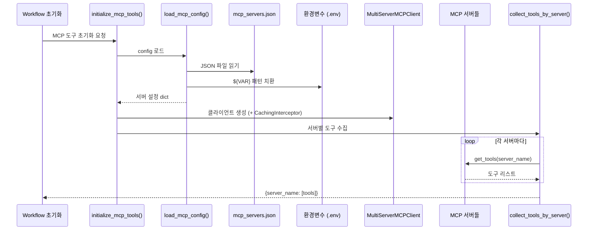
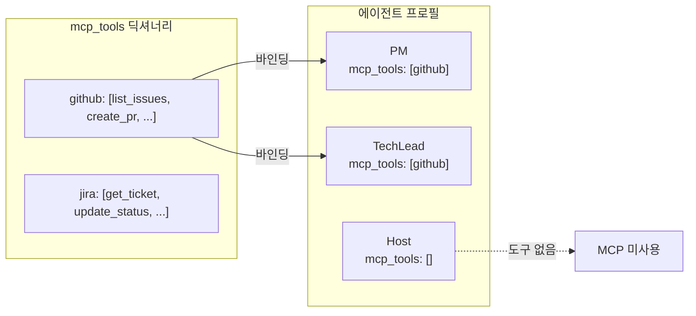
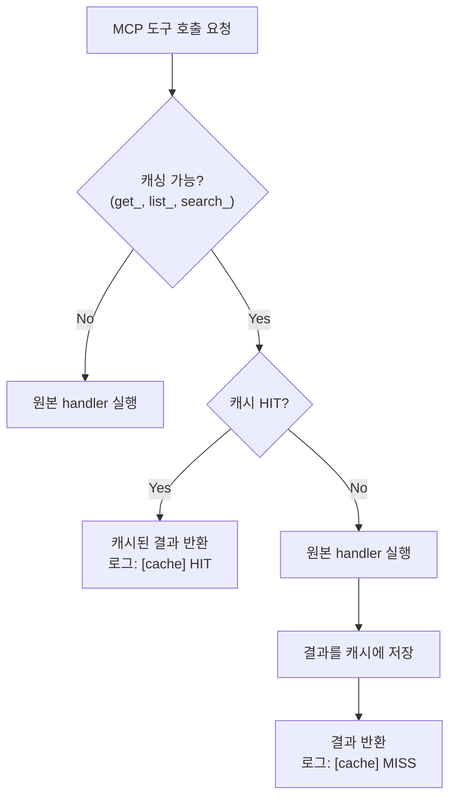

# MCP 통합

Doorae의 AI 에이전트들은 MCP(Model Context Protocol)를 통해 외부 도구(GitHub, Jira 등)에 접근합니다. 이 문서에서는 MCP가 왜 필요한지, 도구가 어떻게 로드되고 에이전트에 바인딩되는지, 캐싱은 어떻게 동작하는지를 설명합니다.

## MCP란 무엇인가

MCP(Model Context Protocol)는 LLM 에이전트가 외부 서비스와 상호작용할 수 있도록 하는 표준 프로토콜입니다. Doorae에서 MCP를 채택한 이유는 다음과 같습니다:

- **표준화된 도구 인터페이스**: 각 외부 서비스마다 별도의 통합 코드를 작성할 필요 없이, MCP 서버만 연결하면 됩니다.
- **에이전트별 도구 할당**: PM에게는 GitHub 도구를, Designer에게는 Figma 도구를 선택적으로 부여할 수 있습니다.
- **런타임 확장성**: 새로운 MCP 서버를 JSON 설정만으로 추가할 수 있습니다.

!!! info "langchain-mcp-adapters"
    Doorae는 `langchain-mcp-adapters` 라이브러리를 통해 MCP 서버를 LangChain 도구로 변환합니다. `MultiServerMCPClient`가 여러 MCP 서버를 동시에 관리합니다.

## 도구 로드 흐름



### 1단계: 설정 로드 (`load_mcp_config`)

`doorae/mcp/__init__.py`의 `load_mcp_config()` 함수가 JSON 설정 파일을 읽고 처리합니다.

```json
// config/mcp_servers.json 예시
{
  "mcpServers": {
    "github": {
      "url": "https://mcp.github.com/sse",
      "headers": {
        "Authorization": "Bearer ${GITHUB_TOKEN}"
      }
    },
    "local-tool": {
      "command": "npx",
      "args": ["-y", "@my/mcp-server"]
    }
  }
}
```

이 과정에서 세 가지 처리가 이루어집니다:

**환경변수 치환**: `${GITHUB_TOKEN}` 같은 패턴을 `os.environ` 값으로 대체합니다.

```python
_ENV_VAR_PATTERN = re.compile(r'\$\{(\w+)\}')

def _resolve_env_vars(obj):
    if isinstance(obj, str):
        return _ENV_VAR_PATTERN.sub(
            lambda m: os.environ.get(m.group(1), ""), obj
        )
    # dict, list에 대해 재귀 처리
```

**Transport 추론**: `transport` 필드가 명시되지 않았을 때 자동 추론합니다.

| 조건 | 추론 결과 |
|------|-----------|
| `url` 필드 존재 | `streamable_http` |
| `command` 필드 존재 | `stdio` |

**인증 검증**: `streamable_http` 서버의 `Authorization` 헤더가 비어 있으면 (환경변수 미설정) 해당 서버를 건너뜁니다.

!!! warning "인증 없는 서버는 자동 제외"
    `Authorization` 헤더가 필요하지만 토큰이 설정되지 않은 서버는 경고 로그와 함께 무시됩니다. 이로 인해 필수 환경변수 없이도 애플리케이션이 시작될 수 있지만, 해당 서버의 도구는 사용할 수 없습니다.

### 2단계: 도구 수집 (`collect_tools_by_server`)

`MultiServerMCPClient`에 연결된 각 서버에서 도구 목록을 수집합니다.

```python
async def collect_tools_by_server(client, server_names):
    tools_by_server = {}
    for name in server_names:
        try:
            tools_by_server[name] = await client.get_tools(server_name=name)
        except ValueError:
            logger.warning(f"MCP 서버 '{name}'을(를) 찾을 수 없습니다.")
        except Exception as e:
            logger.error(f"MCP 서버 '{name}' 도구 로드 실패: {e}")
    return tools_by_server
```

결과는 `{server_name: [tool1, tool2, ...]}` 형태의 딕셔너리입니다. 존재하지 않거나 실패한 서버는 조용히 건너뜁니다.

### 3단계: 초기화 통합 (`initialize_mcp_tools`)

`doorae/graph/nodes/utils.py`의 `initialize_mcp_tools()` 함수가 위 단계들을 통합합니다.

```python
async def initialize_mcp_tools(config_path=None):
    config_dict = load_mcp_config(config_path)
    mcp_client = MultiServerMCPClient(
        config_dict,
        tool_interceptors=[CachingInterceptor()]  # 캐싱 적용
    )
    server_names = set(config_dict.keys())
    tools_by_server = await collect_tools_by_server(mcp_client, server_names)
    return tools_by_server
```

!!! note "ImportError 안전 처리"
    `langchain-mcp-adapters`가 설치되지 않았거나 설정 파일이 없어도 빈 딕셔너리를 반환하며, 애플리케이션은 MCP 도구 없이 정상 동작합니다.

## 에이전트별 도구 바인딩

로드된 도구는 에이전트 프로필의 `mcp_tools` 필드를 기준으로 선택적으로 바인딩됩니다.



`AgentNodeExecutor.__init__()` 에서 바인딩이 이루어집니다:

```python
if tools is None and self._mcp_tools and profile.mcp_tools:
    tools = []
    for server_name in profile.mcp_tools:
        if server_name in self._mcp_tools:
            tools.extend(self._mcp_tools[server_name])
```

프로필의 `mcp_tools` 리스트에 명시된 서버의 도구만 해당 에이전트에 바인딩됩니다. 예를 들어 PM의 프로필에 `mcp_tools: [github]`이 설정되어 있으면, github 서버의 모든 도구가 PM 에이전트에 연결됩니다.

## 도구 결과 캐싱

`doorae/mcp/cache.py`의 `CachingInterceptor`는 읽기 전용 MCP 호출의 결과를 캐싱합니다.

### 캐싱 대상 판별

```python
CACHEABLE_PREFIXES = ("get_", "list_", "search_")

def _is_cacheable(tool_name: str) -> bool:
    return tool_name.startswith(CACHEABLE_PREFIXES)
```

`get_`, `list_`, `search_`로 시작하는 도구 호출만 캐싱합니다. `create_`, `update_`, `delete_` 같은 변경 작업은 항상 실제 서버에 요청합니다.

### 캐시 키 생성

```python
def _make_cache_key(request: MCPToolCallRequest) -> str:
    raw = json.dumps(
        {"server": request.server_name, "name": request.name, "args": request.args},
        sort_keys=True,
        default=str,
    )
    return hashlib.sha256(raw.encode()).hexdigest()
```

서버 이름, 도구 이름, 인자를 결합하여 SHA-256 해시를 생성합니다. 동일한 요청은 동일한 키를 가집니다.

### TTL 기반 만료

```python
@dataclass
class ToolResultCache:
    ttl_seconds: float = 120.0  # 2분

    def get(self, key: str) -> MCPToolCallResult | None:
        entry = self._store.get(key)
        if entry is None:
            return None
        if time.monotonic() - entry.created_at > self.ttl_seconds:
            del self._store[key]
            return None
        return entry.result
```

캐시 항목은 **120초(2분)** 후 자동 만료됩니다. 회의 중 동일한 GitHub 이슈 목록을 반복 조회하는 경우, 2분 이내의 재요청은 캐시에서 즉시 응답합니다.

### Interceptor 동작 방식



`CachingInterceptor`는 `langchain-mcp-adapters`의 interceptor 패턴을 따릅니다. `MultiServerMCPClient` 생성 시 `tool_interceptors` 파라미터로 전달되어 모든 MCP 호출을 투명하게 가로챕니다.

## 설정 예시

### 최소 설정 (GitHub만 사용)

```json
{
  "mcpServers": {
    "github": {
      "url": "https://mcp.github.com/sse",
      "headers": {
        "Authorization": "Bearer ${GITHUB_TOKEN}"
      }
    }
  }
}
```

```yaml
# agent_profiles.yaml
- name: PM
  mcp_tools:
    - github
  metadata:
    target_repository: "myorg/myrepo"
```

### 로컬 MCP 서버 추가

```json
{
  "mcpServers": {
    "github": { "..." : "..." },
    "local-docs": {
      "command": "npx",
      "args": ["-y", "@my/docs-mcp-server"],
      "env": {
        "DOCS_PATH": "/path/to/docs"
      }
    }
  }
}
```

!!! tip "stdio vs streamable_http"
    로컬에서 실행하는 MCP 서버는 `command` + `args`로 `stdio` transport를 사용합니다. 원격 서비스는 `url`로 `streamable_http` transport를 사용합니다. Transport 타입은 자동 추론되므로 명시하지 않아도 됩니다.

## 에러 처리 전략

Doorae의 MCP 통합은 **점진적 저하(graceful degradation)** 원칙을 따릅니다:

| 상황 | 동작 |
|------|------|
| `langchain-mcp-adapters` 미설치 | 경고 로그, 빈 도구 반환 |
| `mcp_servers.json` 미발견 | 경고 로그, 빈 도구 반환 |
| 특정 서버 연결 실패 | 해당 서버만 건너뜀, 나머지 정상 로드 |
| 인증 토큰 미설정 | 해당 서버 건너뜀, 경고 로그 |
| 도구 호출 중 예외 | 개별 호출 실패로 처리, 에이전트는 계속 동작 |

이 설계 덕분에 MCP 서버가 전혀 설정되지 않아도 Doorae는 기본 대화 기능으로 정상 운영됩니다.
