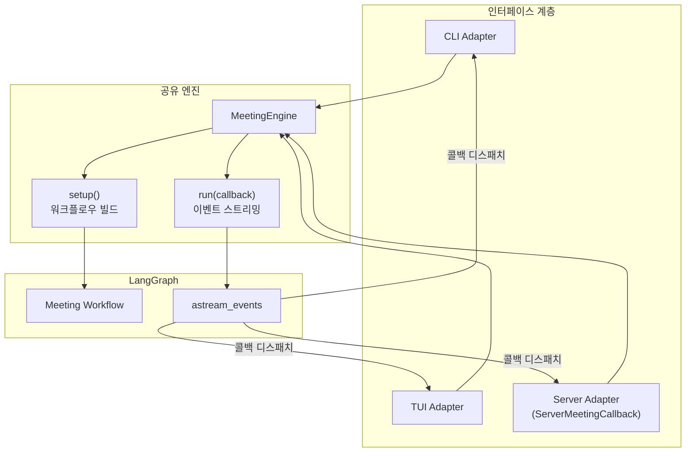
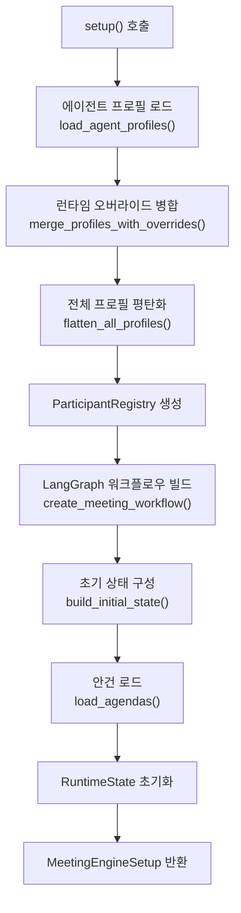

# MeetingEngine 패턴

`MeetingEngine`은 Doorae의 핵심 오케스트레이터로, CLI, TUI, 서버 등 서로 다른 인터페이스 계층에서 **동일한 회의 로직**을 재사용할 수 있게 해주는 공유 엔진입니다. 이 문서에서는 MeetingEngine이 왜 필요한지, 내부적으로 어떻게 동작하는지를 설명합니다.

## 왜 공유 엔진이 필요한가

Doorae는 세 가지 실행 모드를 지원합니다:

| 모드 | 인터페이스 | 사용자 상호작용 |
|------|-----------|----------------|
| **CLI** | 터미널 stdin/stdout | 텍스트 입력, 스트리밍 출력 |
| **TUI** | Textual 기반 터미널 UI | 패널 기반 실시간 표시 |
| **Server** | FastAPI + WebSocket | 브라우저 멀티유저 |

세 모드 모두 동일한 핵심 동작을 수행합니다:

1. 에이전트 프로필 로드 및 워크플로우 빌드
2. LangGraph 이벤트 스트리밍
3. 발언자 변경, 토큰 스트리밍, 안건 진행 등의 이벤트 디스패치

MeetingEngine이 없다면 이 로직이 CLI, TUI, Server 각각에 중복 구현되어야 합니다. MeetingEngine은 이를 한 곳에 캡슐화하고, **콜백 프로토콜**을 통해 각 인터페이스가 자신만의 방식으로 이벤트를 처리하게 합니다.



## MeetingEngine 생성

MeetingEngine은 회의 실행에 필요한 모든 의존성을 생성자에서 받습니다:

```python
engine = MeetingEngine(
    initial_message="회의를 시작합니다",
    settings=settings,                  # 전역 설정
    profiles_path="config/agent_profiles.yaml",  # 에이전트 프로필 경로
    input_provider=input_provider,      # 사용자 입력 소스
    mcp_tools=mcp_tools,               # MCP 도구 딕셔너리
    profiles_override=runtime_profiles, # 런타임 프로필 오버라이드
)
```

| 파라미터 | 용도 | CLI에서 | Server에서 |
|----------|------|---------|-----------|
| `input_provider` | 사용자 입력 수신 | `StdinInputProvider` | `QueueInputProvider` |
| `mcp_tools` | MCP 서버 도구 | CLI에서 초기화 | 서버 캐시에서 로드 |
| `profiles_override` | 런타임 참가자 추가 | 사용하지 않음 | WebSocket 접속자를 human으로 등록 |

!!! info "InputProvider 추상화"
    `InputProvider`는 사용자 입력을 받는 방법을 추상화합니다. CLI에서는 stdin에서 읽고, 서버에서는 `asyncio.Queue`에서 읽습니다. 이 추상화 덕분에 MeetingEngine은 입력 소스를 알 필요가 없습니다.

## setup(): 워크플로우 빌드

`setup()` 메서드는 회의 실행에 필요한 모든 자원을 준비합니다. 이 단계는 `run()` 호출 전에 명시적으로 수행하거나, `run()`이 내부적으로 자동 호출합니다.



`setup()`이 반환하는 `MeetingEngineSetup` 데이터클래스에는 다음이 포함됩니다:

```python
@dataclass(slots=True)
class MeetingEngineSetup:
    workflow: Any                          # 컴파일된 LangGraph 워크플로우
    initial_state: dict[str, Any]          # 워크플로우 초기 상태
    graph_config: dict[str, int]           # recursion_limit 등
    top_profiles: dict[str, AgentProfile]  # 최상위 에이전트 프로필
    all_profiles: dict[str, AgentProfile]  # 평탄화된 전체 프로필
    human_names: list[str]                 # is_human=True인 참가자 이름
    human_name_lookup: dict[str, str]      # 소문자 이름 -> 원래 이름 매핑
    participant_registry: Any              # 런타임 참가자 관리
```

!!! tip "setup()과 run()의 분리"
    `setup()`을 `run()`과 분리한 이유는 서버 모드에서 워크플로우 시작 전에 프로필 정보를 클라이언트에 미리 전송해야 하기 때문입니다. `setup()` 호출 후 프로필을 브로드캐스트하고, 그 다음 `run()`을 호출하는 패턴이 가능합니다.

## 콜백 프로토콜

MeetingEngine은 `MeetingEngineCallback` Protocol을 통해 이벤트를 외부에 전달합니다. 각 인터페이스 어댑터는 이 프로토콜을 구현합니다.

```python
class MeetingEngineCallback(Protocol):
    async def on_raw_event(self, event: dict) -> None: ...
    async def on_speaker_changed(self, speaker: str, is_delegated: bool) -> None: ...
    async def on_token(self, content: str, speaker: str, is_delegated: bool) -> None: ...
    async def on_turn_completed(self, speaker: str, is_delegated: bool) -> None: ...
    async def on_human_turn_started(self, username: str) -> None: ...
    async def on_agenda_updated(self, agendas: list[dict], current_idx: int) -> None: ...
    async def on_meeting_ended(self, agendas: list[dict], speaker_counts: dict) -> None: ...
    async def on_pending_speakers_changed(self, pending_speakers: list[str]) -> None: ...
    async def on_participant_status_changed(self, participant_name: str, status: str) -> None: ...
    async def on_tool_call(self, name: str, status: str) -> None: ...
```

이 설계의 장점:

- **느슨한 결합**: MeetingEngine은 콜백 구현체가 무엇인지 알 필요가 없음
- **구조적 서브타이핑**: Python Protocol을 사용하여 명시적 상속 없이 덕 타이핑으로 구현 가능
- **확장 용이**: 새로운 인터페이스를 추가하려면 콜백 프로토콜만 구현하면 됨

## run(): 이벤트 스트리밍과 디스패치

`run()` 메서드는 LangGraph 워크플로우를 `astream_events`로 실행하면서, 각 이벤트를 적절한 콜백 메서드로 디스패치합니다.

```python
async def run(self, callback: MeetingEngineCallback) -> None:
    async for event in self.iter_events():
        await self._dispatch_event(event, callback)
    await callback.on_meeting_ended(...)
```

### 이벤트 디스패치 규칙

`_dispatch_event()`는 LangGraph의 raw 이벤트를 분석하여 의미 있는 콜백을 호출합니다:

| LangGraph 이벤트 | 처리 메서드 | 호출되는 콜백 |
|-------------------|------------|--------------|
| `on_chain_start` | `_handle_chain_start` | `on_human_turn_started`, `on_agenda_updated` |
| `on_chat_model_start` | `_handle_chat_model_start` | `on_speaker_changed` |
| `on_chat_model_stream` | `_handle_chat_model_stream` | `on_token` |
| `on_chat_model_end` | `_handle_chat_model_end` | `on_turn_completed` |
| `on_chain_end` | `_handle_chain_end` | `on_agenda_updated`, `on_pending_speakers_changed`, `on_participant_status_changed` |
| `on_tool_start` | (직접 처리) | `on_tool_call("started")` |
| `on_tool_end` | (직접 처리) | `on_tool_call("ended")` |

모든 이벤트는 먼저 `on_raw_event()`로 전달되며, 이후 유형별로 파싱되어 semantic 콜백이 호출됩니다.

### 발언자 추적 로직

MeetingEngine은 `MeetingEngineRuntimeState`를 통해 현재 발언 상태를 추적합니다:

```python
@dataclass(slots=True)
class MeetingEngineRuntimeState:
    current_speaker: str | None = None             # 현재 발언자
    current_delegated_speaker: str | None = None   # 위임받은 발언자
    current_agenda_idx: int = 0                     # 현재 안건 인덱스
    agendas: list[dict] = field(default_factory=list)
    pending_speakers: list[str] = field(default_factory=list)
    speaker_counts: dict[str, int] = field(default_factory=dict)
    participant_statuses: dict[str, str] = field(default_factory=dict)
    _turn_completed: bool = False                   # 턴 완료 플래그
```

!!! note "중복 speaker_changed 방지"
    같은 발언자가 연속으로 `on_chat_model_start` 이벤트를 생성하면, `_turn_completed` 플래그를 확인하여 이전 턴이 완료된 경우에만 `on_speaker_changed`를 재발행합니다. 이는 tool-calling 루프에서 불필요한 UI 업데이트를 방지합니다.

### Tool-calling 필터링

LLM이 tool_calls를 반환한 경우(아직 최종 응답이 아닌 중간 단계), `on_turn_completed`를 발행하지 않습니다:

```python
async def _handle_chat_model_end(self, event, callback):
    output = event.get("data", {}).get("output")
    tool_calls = getattr(output, "tool_calls", None)
    if tool_calls:
        return  # tool-calling 중간 응답 - 턴 미완료
```

### Human Turn 감지

`on_chain_start` 이벤트에서 체인 이름이 human 참가자와 일치하면 `on_human_turn_started`를 호출합니다. 이를 통해 UI에서 입력 프롬프트를 표시할 수 있습니다:

```python
async def _handle_chain_start(self, event, callback):
    event_name = event.get("name")
    human_name = human_name_lookup.get(event_name.lower())
    if human_name is not None:
        await callback.on_human_turn_started(human_name)
```

## 세션 관리

### 프로퍼티 접근

MeetingEngine은 두 가지 프로퍼티를 통해 현재 상태에 접근할 수 있게 합니다:

| 프로퍼티 | 반환 타입 | 용도 |
|----------|----------|------|
| `setup_state` | `MeetingEngineSetup \| None` | 프로필, 워크플로우 등 정적 설정 |
| `runtime_state` | `MeetingEngineRuntimeState` | 현재 발언자, 안건 등 동적 상태 |

서버 모드에서는 `runtime_state`를 사용하여 중간 합류 클라이언트에게 현재 회의 상태 snapshot을 전송합니다.

### iter_events(): 저수준 접근

`run()`이 콜백 기반의 고수준 API라면, `iter_events()`는 raw LangGraph 이벤트를 직접 순회할 수 있는 저수준 API입니다. 자체 이벤트 처리 로직이 필요한 경우에 사용합니다.

```python
async def iter_events(self):
    setup_state = self._setup or self.setup()
    async for event in setup_state.workflow.astream_events(
        setup_state.initial_state,
        config=setup_state.graph_config,
        version="v2",
    ):
        yield event
```

## 확장 패턴

새로운 인터페이스(예: Slack 봇, Discord 봇)를 추가하려면:

1. `MeetingEngineCallback` 프로토콜을 구현하는 콜백 클래스 작성
2. 해당 플랫폼의 입력을 `InputProvider`로 래핑
3. `MeetingEngine`을 생성하고 `run(callback)`을 호출

```python
class SlackMeetingCallback:
    """Slack 채널로 이벤트를 전송하는 콜백"""

    async def on_speaker_changed(self, speaker: str, is_delegated: bool) -> None:
        await slack_client.post_message(f"🎙 {speaker} 발언 시작")

    async def on_token(self, content: str, speaker: str, is_delegated: bool) -> None:
        # Slack은 토큰 단위 스트리밍 불가 -> 버퍼링 후 턴 완료 시 전송
        self._buffer.append(content)

    # ... 나머지 콜백 구현
```

## 관련 파일

| 파일 | 역할 |
|------|------|
| `doorae/interfaces/engine.py` | MeetingEngine, Callback Protocol, RuntimeState 정의 |
| `doorae/interfaces/event_utils.py` | `extract_speaker()`, `is_delegated()` 등 이벤트 파싱 유틸리티 |
| `doorae/graph/workflow.py` | `create_meeting_workflow()`, `build_initial_state()` |
| `doorae/graph/input_provider.py` | `InputProvider`, `QueueInputProvider`, `StdinInputProvider` |
| `doorae/graph/participant_registry.py` | `ParticipantRegistry` - 런타임 참가자 관리 |
| `doorae/core/profile.py` | 에이전트 프로필 로드 및 병합 |
| `doorae/server/room.py` | `ServerMeetingCallback` (서버 모드 구현체) |
