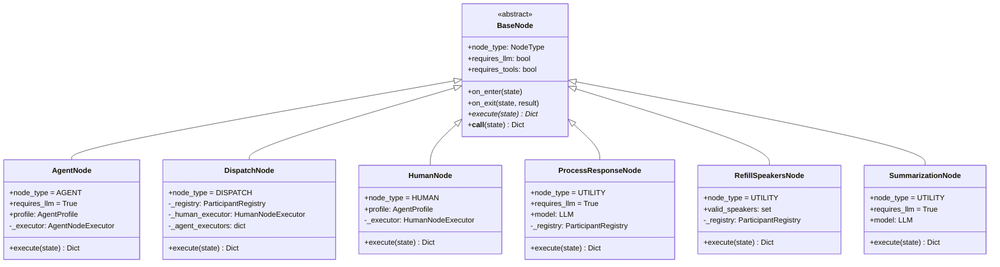
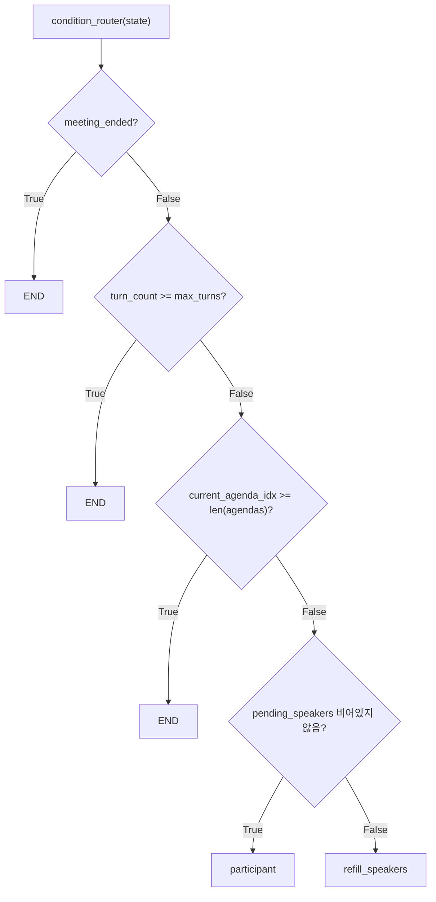

# Node System

이 문서는 `doorae/graph/nodes/` 패키지에 구현된 모든 노드를 상세히 설명한다. 각 노드의 입력/출력, 상태 변이(mutation), 의사결정 로직을 다룬다.

## 노드 아키텍처



## BaseNode (`doorae/graph/nodes/base.py`)

모든 노드의 추상 베이스 클래스. LangGraph는 노드를 callable로 호출하므로 `__call__()` 메서드가 실제 진입점이다.

**실행 순서** (line 75-89):
1. `on_enter(state)` -- 전처리 훅
2. `execute(state)` -- 핵심 로직 (서브클래스 구현)
3. `on_exit(state, result)` -- 후처리 훅

**NodeType 분류** (line 9-16):
- `AGENT`: AI 에이전트 노드
- `DISPATCH`: 단일 참가자 디스패치 노드
- `UTILITY`: 상태 처리 노드
- `HUMAN`: 사용자 입력 노드
- `ROUTING`: 라우팅 노드

## DispatchNode (`doorae/graph/nodes/dispatch.py`)

워크플로우 그래프에서 `participant`라는 이름으로 등록되는 **단일 진입점 노드**. `pending_speakers[0]`를 조회하여 해당 참가자의 executor를 런타임에 선택한다.

**왜 단일 노드인가**: 참가자 수가 가변적이고 런타임에 동적으로 추가/제거될 수 있으므로, 참가자별로 별도 노드를 만드는 대신 하나의 dispatch 노드가 모든 참가자를 처리한다.

**입력 상태**:
- `pending_speakers`: 발언 대기 큐

**실행 로직** (line 63-86):
1. `pending_speakers`가 비어있으면 빈 dict 반환
2. `pending_speakers[0]`의 프로필을 `ParticipantRegistry`에서 조회
3. 프로필이 없으면 퇴장 메시지 생성하고 큐에서 제거
4. `is_human`이면 `HumanNodeExecutor.execute()` 호출
5. AI 에이전트이면 `AgentNodeExecutor.execute()` 호출

**AgentNodeExecutor 캐싱** (line 43-53): 같은 에이전트의 executor를 재생성하지 않도록 `_agent_executors` dict에 캐싱한다.

## AgentNode / AgentNodeExecutor (`doorae/graph/nodes/agent.py`)

AI 에이전트의 발언을 생성하는 핵심 노드. `AgentNodeExecutor`에 실제 로직이 있고, `AgentNode`는 이를 `BaseNode` 인터페이스로 래핑한다.

**입력 상태**:
- `messages`: 전체 대화 이력
- `agendas`, `current_agenda_idx`: 현재 안건 정보
- `summary`: langmem `RunningSummary` (있으면)
- `pending_proposals`: 안건 후보 큐
- `participant_statuses`: 참여자 상태 맵

**실행 로직** (`AgentNodeExecutor.execute()`, line 89-265):

1. **인라인 요약** (line 106-123): `langmem.summarize_messages()`로 메시지를 요약. `max_tokens=4000` 초과 시 요약 생성, 요약은 `max_summary_tokens=1000`으로 제한.

2. **메시지 포맷팅** (line 126-149): 요약된 메시지를 역할 표시와 함께 재구성. `[PM의 발언]` 형식으로 HumanMessage로 변환.

3. **프롬프트 구성** (line 152-211):
   - 에이전트 기본 프롬프트 (`_build_agent_prompt()`)
   - 안건 컨텍스트 (`_format_agenda_context()`)
   - Host인 경우: 중재 컨텍스트 (`build_mediation_context()`)
   - Host인 경우 + 대기 안건 있으면: 안건 후보 컨텍스트

4. **도구 준비** (line 215-219): 안건 관련 도구(propose, approve, reject) + sub-agent 도구

5. **LLM 호출** (line 231-235): `BaseAgent.invoke_with_tools()`로 tool-calling 루프 실행

6. **후처리** (line 238-264): thinking 태그 제거, 빈 응답 처리, 상태 업데이트

**출력 상태 변이**:

| 필드 | 변이 |
|------|------|
| `messages` | 새 AIMessage 추가 |
| `participant_statuses` | 발언자 상태 `speaking` → `idle` |
| `summary` | langmem RunningSummary 업데이트 (있으면) |
| `pending_proposals` | 안건 도구 사용 시 업데이트 |
| `agendas` | 안건 승인 시 추가 |

## HumanNode / HumanNodeExecutor (`doorae/graph/nodes/human.py`)

사용자 입력을 받는 노드. `InputProvider` 추상화를 통해 CLI/TUI/WebSocket에 독립적이다.

**실행 로직** (line 18-38):
1. `InputProvider.get_input(state, profile.name)` 호출 -- 비동기 대기
2. 빈 입력이면 `"(발언 없음)"` 메시지 생성
3. 입력이 있으면 `HumanMessage(content=user_input, name=profile.name)` 생성

**출력 상태 변이**: `messages`에 `HumanMessage` 추가

## ProcessResponseNode (`doorae/graph/nodes/process.py`)

에이전트/사용자 발언 후 상태를 업데이트하는 유틸리티 노드.

**실행 로직** (`execute()`, line 234-335):

1. **발언자 큐 업데이트** (line 257): 현재 발언자를 `pending_speakers`에서 제거
2. **발언 횟수 카운트** (line 260-261): `speaker_counts` 증가
3. **멘션 추출** (line 264): `_extract_mentions(last_msg)` 호출
4. **멘션을 큐에 추가** (line 267-269): 중복 제외, 자기 자신 제외
5. **안건 완료 감지** (line 276-291): Host 발언에서 "다음 안건", "마무리" 등 키워드 감지 시 안건 전환
6. **회의 종료 감지** (line 294-301): `[[HOST_END_MEETING]]` 커맨드 또는 종료 키워드
7. **Host 체크인** (line 307-319): `host_checkin_interval` 턴마다 Host를 `pending_speakers`에 삽입

**멘션 추출 전략** (`_extract_mentions()`, line 138-160):

```mermaid
flowchart TD
    A["메시지 수신"] --> B{"@Name 패턴?"}
    B -->|있음| C["@멘션 반환"]
    B -->|없음| D{"AIMessage?"}
    D -->|Yes| E{"위임 시도 감지?"}
    E -->|Yes| F["경고 로그, 빈 리스트"]
    E -->|No| G["빈 리스트"]
    D -->|No (HumanMessage)| H{"자연어 이름?"}
    H -->|있음| I["이름 멘션 반환"]
    H -->|없음| J{"위임 시도 감지?"}
    J -->|Yes| K["LLM으로 추출"]
    J -->|No| L["빈 리스트"]
```

AI 에이전트의 `@Name` 없는 위임 시도는 의도적으로 무시한다 (line 146-151). 이는 `@멘션` 규칙을 강제하여 라우팅의 예측 가능성을 보장하기 위함이다. 반면 HumanMessage는 자연어 멘션을 허용하고, fallback으로 LLM 기반 추출을 시도한다.

**출력 상태 변이**:

| 필드 | 변이 |
|------|------|
| `pending_speakers` | 멘션된 참여자 추가, 현재 발언자 제거 |
| `speaker_counts` | 발언자 카운트 증가 |
| `current_agenda_idx` | 안건 완료 시 +1 |
| `agendas` | 상태 변경 (completed, in_progress) |
| `meeting_ended` | 종료 커맨드 감지 시 True |
| `turn_count` | +1 |
| `current_agenda_start_turn` | 안건 전환 시 현재 turn_count |
| `consecutive_host_delegations` | 0으로 리셋 |

## RefillSpeakersNode (`doorae/graph/nodes/refill.py`)

`pending_speakers`가 비었을 때 다음 발언자를 결정하는 노드.

**실행 로직** (`execute()`, line 57-102):

1. 모든 안건 완료 → `pending_speakers = []` (종료 방향)
2. 현재 안건의 `required_speakers` 중 미발언자 → 최대 2명 추가
3. 모두 발언했으면 → Host에게 위임
4. Host 위임이 3회 연속이면 (`consecutive_host_delegations >= 3`) → 강제 Host 마무리

**무한루프 방지**: `consecutive_host_delegations` 카운터가 Host → refill → Host 루프를 감지하여 3회 후 리셋한다.

**출력 상태 변이**:

| 필드 | 변이 |
|------|------|
| `pending_speakers` | 미발언자 또는 Host |
| `consecutive_host_delegations` | 증가 또는 리셋 |

## SummarizationNode (`doorae/graph/nodes/summarize.py`)

별도 노드로 존재하지만, 현재 워크플로우 그래프에는 포함되지 않는다. 대신 `AgentNodeExecutor` 내부에서 `langmem.summarize_messages()`를 인라인으로 호출한다. 이 노드는 레거시 지원 및 향후 확장을 위해 보존된다.

**동작 방식** (line 38-117):
1. 메시지 수가 `max_messages_before_summary` (기본 8) 이하면 스킵
2. 최근 `keep_recent_messages` (기본 3)개를 제외한 메시지를 요약
3. LLM으로 요약 생성 (최대 `summary_max_tokens` = 3000 토큰)
4. 요약된 메시지에 `RemoveMessage`를 발행하여 삭제

## condition_router (`doorae/graph/nodes/router.py`)

상태만으로 다음 노드를 결정하는 순수 함수. **LLM을 호출하지 않는다.**

**라우팅 우선순위** (line 7-49):



## NodeRegistry (`doorae/graph/nodes/registry.py`)

플러그인 패턴으로 노드를 등록하고 조회하는 레지스트리.

**등록**: `@register_node("이름", category="카테고리")` 데코레이터 사용
**생성**: `NodeRegistry.create("이름", **kwargs)` -- 등록된 클래스를 kwargs로 인스턴스화
**플러그인 확장**: `NodeRegistry.discover_plugins("package_name")`으로 외부 노드 자동 로드

현재 등록된 노드:

| 이름 | 카테고리 | 클래스 |
|------|---------|--------|
| `agent` | agents | `AgentNode` |
| `dispatch` | dispatch | `DispatchNode` |
| `human` | human | `HumanNode` |
| `process_response` | utility | `ProcessResponseNode` |
| `refill_speakers` | utility | `RefillSpeakersNode` |
| `summarize_conversation` | utility | `SummarizationNode` |
