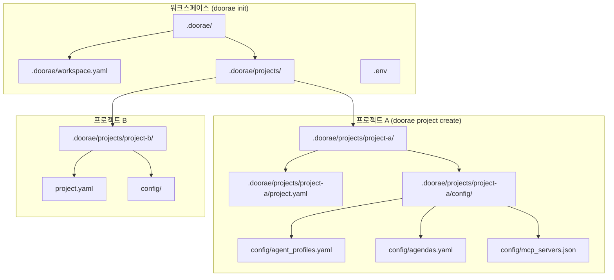
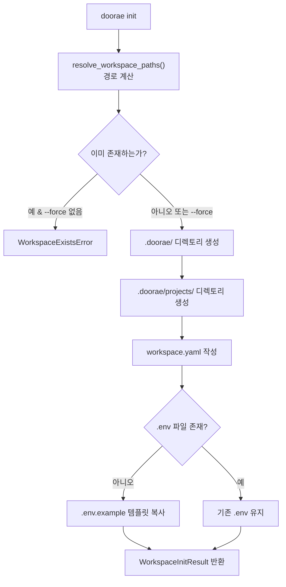
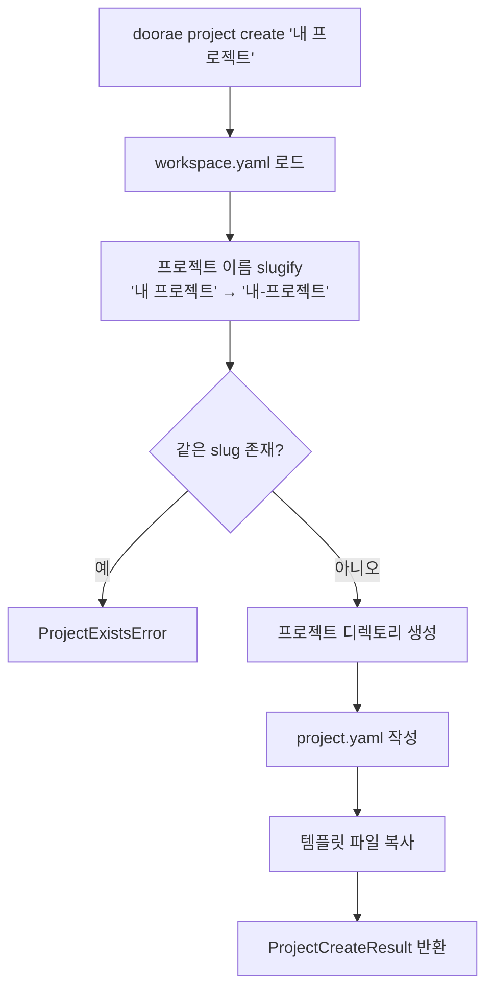
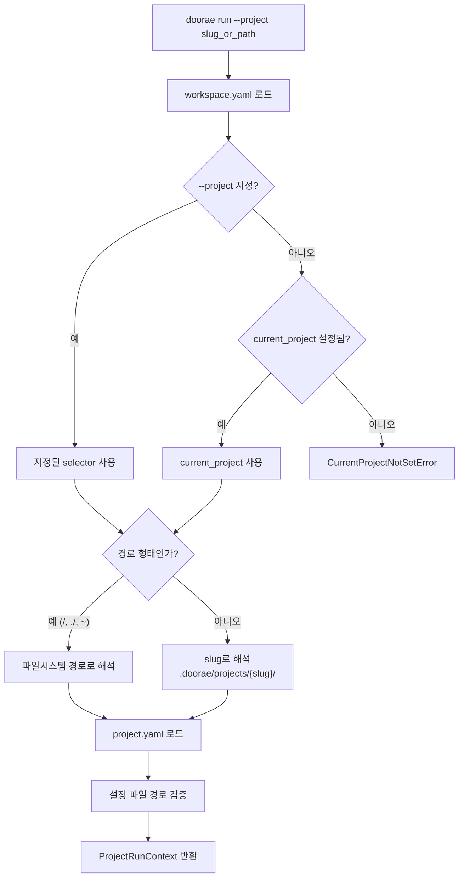
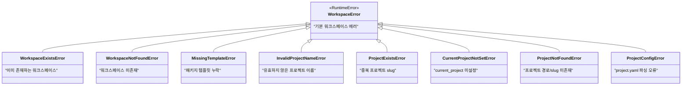

# 프로젝트 스캐폴딩

Doorae는 `doorae init`과 `doorae project create` 명령을 통해 회의 프로젝트를 초기화합니다. 이 문서에서는 워크스페이스와 프로젝트의 관계, 템플릿 시스템의 동작 방식, 생성되는 디렉토리 구조를 설명합니다.

## 왜 프로젝트 단위로 관리하는가

팀에서 Doorae를 사용할 때, 프로젝트마다 다른 에이전트 구성과 안건이 필요합니다. 예를 들어:

- **프로젝트 A**: PM, TechLead, Designer가 참여하는 주간 회의
- **프로젝트 B**: Backend, Frontend, QA가 참여하는 스프린트 리뷰
- **프로젝트 C**: 1:1 코드 리뷰 세션

하나의 워크스페이스 안에서 여러 프로젝트를 관리하면, 프로젝트별로 독립적인 에이전트 프로필과 안건을 유지하면서도 환경 설정(API 키 등)은 공유할 수 있습니다.

## 2단계 구조: Workspace와 Project



## doorae init: 워크스페이스 초기화

`doorae init`은 현재 디렉토리에 `.doorae/` 워크스페이스 메타데이터를 생성합니다.

### 초기화 흐름



### WorkspaceConfig

`workspace.yaml`에 저장되는 워크스페이스 메타데이터입니다:

```yaml
# .doorae/workspace.yaml
version: 1
current_project: null        # 현재 활성 프로젝트 slug
projects_dir: .doorae/projects  # 프로젝트 저장 디렉토리
```

| 필드 | 기본값 | 설명 |
|------|--------|------|
| `version` | `1` | 설정 스키마 버전 |
| `current_project` | `null` | `doorae run` 시 기본으로 사용할 프로젝트 |
| `projects_dir` | `.doorae/projects` | 프로젝트 디렉토리의 상대 경로 |

### .env 파일 생성

워크스페이스 초기화 시 `.env` 파일이 없으면, 패키지에 포함된 `.env.example` 템플릿을 복사합니다. 이 파일에는 LLM 설정, 토큰 관리, MCP 도구 설정 등의 예시가 포함됩니다.

!!! warning "기존 .env 보존"
    이미 `.env` 파일이 존재하면 덮어쓰지 않습니다. API 키 등 민감 정보가 실수로 초기화되는 것을 방지하기 위한 안전장치입니다.

## doorae project create: 프로젝트 생성

`doorae project create "프로젝트 이름"`은 워크스페이스 안에 새 프로젝트 스캐폴드를 생성합니다.

### 생성 흐름



### 프로젝트 이름 Slugify

프로젝트 이름은 파일시스템 안전한 slug로 변환됩니다:

```python
def slugify_project_name(name: str) -> str:
    # 1. NFKC 유니코드 정규화
    # 2. 소문자 변환
    # 3. 언더스코어 → 하이픈
    # 4. 공백 → 하이픈
    # 5. 특수문자 → 하이픈
    # 6. 연속 하이픈 제거
```

| 입력 | 출력 slug |
|------|-----------|
| `"My Project"` | `my-project` |
| `"스프린트 리뷰 #3"` | `스프린트-리뷰-3` |
| `"test__project"` | `test-project` |

!!! note "빈 slug 방지"
    정규화 후 문자나 숫자가 하나도 남지 않으면 `InvalidProjectNameError`가 발생합니다.

### ProjectConfig

`project.yaml`에 저장되는 프로젝트 메타데이터입니다:

```yaml
# .doorae/projects/my-project/project.yaml
version: 1
name: My Project
slug: my-project
agent_profiles_path: config/agent_profiles.yaml
agendas_path: config/agendas.yaml
mcp_servers_path: config/mcp_servers.json
```

| 필드 | 설명 |
|------|------|
| `name` | 원본 프로젝트 이름 |
| `slug` | 파일시스템 안전 식별자 |
| `agent_profiles_path` | 에이전트 프로필 상대 경로 |
| `agendas_path` | 안건 설정 상대 경로 |
| `mcp_servers_path` | MCP 서버 설정 상대 경로 |

## 템플릿 시스템

프로젝트 생성 시 복사되는 템플릿 파일은 `doorae.templates` 패키지에 포함되어 있습니다. Python의 `importlib.resources`를 사용하여 패키지 설치 위치에 관계없이 안정적으로 템플릿을 읽습니다.

```python
# doorae/project/service.py
TEMPLATE_PACKAGE = "doorae.templates"
PROJECT_TEMPLATE_FILES = {
    Path("config/agent_profiles.yaml"): Path("default/config/agent_profiles.yaml"),
    Path("config/agendas.yaml"):        Path("default/config/agendas.yaml"),
    Path("config/mcp_servers.json"):    Path("default/config/mcp_servers.json"),
}
```

### 기본 에이전트 프로필

기본 템플릿은 세 명의 에이전트로 구성됩니다:

```yaml
agents:
  - name: Host
    role: host
    responsibilities:
      - 회의 시작 인사 및 안건 소개
      - 토론 중재 및 의견 요청
      - 회의 요약 및 마무리
    expertise:
      - 회의 퍼실리테이션
      - 시간 관리

  - name: PM
    role: project_manager
    mcp_tools: [github]
    # ...

  - name: TechLead
    role: tech_lead
    mcp_tools: [github]
    agents:              # 하위 에이전트
      - name: Backend
        role: backend_engineer
      - name: Frontend
        role: frontend_engineer
```

!!! info "계층적 에이전트 구조"
    TechLead는 Backend와 Frontend를 하위 에이전트(`agents` 필드)로 가집니다. 이들은 TechLead의 턴에서 위임(delegation)을 통해 발언합니다. 자세한 내용은 [에이전트 프로필 시스템](agent-profile-system.md)을 참조하세요.

### 기본 안건

기본 안건 템플릿은 프로젝트 관리에 초점을 맞춘 4개의 안건을 포함합니다:

```yaml
agendas:
  - title: "프로젝트 로드맵 논의"
    description: "프로젝트 로드맵을 논의하고 달성 계획을 수립합니다"
    required_speakers: ["Host", "PM", "TechLead"]
  - title: "프로젝트 달성 계획"
    required_speakers: ["Host", "PM"]
  - title: "스프린트 리뷰"
    required_speakers: ["PM", "TechLead"]
  - title: "스프린트 계획"
    required_speakers: ["PM", "TechLead"]
```

### MCP 서버 설정

기본 MCP 서버 설정은 GitHub MCP 서버를 포함합니다:

```json
{
  "mcpServers": {
    "github": {
      "command": "go",
      "args": [
        "run",
        "github.com/github/github-mcp-server/cmd/github-mcp-server@latest",
        "stdio"
      ],
      "env": {
        "GITHUB_PERSONAL_ACCESS_TOKEN": "${GITHUB_PERSONAL_ACCESS_TOKEN}"
      }
    }
  }
}
```

## doorae run: 프로젝트 기반 실행

`doorae run`은 현재 워크스페이스의 활성 프로젝트 설정을 로드하여 회의를 시작합니다.

### 프로젝트 해석 과정



`resolve_project_run()` 함수는 다양한 방식으로 프로젝트를 지정할 수 있게 합니다:

| 지정 방식 | 예시 | 해석 방법 |
|-----------|------|-----------|
| **slug** | `my-project` | `.doorae/projects/my-project/` |
| **상대 경로** | `./custom/project` | 현재 디렉토리 기준 |
| **절대 경로** | `/home/user/project` | 그대로 사용 |
| **홈 경로** | `~/project` | 홈 디렉토리 확장 |
| **미지정** | (없음) | `workspace.yaml`의 `current_project` |

!!! tip "경로 vs slug 판별 기준"
    selector가 `/`로 시작하거나, `.` 또는 `~`로 시작하거나, 경로 구분자를 포함하면 경로로 해석됩니다. 그 외에는 slug로 처리됩니다.

### ProjectRunContext

프로젝트 해석 결과로 반환되는 `ProjectRunContext`에는 회의 실행에 필요한 모든 경로가 포함됩니다:

```python
@dataclass(frozen=True)
class ProjectRunContext:
    workspace: WorkspaceConfig     # 워크스페이스 설정
    project: ProjectConfig         # 프로젝트 설정
    project_dir: Path              # 프로젝트 디렉토리
    project_file: Path             # project.yaml 경로
    profiles_path: Path            # 에이전트 프로필 절대 경로
    agendas_path: Path             # 안건 설정 절대 경로
```

## 디렉토리 구조 전체도

```
my-workspace/
├── .doorae/
│   ├── workspace.yaml           # 워크스페이스 메타데이터
│   └── projects/
│       ├── project-a/
│       │   ├── project.yaml     # 프로젝트 메타데이터
│       │   └── config/
│       │       ├── agent_profiles.yaml  # 에이전트 프로필
│       │       ├── agendas.yaml         # 안건 설정
│       │       └── mcp_servers.json     # MCP 서버 설정
│       └── project-b/
│           ├── project.yaml
│           └── config/
│               ├── agent_profiles.yaml
│               ├── agendas.yaml
│               └── mcp_servers.json
├── .env                          # API 키 등 환경 변수
└── ...                           # 사용자 프로젝트 파일
```

## 에러 처리 계층

스캐폴딩 과정에서 발생할 수 있는 에러는 계층적으로 구성됩니다:



모든 에러가 `WorkspaceError(RuntimeError)`를 상속하므로, CLI 계층에서 `except WorkspaceError`로 일괄 처리할 수 있습니다.

## 관련 파일

| 파일 | 역할 |
|------|------|
| `doorae/project/models.py` | `WorkspaceConfig`, `ProjectConfig`, 경로 데이터클래스 |
| `doorae/project/service.py` | `init_workspace()`, `create_project()`, `resolve_project_run()` |
| `doorae/templates/` | 패키지 템플릿 (`.env.example`, 기본 프로필, 안건, MCP 설정) |
| `doorae/project/__init__.py` | 공개 API 및 에러 클래스 re-export |
