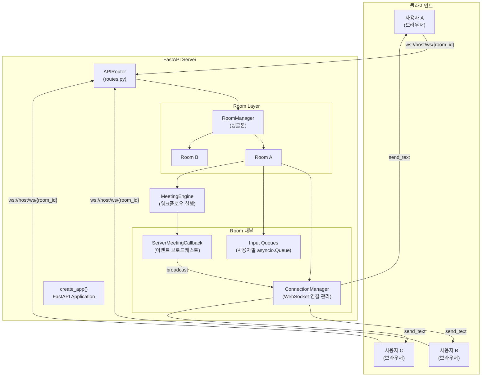
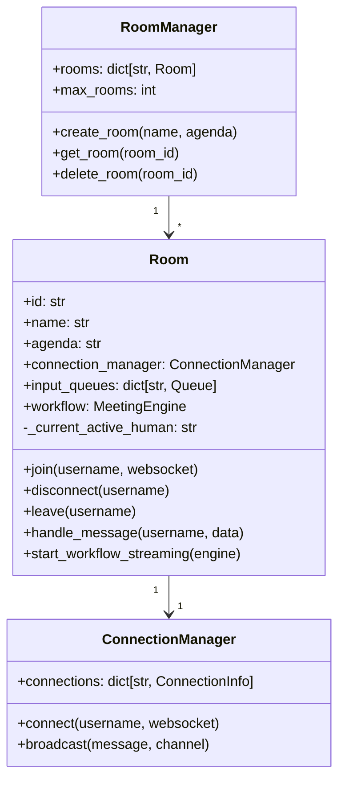
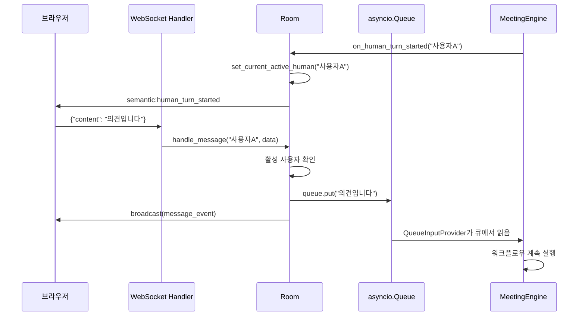
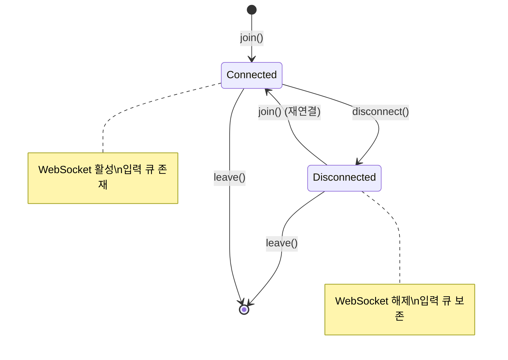
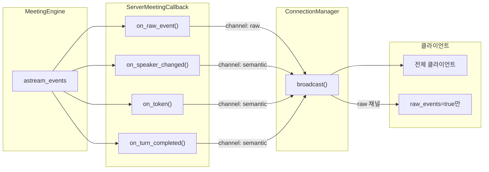
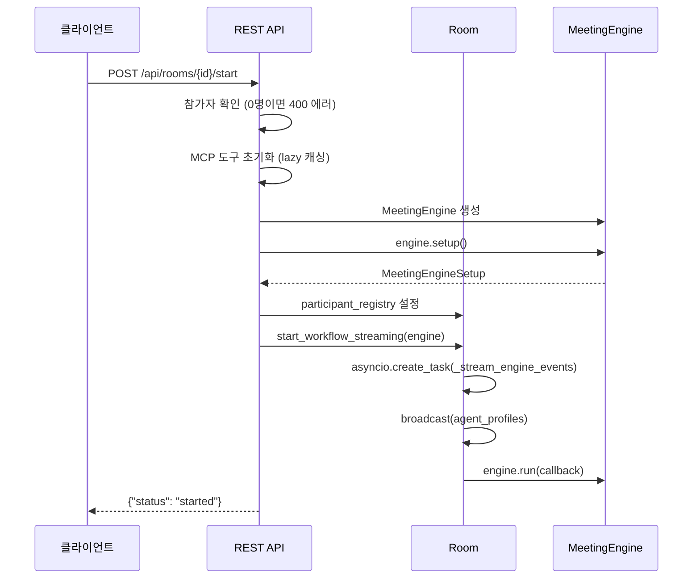

# 서버/WebSocket 아키텍처

Doorae 서버는 FastAPI 기반의 WebSocket 서버로, 여러 사용자가 브라우저에서 AI 회의에 실시간으로 참여할 수 있게 합니다. 이 문서에서는 서버의 내부 구조, Room 기반 격리 모델, 이벤트 시스템의 설계 의도를 설명합니다.

## 아키텍처 개요



## FastAPI 애플리케이션 팩토리

서버 인스턴스는 `create_app()` 팩토리 함수를 통해 생성됩니다. 테스트 환경에서의 의존성 주입과 설정 분리를 위해 팩토리 패턴을 채택했습니다.

```python
# doorae/server/app.py
def create_app() -> FastAPI:
    app = FastAPI(
        title="Doorae Server",
        description="WebSocket 기반 AI 회의 채팅 서버",
    )
    app.add_middleware(CORSMiddleware, ...)
    app.include_router(router)
    app.mount("/static", StaticFiles(...))
    return app
```

!!! note "CORS 설정"
    현재 개발 단계에서는 `allow_origins=["*"]`로 모든 출처를 허용합니다. 프로덕션 배포 시에는 허용 도메인을 명시적으로 제한해야 합니다.

## REST API: Room 관리

회의방의 생성, 조회, 삭제는 REST API로 처리됩니다. WebSocket 연결 전에 먼저 Room을 생성해야 합니다.

| 메서드 | 경로 | 설명 |
|--------|------|------|
| `POST` | `/api/rooms` | 회의방 생성 |
| `GET` | `/api/rooms` | 전체 회의방 목록 조회 |
| `GET` | `/api/rooms/{room_id}` | 특정 회의방 정보 조회 |
| `DELETE` | `/api/rooms/{room_id}` | 회의방 삭제 |
| `POST` | `/api/rooms/{room_id}/start` | AI 워크플로우 시작 |

## WebSocket 연결 관리

### ConnectionManager

`ConnectionManager`는 하나의 Room 내에서 WebSocket 연결을 추적하고 메시지를 전송하는 책임을 가집니다.

```python
# doorae/server/connection_manager.py
@dataclass(slots=True)
class ConnectionInfo:
    websocket: WebSocket
    raw_events: bool = True  # raw LangGraph 이벤트 수신 여부

class ConnectionManager:
    connections: Dict[str, ConnectionInfo]  # username -> 연결 정보
```

핵심 메서드:

| 메서드 | 역할 |
|--------|------|
| `connect()` | WebSocket 수락, 기존 연결이 있으면 교체 |
| `disconnect()` | 연결 정보 제거 |
| `send_personal_message()` | 특정 사용자에게 메시지 전송 |
| `broadcast()` | 모든 연결에 메시지 브로드캐스트 |

!!! tip "채널 기반 브로드캐스트"
    `broadcast()` 메서드는 `channel` 파라미터(`"all"`, `"semantic"`, `"raw"`)를 지원합니다. `raw_events=False`로 연결한 클라이언트는 `"raw"` 채널 메시지를 수신하지 않습니다. 이를 통해 디버깅 용도의 상세 이벤트와 UI 표시용 이벤트를 분리할 수 있습니다.

### 연결 안정성

브로드캐스트 중 개별 연결이 실패해도 나머지 전송은 계속됩니다. 실패한 연결은 별도로 수집한 뒤 순회가 끝난 후 정리합니다:

```python
async def broadcast(self, message: str, channel: str = "all"):
    disconnected: list[tuple[str, ConnectionInfo]] = []
    for username, connection in list(self.connections.items()):
        # 스냅샷 기반 순회 - 동시 변경 안전
        try:
            await connection.websocket.send_text(message)
        except Exception:
            disconnected.append((username, connection))
    # 실패한 연결 정리
    for username, connection in disconnected:
        self.disconnect(username)
```

## Room 기반 회의 격리

### Room 구조

각 Room은 독립적인 회의 공간으로, 자체 ConnectionManager, 입력 큐, 워크플로우를 가집니다.



### RoomManager 싱글톤

`RoomManager`는 싱글톤 패턴으로 구현되어 전체 서버에서 하나의 인스턴스만 존재합니다. 서버 설정의 `max_rooms`에 따라 동시 회의방 수를 제한합니다.

```python
# doorae/server/room_manager.py
_room_manager_instance: Optional[RoomManager] = None

def get_room_manager() -> RoomManager:
    global _room_manager_instance
    if _room_manager_instance is None:
        _room_manager_instance = RoomManager()
    return _room_manager_instance
```

### 입력 큐 시스템

사용자가 WebSocket으로 보낸 메시지는 `asyncio.Queue`를 통해 MeetingEngine으로 전달됩니다. 이 큐 기반 설계 덕분에 LangGraph 워크플로우의 human-in-the-loop 패턴과 자연스럽게 통합됩니다.



!!! warning "발언 순서 제어"
    `_current_active_human` 필드를 통해 현재 발언 차례인 사용자만 입력할 수 있습니다. 차례가 아닌 사용자의 메시지는 거부되며, 에러 이벤트가 해당 사용자에게만 전송됩니다.

## 연결 수명주기

### 입장 (Join)

사용자가 WebSocket으로 연결하면 다음 과정을 거칩니다:

1. 입력 큐 생성 (또는 기존 큐 재사용)
2. WebSocket 연결 수락 및 `ConnectionManager`에 등록
3. 워크플로우가 진행 중이면 participant registry에 프로필 추가
4. 기존 참가자 목록을 새 입장자에게 전송 (`participants_list`)
5. 회의 진행 중이면 현재 상태 snapshot 전송 (`state_snapshot`)
6. 전체 참가자에게 입장 알림 브로드캐스트

### 재연결 (Reconnect)

입력 큐가 이미 존재하는 사용자가 다시 연결하면 **재연결**으로 처리됩니다. 새 입장 대신 `participant_status_changed` (status: `"idle"`)와 재연결 시스템 메시지가 브로드캐스트됩니다.

### 연결 해제 (Disconnect)

WebSocket 연결이 끊기면 연결만 해제하고 **입력 큐는 보존**합니다. 이를 통해 네트워크 불안정 시 재연결이 가능합니다.

### 퇴장 (Leave)

명시적 퇴장 시에는 입력 큐에 `None`을 넣어 워크플로우에 퇴장을 알리고, 큐를 완전히 제거합니다.



## 이벤트 시스템

### 이벤트 유형

서버가 클라이언트에 전송하는 이벤트는 세 가지 카테고리로 나뉩니다:

#### 기본 이벤트

| type | 설명 | 예시 |
|------|------|------|
| `message` | 사용자 채팅 메시지 | `{"content": "...", "sender": "사용자A"}` |
| `system` | 시스템 알림 | 입장/퇴장, 워크플로우 시작 등 |
| `error` | 에러 메시지 | JSON 파싱 실패, 발언 순서 오류 등 |

#### Semantic 이벤트

MeetingEngine의 콜백에서 생성되는 구조화된 이벤트입니다. `type`은 `semantic:` 접두사를 가집니다.

| type | 설명 |
|------|------|
| `semantic:speaker_changed` | 발언자 변경 |
| `semantic:token` | LLM 스트리밍 토큰 |
| `semantic:turn_completed` | 발언 완료 |
| `semantic:human_turn_started` | 사용자 입력 차례 시작 |
| `semantic:agenda_updated` | 안건 상태 변경 |
| `semantic:meeting_ended` | 회의 종료 |
| `semantic:pending_speakers_changed` | 대기 발언자 목록 변경 |
| `semantic:participant_status_changed` | 참가자 상태 변경 (idle/speaking/tool_calling) |
| `semantic:tool_call` | MCP 도구 호출 시작/종료 |
| `semantic:user_joined` | 사용자 입장 |
| `semantic:participants_list` | 기존 참가자 목록 (신규 입장자용) |
| `semantic:agent_profiles` | AI 에이전트 프로필 정보 |
| `semantic:state_snapshot` | 회의 중간 합류 시 현재 상태 |

#### Raw 이벤트

LangGraph의 `astream_events`에서 직접 변환된 이벤트입니다. 디버깅 및 고급 클라이언트에서 사용됩니다.

### 이벤트 흐름



### ServerMeetingCallback

`ServerMeetingCallback`은 `MeetingEngineCallback` 프로토콜을 구현하여 MeetingEngine의 이벤트를 WebSocket 브로드캐스트로 변환합니다. Room 인스턴스에 대한 참조를 가지고 있어, human turn 관리 등의 Room 상태 업데이트도 함께 수행합니다.

```python
class ServerMeetingCallback:
    async def on_turn_completed(self, speaker: str, is_delegated: bool) -> None:
        # human turn 완료 시 활성 사용자 초기화
        if not is_delegated and self._room._current_active_human == speaker:
            self._room.clear_current_active_human()
        await self._broadcast_event("turn_completed", speaker=speaker, ...)
```

## 워크플로우 시작 과정

`POST /api/rooms/{room_id}/start` 요청 시 다음 과정이 실행됩니다:



!!! info "MCP 도구 캐싱"
    MCP 도구 초기화는 서버 시작 후 첫 워크플로우 실행 시 한 번만 수행되며, 이후에는 캐시된 결과를 재사용합니다. 초기화 실패 시에도 빈 도구 목록으로 회의를 진행할 수 있습니다.

## 관련 파일

| 파일 | 역할 |
|------|------|
| `doorae/server/app.py` | FastAPI 애플리케이션 팩토리 |
| `doorae/server/routes.py` | REST API + WebSocket 엔드포인트 정의 |
| `doorae/server/room.py` | Room 클래스, ServerMeetingCallback |
| `doorae/server/room_manager.py` | RoomManager 싱글톤 |
| `doorae/server/connection_manager.py` | WebSocket 연결 관리 |
| `doorae/server/events.py` | 이벤트 포맷팅 유틸리티 |
| `doorae/server/config.py` | 서버 설정 (max_rooms 등) |
