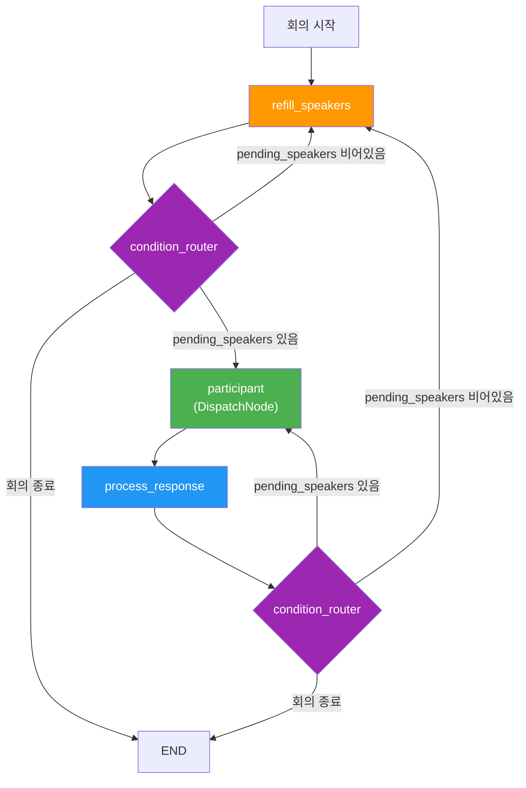
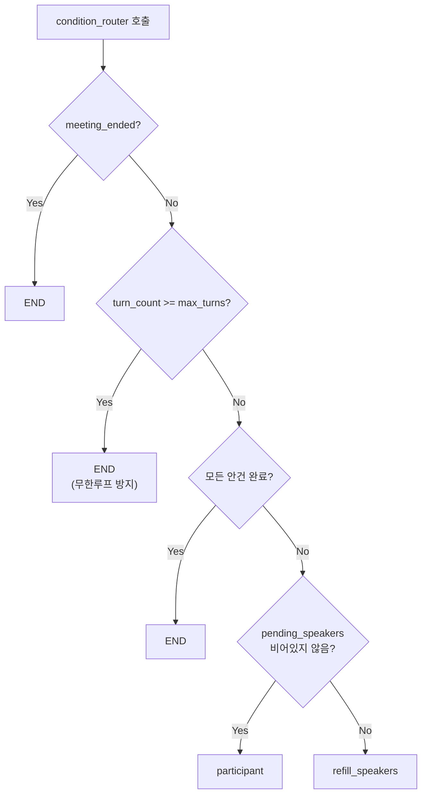
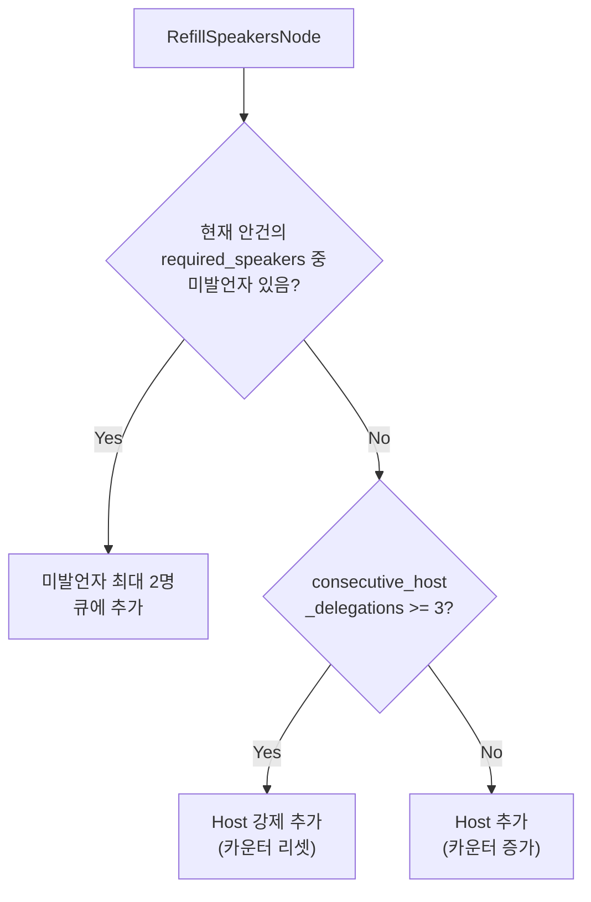
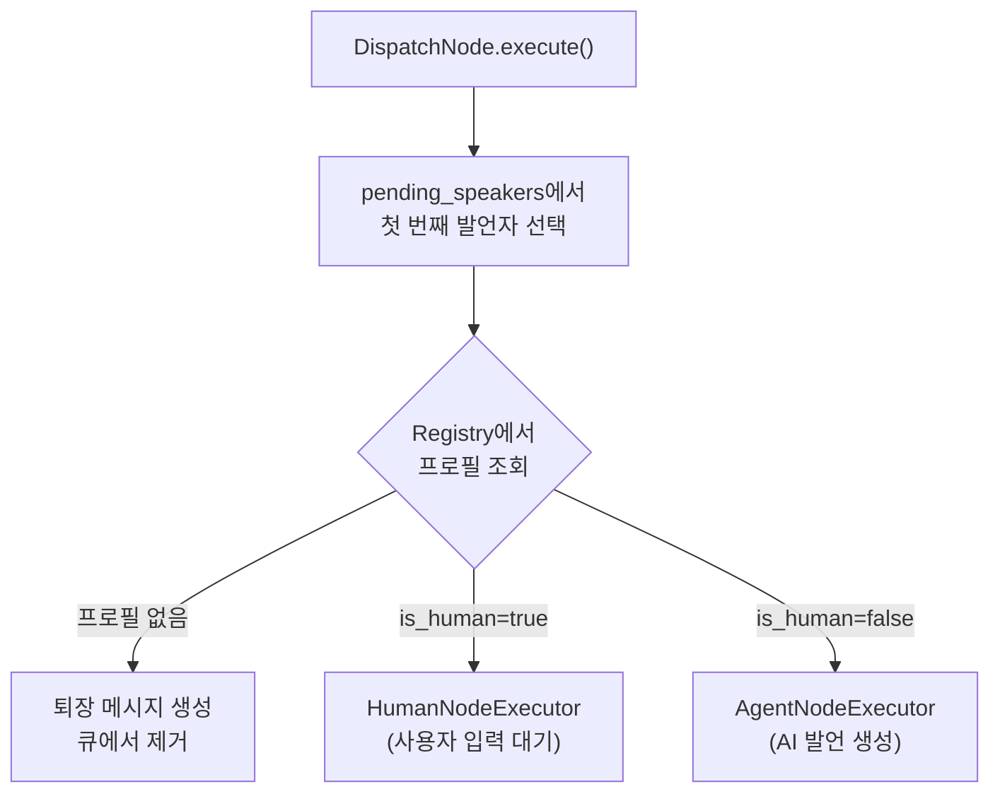

# 발언자 큐와 라우팅

Doorae의 회의는 누가, 언제, 어떤 순서로 발언하는지를 결정하는 라우팅 시스템에 의해 진행됩니다. 이 문서에서는 발언자 큐의 동작 원리, 라우팅 의사결정 로직, 그리고 각 구성요소의 역할을 설명합니다.

## 핵심 설계 원칙

Doorae의 라우팅 시스템은 **LLM 호출 없이 상태만으로** 다음 발언자를 결정합니다. 이는 의도적인 설계 결정입니다:

!!! info "왜 LLM 기반 라우팅을 사용하지 않는가"
    초기에는 LLM이 "누가 다음에 발언할지" 판단하는 방식을 고려했으나, 매 턴마다 추가 LLM 호출이 발생하여 비용과 지연 시간이 급증했습니다. 현재의 상태 기반 라우팅은 O(1) 시간 복잡도로 동작하며, LLM 호출 비용이 전혀 들지 않습니다.

## 전체 워크플로우



## 발언자 큐 (`pending_speakers`)

`MeetingState`의 `pending_speakers` 필드는 발언 대기 중인 에이전트 이름의 리스트입니다.

```python
class MeetingState(MessagesState):
    pending_speakers: List[str] = []  # ["PM", "TechLead", ...]
```

이 큐는 FIFO(선입선출) 방식으로 동작합니다:

- **앞에서 꺼냄**: `DispatchNode`가 `pending[0]`을 발언자로 선택
- **뒤에 추가**: 멘션된 에이전트가 큐 끝에 추가
- **앞에 삽입**: Host 체크인은 `insert(0, HOST_ROLE_NAME)`으로 우선 삽입

### 큐 변경이 발생하는 시점

| 시점 | 동작 | 담당 노드 |
|------|------|-----------|
| 큐 비었을 때 | required_speakers 중 미발언자 추가 | `RefillSpeakersNode` |
| 발언 완료 후 | 현재 발언자를 큐에서 제거 | `ProcessResponseNode` |
| `@멘션` 감지 | 멘션된 에이전트를 큐에 추가 | `ProcessResponseNode` |
| Host 체크인 주기 | Host를 큐 앞에 삽입 | `ProcessResponseNode` |
| 안건 전환 시 | 큐 전체 초기화 | `ProcessResponseNode` |

## ParticipantRegistry

`ParticipantRegistry`는 회의에 참여 중인 에이전트들의 런타임 레지스트리입니다.

```python
class ParticipantRegistry:
    def __init__(self, profiles=None):
        self._profiles: dict[str, AgentProfile] = {}
        self._human_name_lookup: dict[str, str] = {}

    def add(self, profile: AgentProfile) -> None: ...
    def remove(self, name: str) -> None: ...
    def get(self, name: str) -> AgentProfile | None: ...
    def is_human(self, name: str) -> bool: ...
    def all_names(self) -> list[str]: ...
```

Registry는 다음과 같은 역할을 수행합니다:

- **참여자 조회**: `DispatchNode`가 발언자의 프로필을 찾아 적절한 executor(AI vs Human)로 위임
- **유효성 검증**: `RefillSpeakersNode`가 required_speakers를 채울 때 실제 존재하는 참여자만 필터링
- **동적 참여**: `add()`/`remove()`로 회의 중 참여자 추가/퇴장 가능
- **Human 구분**: `is_human()` 메서드로 실제 사용자와 AI 에이전트를 구분

!!! note "Human Name Lookup"
    `_human_name_lookup`은 사용자 이름의 대소문자 무관 조회를 위한 딕셔너리입니다. `"chulsoo"` -> `"Chulsoo"` 매핑을 유지합니다.

## condition_router: 라우팅 의사결정

`doorae/graph/nodes/router.py`의 `condition_router()`는 워크플로우의 분기점에서 다음 노드를 결정합니다.

```python
def condition_router(state: MeetingState) -> str:
    # 우선순위 순서로 체크
    if meeting_ended:        return END
    if turn_count >= max_turns: return END
    if current_idx >= len(agendas): return END
    if pending:              return "participant"
    return "refill_speakers"
```

### 라우팅 우선순위



1. **회의 종료 플래그**: `meeting_ended=True`이면 즉시 종료. Host의 종료 커맨드에 의해 설정됩니다.
2. **최대 턴 수**: `max_turns`(기본 1000) 초과 시 강제 종료. 무한루프 방지 안전장치입니다.
3. **안건 완료**: 모든 안건이 처리되었으면 종료.
4. **발언자 존재**: 큐에 대기자가 있으면 `participant` 노드로.
5. **큐 비어있음**: `refill_speakers` 노드에서 큐를 채우도록 위임.

!!! warning "max_turns 안전장치"
    `max_turns`는 `Settings`에서 기본값 1000으로 설정됩니다. 이 값은 에이전트들의 무한 대화를 방지하는 최후의 안전장치입니다. 일반적인 회의는 이 한도에 도달하지 않습니다.

## RefillSpeakersNode: 큐 채우기

`pending_speakers`가 비었을 때 동작하는 노드입니다.



### 동작 로직

**1차: 미발언자 우선 배정**

```python
remaining = [s for s in required_speakers if s not in already_spoken]
if remaining:
    return {"pending_speakers": remaining[:2]}  # 최대 2명씩
```

안건의 `required_speakers` 중 아직 `speaker_counts`에 없는 에이전트를 최대 2명까지 큐에 추가합니다.

**2차: Host 위임**

모든 required_speakers가 발언을 마쳤으면 Host에게 위임합니다. Host는 안건을 마무리하거나 추가 논의를 유도합니다.

**무한루프 방지**: `consecutive_host_delegations`가 3회 연속에 도달하면 카운터를 리셋하고 Host를 강제 추가합니다. 이는 Host도 계속 위임만 하는 교착 상태를 방지합니다.

## ProcessResponseNode: 응답 후 큐 관리

에이전트 발언 후 `ProcessResponseNode`가 다음 처리를 수행합니다.

### 멘션 기반 큐 업데이트

```python
# 1. 현재 발언자를 큐에서 제거
new_pending = [s for s in pending if s != speaker_name]

# 2. @멘션 추출
mentions = await self._extract_mentions(last_msg)

# 3. 멘션된 에이전트를 큐에 추가 (중복 제외)
for m in mentions:
    if m not in new_pending and m != speaker_name:
        new_pending.append(m)
```

멘션 추출은 두 단계로 이루어집니다:

| 메시지 유형 | 추출 방식 | 예시 |
|-------------|-----------|------|
| AIMessage | `@Name` 정규식 매칭 | `@PM 의견 부탁드립니다` |
| HumanMessage | 자연어 이름 매칭 + LLM fallback | `PM에게 확인해봐` |

!!! info "AI 에이전트의 @멘션 의무"
    AI 에이전트는 다른 에이전트의 의견이 필요할 때 반드시 `@Name` 형식을 사용하도록 시스템 프롬프트에서 지시받습니다. 이는 정규식만으로 정확한 멘션 추출을 가능하게 합니다.

### Host 체크인 삽입

```python
interval = settings.host_checkin_interval  # 기본 10턴

if (interval > 0
    and agenda_turns % interval == 0
    and speaker_name != HOST_ROLE_NAME
    and HOST_ROLE_NAME not in new_pending):
    new_pending.insert(0, HOST_ROLE_NAME)
```

`host_checkin_interval`(기본 10턴)마다 Host를 큐 **맨 앞에** 삽입합니다. 이를 통해 Host가 주기적으로 토론 현황을 파악하고 중재할 수 있습니다.

### 안건 전환

Host가 안건 완료 키워드("다음 안건", "마무리", "결론" 등)를 발언하면:

```python
if self._detect_agenda_completion(content):
    new_agendas[current_idx]["status"] = "completed"
    new_idx = current_idx + 1
    new_counts = {speaker_name: 1}  # 발언 카운트 리셋
    new_pending = []                 # 큐 초기화
```

발언 카운트와 큐가 모두 초기화되며, 새 안건의 required_speakers로 큐가 다시 채워집니다.

## DispatchNode: 발언자에게 턴 전달

`DispatchNode`는 `pending_speakers[0]`을 꺼내서 적절한 executor에게 위임합니다.



`ParticipantRegistry`에서 프로필을 조회하여:

- **프로필 없음**: 퇴장한 참여자로 간주하고 시스템 메시지 생성
- **Human**: `HumanNodeExecutor`가 CLI/TUI에서 사용자 입력을 받음
- **AI Agent**: `AgentNodeExecutor`가 LLM을 호출하여 발언 생성

## 전체 턴 사이클 예시

1인 회의의 첫 안건에 `required_speakers: [PM, TechLead]`가 설정된 경우:

```
[Turn 0] refill_speakers → pending: [PM, TechLead]
[Turn 1] condition_router → "participant" (PM)
         DispatchNode → PM 발언: "이번 스프린트에서 @TechLead 기술 검토 부탁합니다."
         ProcessResponseNode → pending: [TechLead] (PM 제거, TechLead는 이미 있으므로 중복 미추가)
[Turn 2] condition_router → "participant" (TechLead)
         DispatchNode → TechLead 발언: "검토 완료했습니다. @Host 다음 안건으로 넘어가도 좋겠습니다."
         ProcessResponseNode → pending: [Host]
[Turn 3] condition_router → "participant" (Host)
         DispatchNode → Host 발언: "좋습니다. 이 안건은 여기까지 정리하겠습니다. 다음 안건으로..."
         ProcessResponseNode → 안건 완료 감지 → pending: [], speaker_counts 리셋
[Turn 4] condition_router → "refill_speakers"
         refill_speakers → 다음 안건의 required_speakers로 큐 채우기
```

## 관련 상태 필드

| 필드 | 타입 | 용도 |
|------|------|------|
| `pending_speakers` | `List[str]` | 발언 대기 큐 |
| `speaker_counts` | `Dict[str, int]` | 현재 안건 발언 횟수 |
| `turn_count` | `int` | 전체 턴 카운트 |
| `max_turns` | `int` | 최대 턴 수 (기본 1000) |
| `current_agenda_idx` | `int` | 현재 안건 인덱스 |
| `current_agenda_start_turn` | `int` | 현재 안건 시작 턴 |
| `consecutive_host_delegations` | `int` | 연속 Host 위임 횟수 |
| `meeting_ended` | `bool` | 회의 종료 플래그 |
