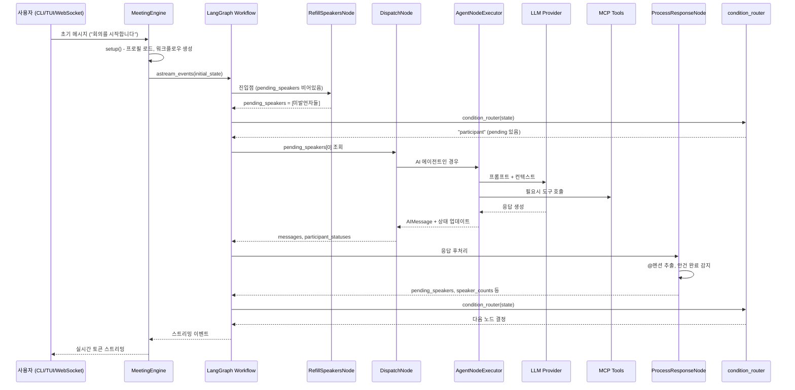
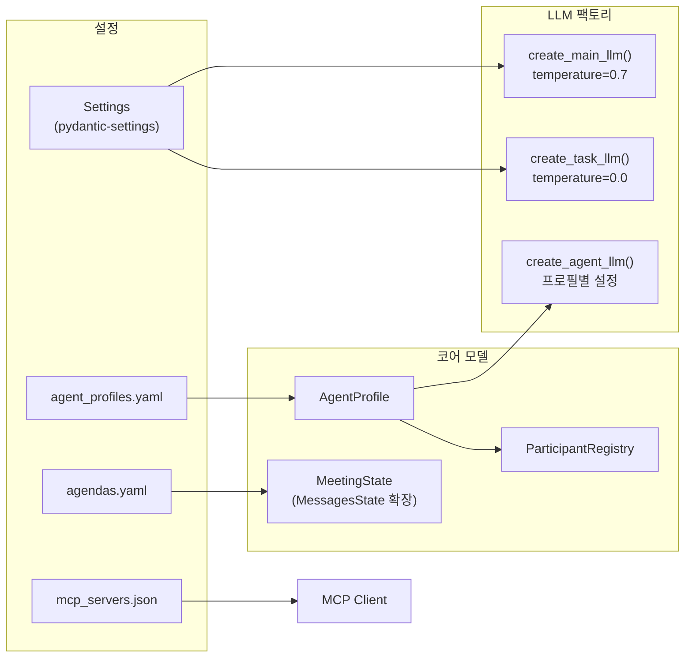

# System Overview

이 문서는 사용자의 입력이 어떻게 AI 에이전트의 발언으로 변환되는지, 전체 데이터 흐름을 설명한다.

## 데이터 흐름

## 컴포넌트 관계

## 계층 구조

Doorae는 5개의 명확한 계층으로 구성된다.

### 1. 인터페이스 계층 (`doorae/interfaces/`, `doorae/server/`)

사용자와의 접점. CLI, TUI, WebSocket Server 세 가지 어댑터가 존재하며, 모두 동일한 `MeetingEngine`을 사용한다.

- **CLI** (`cli.py`): 터미널 기반, `CliInputProvider`로 stdin 입력
- **TUI** (`tui.py`): Textual 프레임워크 기반 리치 UI, `TuiInputProvider`로 이벤트 기반 입력
- **Server** (`server/`): FastAPI + WebSocket, `QueueInputProvider`로 비동기 큐 입력

### 2. 엔진 계층 (`doorae/interfaces/engine.py`)

`MeetingEngine` 클래스가 워크플로우 설정과 이벤트 디스패치를 담당한다. `MeetingEngineCallback` Protocol을 통해 인터페이스 계층에 이벤트를 전달한다.

### 3. 그래프 계층 (`doorae/graph/`)

LangGraph `StateGraph`를 구성하고 실행한다. 핵심 파일:

| 파일 | 역할 |
|------|------|
| `workflow.py` | `create_meeting_workflow()` -- 그래프 빌드 |
| `state.py` | `MeetingState` -- 공유 상태 스키마 |
| `nodes/` | 각 노드 구현 |
| `mediation.py` | Host 중재 컨텍스트 생성 |

### 4. 에이전트 계층 (`doorae/agents/`)

`BaseAgent`가 LLM과 MCP 도구를 통합한다. tool-calling 루프(최대 50회 반복)를 내장하여 도구 호출 → 결과 수집 → 최종 응답 생성까지를 자체 처리한다.

### 5. 코어 계층 (`doorae/core/`, `doorae/config/`)

프로필 시스템, 설정 관리, 날짜 컨텍스트 등 도메인 독립적 기반 코드.

## 실행 모드

| 모드 | 명령어 | InputProvider | 특징 |
|------|--------|---------------|------|
| CLI | `doorae run` | `CliInputProvider` | 터미널 stdin, prompt_toolkit |
| TUI | `doorae run` (기본) | `TuiInputProvider` | Textual 위젯, asyncio.Event 동기화 |
| Server | `doorae serve` | `QueueInputProvider` | asyncio.Queue, WebSocket 브릿지 |
