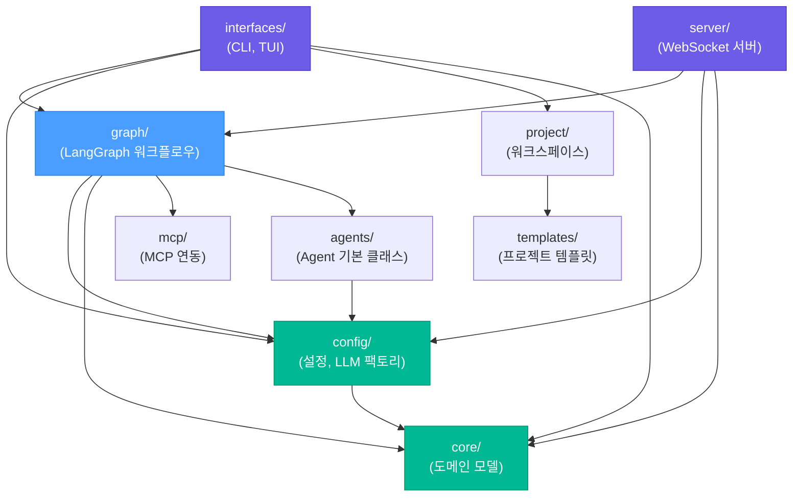

# 코드 구조

Doorae 프로젝트의 패키지 구조와 각 모듈의 역할을 설명합니다.

## 최상위 디렉토리

```
thetable/
├── doorae/              # 메인 Python 패키지
├── tests/               # 테스트 (doorae/ 구조를 미러링)
├── docs/                # MkDocs 문서
├── config/              # MCP 서버 설정 등 외부 설정 파일
├── pyproject.toml       # 프로젝트 메타데이터 및 의존성
└── .env                 # 환경 변수 (gitignore 대상)
```

## 패키지 구조

```
doorae/
├── __init__.py          # 패키지 루트, PROJECT_ROOT 상수
├── __main__.py          # python -m doorae 진입점
├── agents/              # Agent 기본 클래스
├── config/              # 설정 및 LLM 팩토리
├── core/                # 핵심 도메인 모델
├── graph/               # LangGraph 워크플로우
├── interfaces/          # 사용자 인터페이스 (CLI, TUI)
├── mcp/                 # MCP 서버 연동
├── project/             # 워크스페이스/프로젝트 관리
├── server/              # WebSocket 채팅 서버
├── static/              # 웹 UI 정적 파일
└── templates/           # 프로젝트 템플릿
```

## 패키지 상세

### `core/` - 핵심 도메인 모델

회의 시스템의 기본 데이터 모델과 유틸리티를 담당합니다.

| 파일 | 역할 |
|------|------|
| `profile.py` | `AgentProfile`, `AgentLLMConfig` - 에이전트 프로필 정의 및 로드 |
| `agenda.py` | 회의 안건(agenda) 데이터 모델 |
| `date_context.py` | 날짜/시간 컨텍스트 생성 |
| `text_utils.py` | 텍스트 처리 유틸리티 |
| `server_address.py` | 서버 주소 파싱 |

### `config/` - 설정 관리

애플리케이션 설정과 LLM 인스턴스 생성을 관리합니다.

| 파일 | 역할 |
|------|------|
| `settings.py` | `Settings` - Pydantic Settings 기반 설정 클래스 |
| `llm_factory.py` | `create_main_llm()`, `create_agent_llm()` 등 LLM 팩토리 |
| `tracing.py` | LangSmith 트레이싱 설정 |

### `graph/` - LangGraph 워크플로우

LangGraph 기반의 회의 워크플로우를 정의합니다. Doorae의 핵심 로직입니다.

| 파일 | 역할 |
|------|------|
| `workflow.py` | 메인 워크플로우 그래프 정의 |
| `state.py` | `MeetingState` - 워크플로우 상태 정의 |
| `mediation.py` | Host의 발언 중재 로직 |
| `prompts.py` | LLM 프롬프트 템플릿 |
| `constants.py` | 워크플로우 상수 |
| `input_provider.py` | 사용자 입력 제공자 |
| `sub_agent_tool.py` | Sub-agent 도구 정의 |
| `agenda_tools.py` | 안건 관련 도구 |
| `participant_registry.py` | 참가자 레지스트리 |

#### `graph/nodes/` - 워크플로우 노드

```
graph/nodes/
├── __init__.py    # 노드 export
├── base.py        # 노드 기본 클래스
├── agent.py       # Agent 발언 노드
├── human.py       # 사람 입력 노드
├── process.py     # 메시지 처리 노드
├── dispatch.py    # 발언자 결정 노드
├── router.py      # 라우팅 노드
├── summarize.py   # 요약 노드
├── refill.py      # 안건 보충 노드
├── registry.py    # 노드 레지스트리
└── utils.py       # 노드 유틸리티
```

### `interfaces/` - 사용자 인터페이스

CLI와 TUI(Terminal User Interface) 두 가지 인터페이스를 제공합니다.

| 파일 | 역할 |
|------|------|
| `cli.py` | Typer 기반 CLI 명령어 정의 (`doorae` 엔트리포인트) |
| `engine.py` | 회의 실행 엔진 |
| `tui.py` | Textual 기반 TUI 애플리케이션 |
| `tui_ws_client.py` | TUI용 WebSocket 클라이언트 |
| `event_utils.py` | 이벤트 처리 유틸리티 |
| `logging.py` | 로깅 설정 |
| `time_utils.py` | 시간 관련 유틸리티 |

### `server/` - WebSocket 서버

FastAPI/WebSocket 기반의 실시간 회의 채팅 서버입니다.

| 파일 | 역할 |
|------|------|
| `app.py` | FastAPI 앱 팩토리 |
| `routes.py` | HTTP/WebSocket 라우트 |
| `room.py` | 회의방 로직 (LangGraph 워크플로우 실행) |
| `room_manager.py` | 회의방 관리자 |
| `connection_manager.py` | WebSocket 연결 관리 |
| `events.py` | 서버 이벤트 정의 |
| `models.py` | 서버 데이터 모델 |
| `config.py` | 서버 설정 |

### `mcp/` - MCP 서버 연동

[Model Context Protocol](https://modelcontextprotocol.io/) 서버 설정 로드 및 도구 관리를 담당합니다.

| 파일 | 역할 |
|------|------|
| `__init__.py` | `load_mcp_config()`, `collect_tools_by_server()` - 설정 로드 및 도구 수집 |
| `cache.py` | MCP 도구 캐시 |

### `agents/` - Agent 기본 클래스

AI 에이전트의 공통 기본 클래스를 정의합니다.

| 파일 | 역할 |
|------|------|
| `base_agent.py` | Agent 추상 기본 클래스 |

### `project/` - 워크스페이스/프로젝트 관리

Doorae CLI의 워크스페이스와 프로젝트 구조를 관리합니다.

| 파일 | 역할 |
|------|------|
| `models.py` | `ProjectConfig`, `WorkspaceConfig`, `ProjectPaths` 등 데이터 모델 |
| `service.py` | `init_workspace()`, `create_project()`, `resolve_project_run()` - 비즈니스 로직 |

### `templates/` - 프로젝트 템플릿

`doorae new` 명령으로 생성되는 프로젝트의 기본 템플릿입니다.

```
templates/
└── default/
    ├── .env.example    # 환경 변수 예시
    └── config/         # 기본 설정 파일
```

### `static/` - 정적 파일

서버의 웹 UI에서 사용하는 HTML 파일입니다.

| 파일 | 역할 |
|------|------|
| `index.html` | 메인 웹 UI |
| `chat-smoke.html` | 채팅 스모크 테스트 페이지 |

## 패키지 의존성



### 의존성 흐름 설명

1. **`interfaces/`** (CLI, TUI)는 최상위 계층으로, 사용자 입력을 받아 `graph/`와 `project/`를 실행합니다
2. **`server/`**는 WebSocket을 통해 `graph/` 워크플로우를 실행하는 또 다른 진입점입니다
3. **`graph/`**는 핵심 비즈니스 로직으로, `config/`, `core/`, `mcp/`, `agents/`에 의존합니다
4. **`config/`**와 **`core/`**는 하위 계층으로, 다른 패키지에 의존하지 않거나 최소한의 의존성만 가집니다
5. **`mcp/`**는 외부 MCP 서버와의 연동을 담당하며, `graph/`에서 사용됩니다
6. **`project/`**는 CLI의 워크스페이스 관리에 사용되며, `templates/`에서 기본 파일을 가져옵니다

### 진입점

| 엔트리포인트 | 경로 | 설명 |
|-------------|------|------|
| `doorae` | `doorae.interfaces.cli:app` | 메인 CLI (Typer) |
| `doorae-server` | `doorae.server:main` | 서버 (deprecated, `doorae serve` 사용 권장) |
