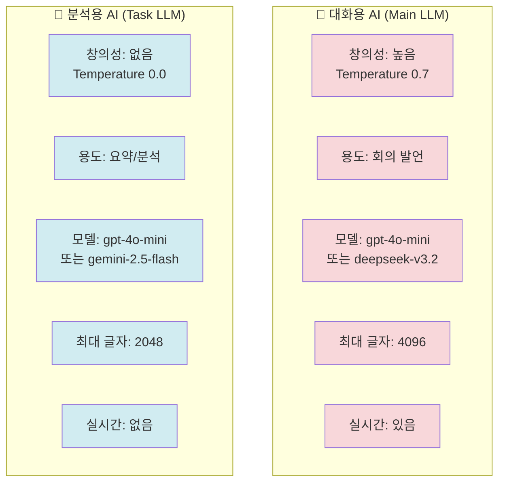
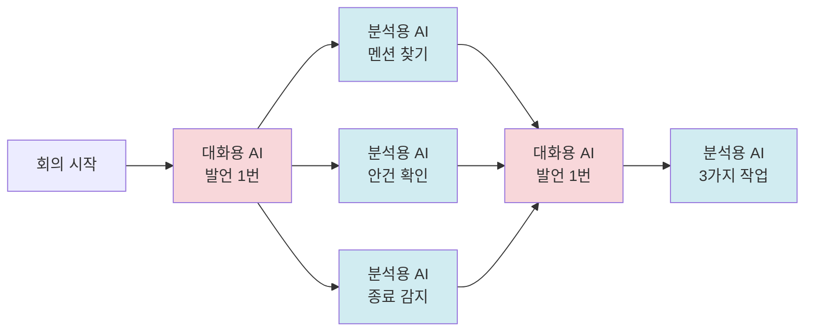
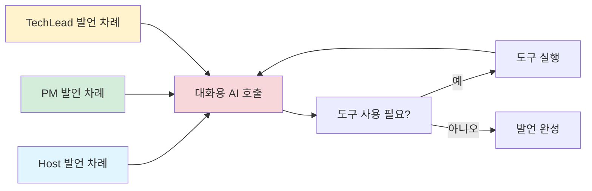
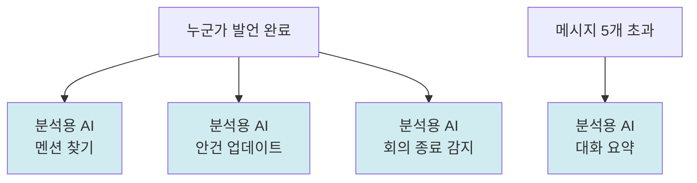

# AI 두뇌의 비밀

> Doorae은 왜 2개의 AI 두뇌를 사용할까요?

---

## 왜 AI가 2개 필요한가요?

회의에서 하는 일을 크게 **2가지**로 나눌 수 있어요.

### 🧠 창의적인 일
- 회의 발언 만들기
- 상황에 맞게 다양하게 표현하기
- 문맥을 이해하고 적절히 반응하기

### 🤖 단순한 일
- 대화 요약하기
- 누구를 언급했는지 찾기
- 안건이 끝났는지 판단하기

> 💡 **쉽게 말하면...**
> 창의적인 일은 실력 좋은 AI가 해야 하지만, 단순한 일은 빠르고 저렴한 AI로도 충분해요. 그래서 2개를 나눠서 사용하면 비용이 약 70% 절약돼요!

---

## 대화용 AI (Main LLM)

### 🧠 역할

**비유**: 발표 전문가

**하는 일**
- Host, PM, TechLead의 회의 발언을 만들어요
- 역할에 맞게 창의적으로 표현해요
- 상황을 파악하고 적절히 반응해요
- 외부 도구를 사용해서 정보를 가져와요

### 특징

**창의성 조절 손잡이 (Temperature)**
- 값: 0.7 (중간보다 조금 높음)
- 의미: 다양하고 창의적인 표현을 사용해요
- 결과: 같은 상황에서도 조금씩 다르게 말해요

**최대 글자 수**
- 값: 4096 단어 조각 (토큰)
- 의미: 충분히 긴 발언을 만들 수 있어요
- 도구 결과도 포함할 수 있어요

**실시간 출력**
- 발언을 만들면서 바로바로 보여줘요
- 기다리지 않아도 돼요

> 🤔 **이해했나요?**
> Q: Temperature가 뭔가요?
> A: 창의성 조절 손잡이예요. 높으면 다양한 표현을 쓰고, 낮으면 비슷한 표현을 반복해요.

---

## 분석용 AI (Task LLM)

### 🤖 역할

**비유**: 문서 정리 담당

**하는 일**
- 대화를 요약해요
- 발언에서 멘션을 찾아요
- 회의 종료 의도를 파악해요
- 새로운 안건을 찾아서 추가해요

### 특징

**창의성 조절 손잡이 (Temperature)**
- 값: 0.0 (최소)
- 의미: 일관되고 예측 가능한 결과를 내놔요
- 결과: 같은 입력이면 항상 같은 결과가 나와요

**최대 글자 수**
- 값: 2048 단어 조각 (토큰)
- 의미: 짧은 답변만 필요해요
- 예: "PM, TechLead", "예/아니오"

**실시간 출력**
- 필요 없어요 (빠르게 결과만 받으면 돼요)

> 💡 **쉽게 말하면...**
> 분석용 AI는 창의성이 필요 없어요. "PM을 언급했나?"라는 질문에는 "예" 또는 "아니오"만 정확하게 답하면 돼요.

---

## 두 AI 비교



### 비교표

| 항목 | 🧠 대화용 AI | 🤖 분석용 AI |
|------|------------|------------|
| **비유** | 발표 전문가 | 문서 정리 담당 |
| **용도** | 회의 발언 생성 | 요약, 멘션 찾기, 안건 분석 |
| **Temperature** | 0.7 (창의적) | 0.0 (일관적) |
| **최대 글자** | 4096 토큰 | 2048 토큰 |
| **실시간 출력** | 있음 | 없음 |
| **속도** | 보통 | 빠름 |
| **비용** | 높음 | 낮음 |

---

## 비용 절약 원리

### 📊 왜 70% 절약될까요?

**분석**
- 회의에서 분석용 AI는 대화용 AI보다 2~3배 더 자주 호출돼요
- 매 발언마다: 멘션 찾기, 안건 업데이트 확인
- 메시지 5개마다: 대화 요약

**계산**
- 분석용 AI를 저렴한 모델로 바꾸면
- 호출 횟수가 많은 작업의 비용이 크게 줄어요
- 전체 비용의 약 70%가 절약돼요

### 비용 절약 흐름



> 💡 **쉽게 말하면...**
> 대화용 AI는 1번 호출될 때, 분석용 AI는 3번 호출돼요. 분석용 AI를 저렴한 것으로 쓰면 비용이 크게 줄어요!

---

## API 키는 출입증이에요

AI를 사용하려면 **API 키 (출입증)**가 필요해요.

### 🔑 API 키란?

**비유**: 출입증

**역할**
- AI 서비스에 접속할 수 있는 비밀번호예요
- 사용한 만큼 요금이 청구돼요
- 다른 사람에게 절대 알려주면 안 돼요

### 설정 방법

**환경변수 파일 (.env)**
- 비밀번호 메모장처럼 API 키를 저장해요
- 여러 AI 서비스를 동시에 사용할 수 있어요

**예시**
```
공통 API 키: OPENAI_API_KEY=sk-...
대화용 전용 키: LLM_MAIN_API_KEY=sk-...
분석용 전용 키: LLM_TASK_API_KEY=sk-...
```

> 🤔 **이해했나요?**
> Q: 왜 API 키를 나눠서 관리하나요?
> A: 대화용 AI와 분석용 AI를 다른 서비스로 쓸 수 있어서 비용을 더 절약할 수 있어요.

---

## 어디서 호출되나요?

### 🧠 대화용 AI 호출 위치



**호출 시점**
- Host, PM, TechLead가 발언할 때
- 도구를 사용할 때마다 (최대 50번 반복)

**특징**
- 회의 참여자의 역할 정보를 함께 전달해요
- 지금까지의 대화 요약을 포함해요
- 사용 가능한 도구 목록을 알려줘요

---

### 🤖 분석용 AI 호출 위치



**호출 시점**
1. 매 발언 후: 멘션 찾기, 안건 업데이트
2. Host 발언 후 (필요시): 회의 종료 감지
3. 메시지 5개 초과: 대화 요약

**특징**
- Temperature 0.0으로 일관된 결과
- 짧은 답변만 요구 (2048 토큰)
- 빠르게 처리해야 해요

---

## 모델 선택 전략

### 대화용 AI - 품질 우선

**권장 모델**
- **OpenAI**: gpt-4o-mini (품질과 비용의 균형)
- **OpenRouter**: deepseek-v3.2 (고품질, 저렴함)
- **로컬**: llama3.1:8b (인터넷 없이 사용)

**선택 기준**
- 다양한 표현을 만들 수 있나요?
- 역할에 맞게 발언할 수 있나요?
- 문맥을 잘 이해하나요?

---

### 분석용 AI - 속도와 비용 우선

**권장 모델**
- **OpenAI**: gpt-4o-mini (안정적)
- **OpenRouter**: gemini-2.5-flash (빠르고 저렴)
- **로컬**: llama3.1:8b (인터넷 없이 사용)

**선택 기준**
- 빠르게 답변하나요?
- 비용이 저렴한가요?
- 일관된 결과를 내나요?

> 💡 **쉽게 말하면...**
> 대화용은 품질이 중요하고, 분석용은 속도와 비용이 중요해요. 그래서 다른 기준으로 모델을 골라요.

---

## 비용 최적화 팁

### 1. 모델 차별화

대화용 AI와 분석용 AI를 다른 서비스로 사용해요.

**예시**
- 대화용: deepseek-v3.2 (품질 좋음, $0.14/M 토큰)
- 분석용: gemini-2.5-flash (빠름, $0.075/M 토큰)
- 절약: 약 70%

### 2. 글자 수 제한

필요한 만큼만 생성해요.

- 대화용: 4096 토큰 (충분한 발언)
- 분석용: 2048 토큰 (짧은 답변)

### 3. 대화 요약

메시지가 쌓이면 자동으로 요약해요.

- 5개 초과 시 자동 요약
- 최근 3개 메시지만 유지
- 긴 회의에서도 비용 일정

### 4. 조건부 호출

꼭 필요할 때만 AI를 호출해요.

- 회의 종료: 키워드로 먼저 확인 (AI 안 씀)
- 안건 80% 완료 시에만 AI로 재확인
- 매번 AI 쓰지 않아서 절약

> 🤔 **이해했나요?**
> Q: 대화 요약을 하면 정보가 없어지지 않나요?
> A: 중요한 내용은 요약문에 남아있고, 최근 메시지도 유지되어서 맥락을 잃지 않아요.

---

## 설정 예시

### OpenRouter 사용 (권장)

```
공통 설정:
- API 키: 하나로 통일
- 주소: https://openrouter.ai/api/v1

대화용 AI:
- 모델: deepseek-v3.2
- Temperature: 0.7

분석용 AI:
- 모델: gemini-2.5-flash
- Temperature: 0.0
```

### 여러 서비스 혼합

```
대화용 AI:
- API 키: OpenRouter 키
- 주소: https://openrouter.ai/api/v1
- 모델: deepseek-v3.2

분석용 AI:
- API 키: Azure OpenAI 키
- 주소: Azure OpenAI 주소
- 모델: gpt-35-turbo
```

---

> 💡 **핵심 정리**
>
> - 2개의 AI를 사용해서 비용을 약 70% 절약해요
> - 대화용 AI는 창의적인 발언을 만들어요 (Temperature 0.7)
> - 분석용 AI는 단순 작업을 빠르게 해요 (Temperature 0.0)
> - API 키는 출입증처럼 AI 서비스에 접속할 때 필요해요
> - 대화 요약과 조건부 호출로 비용을 더 줄여요

---

## 다음 문서

- [mcp-integration.md](./mcp-integration.md): 외부 도구를 어떻게 사용하는지 알아봐요
- [configuration.md](./configuration.md): 설정 파일을 어떻게 수정하는지 배워요
