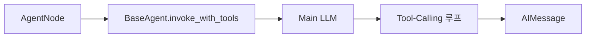
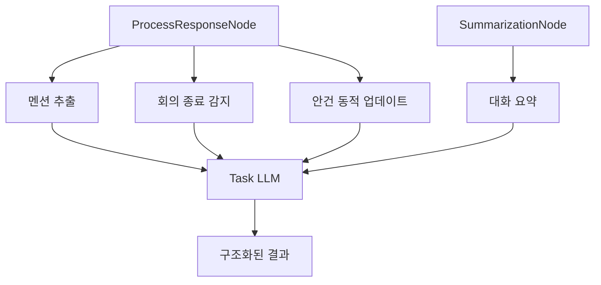

# 2-Tier LLM 아키텍처

## Main LLM vs Task LLM 비교

| 항목 | Main LLM | Task LLM |
|------|----------|----------|
| **용도** | 에이전트 응답 생성 | 유틸리티 작업 (멘션 추출, 안건 분석, 종료 감지) |
| **기본 모델** | gpt-4o-mini (또는 deepseek-v3.2) | gpt-4o-mini (또는 gemini-2.5-flash) |
| **Temperature** | 0.7 (창의성, 맥락 이해) | 0.0 (일관성, 결정성) |
| **최대 토큰** | 4096 | 2048 |
| **스트리밍** | 지원 (`streaming=True`) | 미지원 |
| **사용 노드** | AgentNode, (RefillSpeakersNode - 미사용) | ProcessResponseNode, SummarizationNode, AgendaManager |
| **API 키** | `LLM_MAIN_API_KEY` (fallback: `OPENAI_API_KEY`) | `LLM_TASK_API_KEY` (fallback: `OPENAI_API_KEY`) |
| **Base URL** | `LLM_MAIN_BASE_URL` (fallback: `OPENAI_BASE_URL`) | `LLM_TASK_BASE_URL` (fallback: `OPENAI_BASE_URL`) |

---

## LLM 호출 지점 맵

### Main LLM 호출



**노드**: `AgentNode` (Host, PM, TechLead 등)

**용도**: 회의 발언 생성

**특징**:
- 역할에 맞는 창의적 응답 필요
- MCP 도구 바인딩 (tool-calling 지원)
- 스트리밍 응답 (실시간 표시 가능)

**파일**: `thetable/graph/nodes/agent.py`, `thetable/agents/base_agent.py`

---

### Task LLM 호출



**노드 및 용도**:

1. **ProcessResponseNode**
   - 멘션 추출: 발언에서 언급된 참여자 찾기
   - 회의 종료 감지: Host 발언의 종료 의도 분석
   - 안건 동적 업데이트: 최근 대화에서 안건 추출

2. **SummarizationNode**
   - 대화 요약: 메시지 개수 초과 시 요약 생성

3. **AgendaManager**
   - 안건 분석: `extract_agenda_updates()` 함수

**특징**:
- `temperature=0.0` (일관된 결과 보장)
- 짧은 응답 (최대 2048 토큰)
- Structured Output 사용 (JSON 파싱 오류 최소화)

**파일**:
- `thetable/graph/nodes/process.py`
- `thetable/graph/nodes/summarize.py`
- `thetable/graph/agenda_manager.py`

---

## 팩토리 패턴

### create_main_llm()

**역할**: Main LLM 인스턴스 생성

```python
from thetable.config import create_main_llm

main_llm = create_main_llm(streaming=True)
```

**설정**:
- 모델: `settings.llm_main_model` (기본값 `gpt-4o-mini`)
- Temperature: `settings.llm_main_temperature` (기본값 `0.7`)
- 최대 토큰: `settings.llm_main_max_tokens` (기본값 `4096`)
- API 키: `settings.main_api_key` (fallback: `openai_api_key`)
- Base URL: `settings.main_base_url` (fallback: `openai_base_url`)
- 타임아웃: `settings.llm_timeout` (기본값 `60.0`초)
- 재시도: `settings.llm_max_retries` (기본값 `3`)

**파일**: `thetable/config/llm_factory.py:8-30`

---

### create_task_llm()

**역할**: Task LLM 인스턴스 생성

```python
from thetable.config import create_task_llm

task_llm = create_task_llm()
```

**설정**:
- 모델: `settings.llm_task_model` (기본값 `gpt-4o-mini`)
- Temperature: `settings.llm_task_temperature` (기본값 `0.0`)
- 최대 토큰: `settings.llm_task_max_tokens` (기본값 `2048`)
- API 키: `settings.task_api_key` (fallback: `openai_api_key`)
- Base URL: `settings.task_base_url` (fallback: `openai_base_url`)
- 타임아웃: `settings.llm_timeout` (기본값 `60.0`초)
- 재시도: `settings.llm_max_retries` (기본값 `3`)

**파일**: `thetable/config/llm_factory.py:33-50`

---

## 독립 API 키/Base URL + Fallback 체인

### Fallback 메커니즘

**Main LLM API 키** (`Settings.main_api_key` property):
```python
@property
def main_api_key(self) -> str:
    key = self.llm_main_api_key or self.openai_api_key
    if not key:
        raise ValueError("Main LLM API key is required.")
    return key
```
- `LLM_MAIN_API_KEY` 우선
- 없으면 `OPENAI_API_KEY` 사용
- 둘 다 없으면 예외 발생

**Task LLM API 키** (`Settings.task_api_key` property):
```python
@property
def task_api_key(self) -> str:
    key = self.llm_task_api_key or self.openai_api_key
    if not key:
        raise ValueError("Task LLM API key is required.")
    return key
```
- `LLM_TASK_API_KEY` 우선
- 없으면 `OPENAI_API_KEY` 사용
- 둘 다 없으면 예외 발생

**Base URL** (`Settings.main_base_url`, `Settings.task_base_url` property):
```python
@property
def main_base_url(self) -> Optional[str]:
    return self.llm_main_base_url or self.openai_base_url

@property
def task_base_url(self) -> Optional[str]:
    return self.llm_task_base_url or self.openai_base_url
```
- 전용 Base URL 우선
- 없으면 공통 Base URL 사용
- 둘 다 없으면 OpenAI 공식 엔드포인트 (ChatOpenAI 기본값)

**파일**: `thetable/config/settings.py:56-91`

---

## 모델 선택 전략

### Main LLM - 창의성 우선

**Temperature 0.7**:
- 다양한 표현 생성
- 역할에 맞는 자연스러운 대화
- 안건 맥락 이해 및 반영

**권장 모델**:
- **OpenAI**: gpt-4o-mini (품질/비용 균형)
- **OpenRouter**: deepseek-v3.2 (고품질, 저비용)
- **Ollama**: llama3.1:8b (로컬 실행)

**사용 예시**:
```bash
# .env 파일
LLM_MAIN_API_KEY=sk-...
LLM_MAIN_BASE_URL=https://api.openai.com/v1
LLM_MAIN_MODEL=gpt-4o-mini
LLM_MAIN_TEMPERATURE=0.7
```

---

### Task LLM - 결정성 우선

**Temperature 0.0**:
- 일관된 결과 (동일 입력 → 동일 출력)
- 구조화된 데이터 추출 (멘션, 안건, 종료 의도)
- 예측 가능한 동작

**권장 모델**:
- **OpenAI**: gpt-4o-mini (안정성)
- **OpenRouter**: gemini-2.5-flash (빠른 속도, 저비용)
- **Ollama**: llama3.1:8b (로컬 실행)

**사용 예시**:
```bash
# .env 파일
LLM_TASK_API_KEY=sk-...
LLM_TASK_BASE_URL=https://openrouter.ai/api/v1
LLM_TASK_MODEL=google/gemini-2.5-flash
LLM_TASK_TEMPERATURE=0.0
```

---

## 비용 최적화 전략

### 모델 차별화 (약 70% 비용 절감)

**OpenRouter 사용 예시**:
- **Main LLM**: `deepseek-v3.2` ($0.14/M tokens)
- **Task LLM**: `gemini-2.5-flash` ($0.075/M tokens)

**비용 절감 근거** (LangSmith trace 기반 분석):
- Task LLM 호출 빈도가 Main LLM보다 2-3배 높음
- Task LLM을 저렴한 모델로 대체 시 전체 비용 약 70% 절감
- Main LLM 품질 유지하면서 Task LLM만 최적화

---

### 토큰 제한

**Main LLM**: 4096 토큰
- 충분한 발언 생성 여유
- MCP 도구 결과 포함 가능

**Task LLM**: 2048 토큰
- 짧은 응답만 필요 (멘션: "PM, TechLead", 종료: "예/아니오")
- 불필요한 장문 응답 방지
- 비용 절감

---

### 캐싱 (대화 요약)

**SummarizationNode**:
- 메시지 개수 초과 시 (`max_messages_before_summary=5`) 자동 요약
- 최근 3개 메시지만 유지
- 요약문을 시스템 프롬프트에 포함 → 컨텍스트 윈도우 절약

**효과**:
- 긴 회의에서도 토큰 사용량 일정 유지
- 컨텍스트 윈도우 한계 회피

---

### 조건부 호출

**회의 종료 감지**:
1. 키워드 감지 (LLM 호출 없음)
2. 안건 80% 이상 완료 시에만 LLM 분석 (토큰 절약)

**안건 동적 업데이트**:
- 매 발언마다 최근 10개 메시지만 분석 (전체 대화 분석 불필요)

---

## 설정 유연성

### 단일 Provider 운영

**최소 설정** (.env):
```bash
OPENAI_API_KEY=sk-...
```
- Main/Task LLM 모두 동일 API 키 사용
- 모델만 다르게 설정 가능

---

### 다중 Provider 조합

**OpenAI (Main) + OpenRouter (Task)**:
```bash
# Main LLM - OpenAI
LLM_MAIN_API_KEY=sk-...
LLM_MAIN_MODEL=gpt-4o-mini

# Task LLM - OpenRouter
LLM_TASK_API_KEY=sk-or-v1-...
LLM_TASK_BASE_URL=https://openrouter.ai/api/v1
LLM_TASK_MODEL=google/gemini-2.5-flash
```

---

### 로컬 LLM (Ollama)

**Main + Task 모두 로컬**:
```bash
OPENAI_BASE_URL=http://localhost:11434/v1
LLM_MAIN_MODEL=llama3.1:8b
LLM_TASK_MODEL=llama3.1:8b
LLM_TASK_TEMPERATURE=0.0
```

---

## 환경변수 목록

| 변수 | 기본값 | 설명 |
|------|--------|------|
| `OPENAI_API_KEY` | - | 공통 fallback API 키 |
| `OPENAI_BASE_URL` | - | 공통 fallback Base URL (기본: OpenAI 공식) |
| `LLM_MAIN_API_KEY` | - | Main LLM 전용 API 키 (fallback: `OPENAI_API_KEY`) |
| `LLM_MAIN_BASE_URL` | - | Main LLM 전용 Base URL (fallback: `OPENAI_BASE_URL`) |
| `LLM_MAIN_MODEL` | `gpt-4o-mini` | Main LLM 모델 |
| `LLM_MAIN_TEMPERATURE` | `0.7` | Main LLM temperature |
| `LLM_MAIN_MAX_TOKENS` | `4096` | Main LLM 최대 토큰 |
| `LLM_TASK_API_KEY` | - | Task LLM 전용 API 키 (fallback: `OPENAI_API_KEY`) |
| `LLM_TASK_BASE_URL` | - | Task LLM 전용 Base URL (fallback: `OPENAI_BASE_URL`) |
| `LLM_TASK_MODEL` | `gpt-4o-mini` | Task LLM 모델 |
| `LLM_TASK_TEMPERATURE` | `0.0` | Task LLM temperature |
| `LLM_TASK_MAX_TOKENS` | `2048` | Task LLM 최대 토큰 |
| `LLM_TIMEOUT` | `60.0` | LLM 호출 타임아웃 (초) |
| `LLM_MAX_RETRIES` | `3` | LLM 호출 재시도 횟수 |

---

## 참고 파일

- `thetable/config/llm_factory.py` - create_main_llm, create_task_llm
- `thetable/config/settings.py` - Settings 클래스, fallback property
- `thetable/graph/workflow.py` - 워크플로우 생성 시 LLM 주입
- `thetable/graph/nodes/agent.py` - Main LLM 사용
- `thetable/graph/nodes/process.py` - Task LLM 사용
- `thetable/graph/nodes/summarize.py` - Task LLM 사용
- `thetable/graph/agenda_manager.py` - Task LLM 사용
