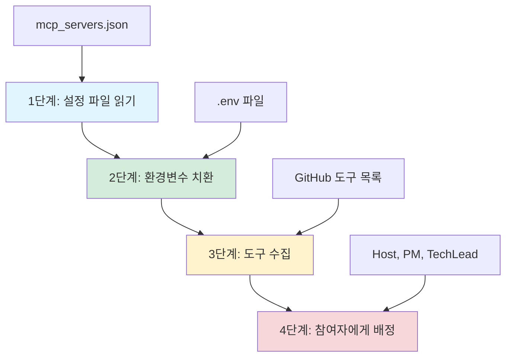
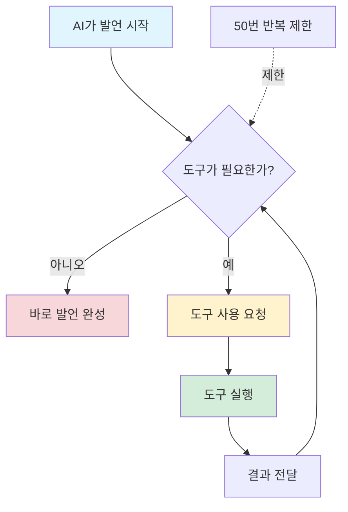
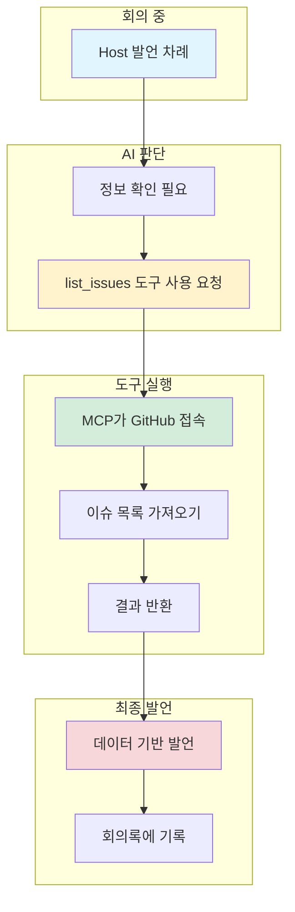

# 외부 도구 사용하기

> AI가 GitHub 같은 외부 도구를 어떻게 사용할까요?

---

## MCP가 뭔가요?

**MCP (Model Context Protocol)**: AI가 외부 도구를 사용할 수 있게 해주는 규칙이에요.

### 🛠️ 비유: 도구함

**역할**
- AI에게 "이런 도구들을 쓸 수 있어"라고 알려줘요
- 도구 사용 방법을 설명해줘요
- 도구를 꺼내 쓸 수 있게 연결해줘요

**목적**
- AI가 실시간으로 정보를 가져와요
- 추측이 아닌 실제 데이터로 발언해요
- 외부 서비스와 연동돼요

> 💡 **쉽게 말하면...**
> MCP는 AI가 GitHub, Jira, Slack 같은 도구를 쓸 수 있게 해주는 사용 설명서예요. "이슈 목록 보여줘"라고 하면 실제로 GitHub에서 가져와요.

---

## 도구 연결 과정

TheTable이 외부 도구를 사용할 수 있게 되는 과정을 봐요.

### 과정 4단계



---

### 1단계: 설정 파일 읽기

**파일**: `config/mcp_servers.json`

**내용**
- 어떤 도구를 사용할지 적혀 있어요
- 도구에 접속하는 방법이 있어요
- 필요한 비밀번호 위치를 알려줘요

**예시**
```
서버 이름: github
실행 명령: go run github-mcp-server
필요한 비밀번호: GITHUB_PERSONAL_ACCESS_TOKEN
```

---

### 2단계: 환경변수 치환

**역할**: 비밀번호를 실제 값으로 바꿔요

**비유**: 비밀번호 메모장에서 찾기

**과정**
1. 설정 파일에 `${GITHUB_PERSONAL_ACCESS_TOKEN}` 같은 표시를 찾아요
2. 환경변수 파일(.env)에서 실제 비밀번호를 가져와요
3. 표시를 실제 비밀번호로 바꿔요

**왜 이렇게 하나요?**
- 비밀번호를 설정 파일에 직접 쓰면 위험해요
- 다른 사람이 볼 수도 있어요
- 환경변수 파일은 비공개로 관리해요

> 🤔 **이해했나요?**
> Q: 환경변수 치환이 왜 필요한가요?
> A: 비밀번호를 안전하게 보관하려고요. 설정 파일은 공개해도 되지만, 비밀번호는 숨겨야 해요.

---

### 3단계: 도구 수집

**역할**: 사용할 수 있는 도구 목록을 가져와요

**과정**
1. GitHub MCP 서버에 접속해요
2. "무슨 도구가 있어?"라고 물어봐요
3. 도구 목록을 받아와요

**GitHub 도구 예시**
- 이슈 목록 보기 (list_issues)
- 이슈 만들기 (create_issue)
- PR 목록 보기 (list_pull_requests)
- PR 상태 확인하기 (get_pull_request)
- 브랜치 목록 보기 (list_branches)

---

### 4단계: 참여자에게 배정

**역할**: 각 참여자가 쓸 도구를 선택해요

**설정 위치**: `config/agent_profiles.yaml`

**예시**
```
Host:
- 사용 도구: github
- 저장소: yaklevel/thetable

PM:
- 사용 도구: github

TechLead:
- 사용 도구: github
```

**왜 나눠서 배정하나요?**
- 모든 참여자가 모든 도구를 쓸 필요는 없어요
- 필요한 도구만 주면 헷갈리지 않아요
- 비용도 절약돼요

> 💡 **쉽게 말하면...**
> 도구함에서 필요한 도구만 골라서 각 참여자에게 나눠줘요. Host, PM, TechLead는 GitHub 도구를 받아요.

---

## GitHub로 할 수 있는 일

TheTable에서 GitHub MCP 서버를 사용하면 이런 일들을 할 수 있어요.

### 이슈 관리

**할 수 있는 일**
- 📋 이슈 목록 보기: 열려있는 이슈가 뭐가 있는지 확인
- ➕ 이슈 만들기: 새로운 문제를 등록
- 🔍 이슈 상세 보기: 특정 이슈의 자세한 내용 확인
- ✏️ 이슈 수정하기: 이슈 내용을 변경

### PR (Pull Request) 관리

**할 수 있는 일**
- 📋 PR 목록 보기: 리뷰 대기 중인 PR 확인
- ➕ PR 만들기: 코드 변경사항 제출
- 🔍 PR 상세 보기: PR 내용과 리뷰 확인
- ✅ PR 병합하기: 코드를 메인 브랜치에 합치기

### 브랜치와 커밋

**할 수 있는 일**
- 🌿 브랜치 목록 보기: 어떤 브랜치가 있는지 확인
- 📝 커밋 상세 보기: 특정 커밋의 변경사항 확인
- 📋 커밋 목록 보기: 최근 커밋들 확인

---

## 실제 사용 시나리오

### 시나리오 1: 이슈 확인

**상황**: Host가 현재 이슈 상황을 확인하고 싶어요

**진행 과정**
1. **Host 발언**: "현재 열려있는 이슈를 확인해주세요."
2. **AI가 도구 요청**: list_issues 도구를 사용하고 싶다고 해요
3. **도구 실행**: GitHub에서 실제 이슈 목록을 가져와요
4. **결과 전달**: AI에게 이슈 목록을 알려줘요
5. **Host 최종 발언**: "현재 이슈는 #103 '기술 문서 작성'이 있네요."

> 💡 **쉽게 말하면...**
> AI가 "GitHub에서 이슈 목록 좀 가져와줘"라고 하면, 실제로 GitHub에 접속해서 데이터를 가져와서 AI에게 전달해요.

---

### 시나리오 2: PR 상태 보고

**상황**: PM이 PR 상태를 보고해야 해요

**진행 과정**
1. **PM 발언**: "리뷰 대기 중인 PR 상태를 확인하겠습니다."
2. **AI가 도구 요청**: list_pull_requests 도구 사용
3. **도구 실행**: GitHub에서 PR 목록 가져오기
4. **결과 확인**: PR #52, #53이 리뷰 대기 중
5. **PM 최종 발언**: "PR #52와 #53이 리뷰를 기다리고 있습니다."

---

## 누가 어떤 도구를 쓰나요?

| 참여자 | 사용 도구 | 주로 하는 일 |
|--------|----------|-------------|
| 🎤 **Host** | GitHub | 전체 프로젝트 상황 확인, 회의 진행 |
| 📋 **PM** | GitHub | 이슈와 PR 상태 보고, 일정 관리 |
| 🔧 **TechLead** | GitHub | 기술적 이슈 검토, 코드 리뷰 |

> 🤔 **이해했나요?**
> Q: 모든 참여자가 같은 도구를 쓰나요?
> A: 지금은 그래요. 하지만 나중에 PM은 Jira, Host는 Slack처럼 다른 도구를 줄 수도 있어요.

---

## Tool-Calling (도구 사용 요청)

**비유**: 도구 꺼내 쓰기

AI가 도구를 사용하는 과정을 자세히 봐요.

### 과정



### 단계별 설명

1. **AI가 발언 시작**: 역할에 맞게 무슨 말을 할지 생각해요
2. **도구 필요 판단**: "GitHub에서 정보를 가져와야겠다"고 결정
3. **도구 사용 요청**: "list_issues 도구를 써줘"라고 요청
4. **도구 실행**: 실제로 GitHub API를 호출해요
5. **결과 전달**: 이슈 목록을 AI에게 줘요
6. **다시 판단**: 더 필요한 도구가 있는지 확인
7. **최종 발언**: 모든 정보를 바탕으로 발언 완성

### 안전장치

**최대 50번 반복**
- 도구를 계속 쓰면 끝나지 않을 수 있어요
- 50번 넘으면 자동으로 멈춰요
- 대부분 2-3번이면 충분해요

---

## 새 도구 추가하기

나중에 Jira, Slack 같은 다른 도구를 추가하려면 어떻게 할까요?

### 추가 과정 4단계

**1단계: 도구 서버 설정 추가**
- `config/mcp_servers.json` 파일을 열어요
- 새 도구 정보를 추가해요

**예시**
```
서버 이름: jira
실행 명령: npx jira-mcp-server
필요한 비밀번호: JIRA_API_TOKEN, JIRA_DOMAIN
```

**2단계: 환경변수 추가**
- `.env` 파일에 비밀번호를 추가해요

**예시**
```
JIRA_API_TOKEN=your-token
JIRA_DOMAIN=your-company.atlassian.net
```

**3단계: 참여자에게 배정**
- `config/agent_profiles.yaml` 파일을 열어요
- 어떤 참여자가 Jira를 쓸지 정해요

**예시**
```
PM:
- 사용 도구: github, jira
```

**4단계: 코드 변경 없이 실행**
- 설정만 바꾸면 돼요
- 코드는 수정할 필요가 없어요
- 바로 새 도구를 사용할 수 있어요

> 💡 **쉽게 말하면...**
> 새 도구를 추가하려면 3개 설정 파일만 수정하면 돼요. 코드는 건드리지 않아도 자동으로 새 도구를 인식해요.

---

## GitHub 사용 과정 다이어그램



---

## 에러가 나면 어떻게 하나요?

### 도구 실행 실패

**상황**: GitHub API가 응답하지 않아요

**처리**
1. 에러 메시지를 기록해요
2. AI에게 "도구 실행이 실패했어"라고 알려줘요
3. AI가 다시 시도하거나 다른 방법을 찾아요

**예시**
> AI: "GitHub 이슈를 확인하려고 했으나 연결이 실패했습니다. 나중에 다시 확인하겠습니다."

### 비밀번호 없음

**상황**: 환경변수에 GitHub 토큰이 설정되지 않았어요

**처리**
1. 경고 메시지를 출력해요: "⚠️ github 서버 건너뜀: 인증 토큰 없음"
2. 해당 도구를 사용할 수 없게 만들어요
3. 회의는 계속 진행돼요 (도구 없이)

> 🤔 **이해했나요?**
> Q: 도구가 실패하면 회의가 멈추나요?
> A: 아니요. 에러를 기록하고 AI에게 알려준 뒤, 회의는 계속 진행돼요.

---

## 장점과 특징

### ✅ 장점

**실시간 정보**
- 추측이 아닌 실제 데이터로 발언해요
- GitHub 상태를 정확히 알 수 있어요

**확장 가능**
- 새 도구를 쉽게 추가할 수 있어요
- 코드 변경 없이 설정만 바꿔요

**안전**
- 비밀번호를 안전하게 관리해요
- 각 참여자가 필요한 도구만 사용해요

### ⚡ 특징

**선택적 사용**
- 모든 참여자가 도구를 쓸 필요는 없어요
- 필요한 참여자에게만 배정해요

**자동 연결**
- 설정 파일을 읽고 자동으로 연결해요
- 수동으로 연결할 필요가 없어요

**에러 처리**
- 도구 실패 시 회의는 계속 진행돼요
- 에러 메시지를 명확히 알려줘요

---

> 💡 **핵심 정리**
>
> - MCP는 AI가 외부 도구를 쓸 수 있게 하는 규칙이에요
> - 도구 연결은 4단계로 진행돼요: 설정 읽기 → 비밀번호 치환 → 도구 수집 → 참여자 배정
> - GitHub로 이슈, PR, 브랜치 등을 관리할 수 있어요
> - Tool-Calling으로 AI가 필요할 때 도구를 꺼내 써요
> - 새 도구 추가는 설정 파일만 수정하면 돼요

---

## 다음 문서

- [configuration.md](./configuration.md): 설정 파일을 어떻게 수정하는지 자세히 배워요
- [future-direction.md](./future-direction.md): 앞으로 추가될 도구들을 살펴봐요
