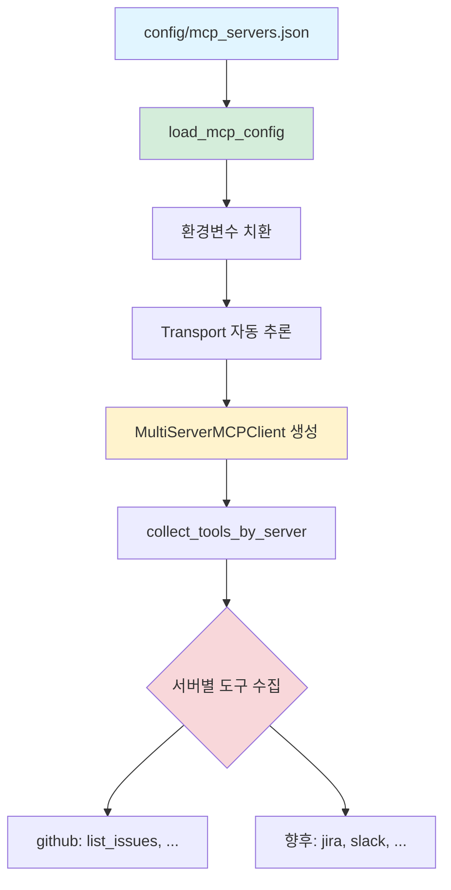

# MCP (Model Context Protocol) 통합

## MCP 개요

**정의**: Anthropic이 제안한 LLM과 외부 시스템 통합을 위한 표준 프로토콜

**목적**: LLM이 실시간 데이터 접근 및 외부 도구 사용을 위한 통일된 인터페이스 제공

**TheTable에서의 역할**:
- AI 에이전트가 GitHub 이슈/PR 실시간 조회
- 추측이 아닌 실제 데이터 기반 회의 진행
- 에이전트별 도구 선택 (Host, PM, TechLead만 GitHub 도구 사용)

---

## 설정 로드 흐름



### 1. mcp_servers.json 파일

**위치**: `config/mcp_servers.json`

**구조**:
```json
{
  "mcpServers": {
    "github": {
      "command": "go",
      "args": ["run", "github.com/github/github-mcp-server/cmd/github-mcp-server@latest", "stdio"],
      "env": {
        "GITHUB_PERSONAL_ACCESS_TOKEN": "${GITHUB_PERSONAL_ACCESS_TOKEN}"
      }
    }
  }
}
```

**필드**:
- `command` - 실행 명령 (stdio transport)
- `args` - 명령 인자
- `env` - 환경변수 (`${VAR}` 패턴으로 .env 값 치환)
- `url` - 서버 URL (streamable_http transport)
- `headers` - HTTP 헤더 (streamable_http transport)

---

### 2. 환경변수 치환

**패턴**: `${VARIABLE_NAME}`

**로직** (`_resolve_env_vars()`):
```python
_ENV_VAR_PATTERN = re.compile(r'\$\{(\w+)\}')

def _resolve_env_vars(obj: Any) -> Any:
    if isinstance(obj, str):
        return _ENV_VAR_PATTERN.sub(
            lambda m: os.environ.get(m.group(1), ""), obj
        )
    # 재귀적으로 dict, list 처리
```

**예시**:
```json
"env": {
  "GITHUB_PERSONAL_ACCESS_TOKEN": "${GITHUB_PERSONAL_ACCESS_TOKEN}"
}
```
→ .env 파일의 `GITHUB_PERSONAL_ACCESS_TOKEN` 값으로 치환

**필수 환경변수 미설정 시**:
- Authorization 헤더가 비어있으면 서버 건너뛰기
- 경고 로그 출력: `⚠️ 'github' MCP 서버 건너뜀: 인증 토큰 환경변수가 설정되지 않음`

**파일**: `thetable/mcp/__init__.py:10-62`

---

### 3. Transport 자동 추론

**로직** (`_infer_transport()`):
```python
if "transport" not in entry:
    if "url" in entry:
        entry["transport"] = "streamable_http"
    elif "command" in entry:
        entry["transport"] = "stdio"
```

**Transport 타입**:
- **stdio**: 로컬 프로세스 (command + args)
- **streamable_http**: HTTP 서버 (url + headers)

**현재 사용**: stdio (GitHub MCP Server)

**파일**: `thetable/mcp/__init__.py:64-78`

---

### 4. MultiServerMCPClient 생성

**라이브러리**: `langchain-mcp-adapters`

**클라이언트 생성**:
```python
from langchain_mcp_adapters import MultiServerMCPClient

config = load_mcp_config("config/mcp_servers.json")
client = MultiServerMCPClient(config)
```

**설정 포맷**:
```python
{
  "github": {
    "command": "go",
    "args": ["run", "..."],
    "env": {...},
    "transport": "stdio"
  }
}
```

**파일**: `thetable/mcp/__init__.py:13-49`

---

## 에이전트-도구 바인딩

### 1. Agent Profile 설정

**파일**: `config/agent_profiles.yaml`

```yaml
agents:
  - name: Host
    role: meeting_host
    mcp_tools:
      - github  # GitHub MCP 도구 사용
    metadata:
      target_repository: "yaklevel/thetable"

  - name: PM
    role: project_manager
    mcp_tools:
      - github

  - name: TechLead
    role: tech_lead
    mcp_tools:
      - github
```

**필드**:
- `mcp_tools` - 사용할 MCP 서버 목록 (서버 이름)
- `metadata.target_repository` - 도구 사용 시 필요한 컨텍스트 정보

---

### 2. 서버별 도구 수집

**함수**: `collect_tools_by_server()`

**로직**:
```python
async def collect_tools_by_server(
    client: MultiServerMCPClient,
    server_names: set[str]
) -> dict[str, list]:
    tools_by_server = {}
    for name in server_names:
        tools_by_server[name] = await client.get_tools(server_name=name)
    return tools_by_server
```

**반환 예시**:
```python
{
  "github": [
    Tool(name="list_issues", ...),
    Tool(name="create_issue", ...),
    Tool(name="list_pull_requests", ...),
    # ...
  ]
}
```

**에러 처리**:
- 존재하지 않는 서버: `ValueError` → 경고 로그 + 건너뛰기
- 도구 로드 실패: `Exception` → 에러 로그 + 건너뛰기

**파일**: `thetable/mcp/__init__.py:152-177`

---

### 3. bind_mcp_tools() - 에이전트에 도구 바인딩

**클래스**: `BaseAgent`

**메서드**:
```python
def bind_mcp_tools(self, tools: list) -> None:
    self._mcp_tools = tools

    if tools:
        tool_names = [t.name for t in tools]
        tools_instruction = f"""
**AVAILABLE TOOLS:**
You have access to MCP tools: {', '.join(sorted(tool_names))}

When relevant to the discussion, use these tools to:
- Check actual repository status, open PRs, recent issues
- Fetch real data before making statements about code or project status
- Verify facts rather than making assumptions
"""
        self._system_prompt = self._build_system_prompt() + tools_instruction
```

**효과**:
- 도구 목록을 에이전트 내부 필드에 저장
- 시스템 프롬프트에 도구 사용 지침 추가
- LLM이 도구 사용 컨텍스트 인지

**파일**: `thetable/agents/base_agent.py:65-92`

---

### 4. AgentNode 생성 시 도구 필터링

**노드**: `AgentNode`

**생성 로직** (`workflow.py`):
```python
for name, profile in profiles.items():
    node = NodeRegistry.create(
        "agent",
        profile=profile,
        model=main_model,
        all_agent_names=list(profiles.keys()),
        all_profiles=profiles,
        mcp_tools=mcp_tools,  # {서버명: [도구]} 전달
    )
    workflow.add_node(name.lower(), node)
```

**AgentNode 초기화** (`agent.py`):
```python
class AgentNode(BaseNode):
    def __init__(self, profile, model, mcp_tools, ...):
        # 프로필의 mcp_tools에 지정된 서버의 도구만 필터링
        selected_tools = []
        for server_name in profile.mcp_tools:
            selected_tools.extend(mcp_tools.get(server_name, []))

        self.agent = BaseAgent(profile.name, profile, model)
        self.agent.bind_mcp_tools(selected_tools)
```

**효과**:
- 에이전트별로 필요한 도구만 바인딩 (토큰 절약)
- Host, PM, TechLead만 GitHub 도구 사용

**파일**:
- `thetable/graph/workflow.py:74-85`
- `thetable/graph/nodes/agent.py`

---

## Tool-Calling 루프

### invoke_with_tools() 상세

**클래스**: `BaseAgent`

**메서드**:
```python
async def invoke_with_tools(
    self,
    messages: list,
    config: Optional[Dict[str, Any]] = None
) -> AIMessage:
    if not self._mcp_tools:
        # 도구 없으면 단순 호출
        return await self._llm.ainvoke(messages, config=config)

    # Tool-calling 루프
    tool_messages = list(messages)
    iteration = 0
    max_iterations = 50

    while iteration < max_iterations:
        iteration += 1

        # LLM 호출 (도구 바인딩)
        response = await self._llm.bind_tools(self._mcp_tools).ainvoke(
            tool_messages, config=config
        )
        tool_messages.append(response)

        if not response.tool_calls:
            # 최종 응답 (도구 호출 없음)
            return response

        # 도구 실행
        for tc in response.tool_calls:
            tool_fn = {t.name: t for t in self._mcp_tools}.get(tc["name"])
            if tool_fn:
                result = await tool_fn.ainvoke(tc.get("args", {}))
                tool_messages.append(ToolMessage(
                    content=str(result),
                    tool_call_id=tc["id"]
                ))

    # 최대 반복 도달
    return AIMessage(content=f"({self.name}: 응답 생성 중 문제가 발생했습니다.)")
```

**파일**: `thetable/agents/base_agent.py:94-174`

---

### 최대 50회 반복

**목적**: 무한루프 방지

**시나리오**:
1. LLM이 도구 호출 요청 (`response.tool_calls`)
2. 도구 실행 및 결과를 메시지에 추가 (`ToolMessage`)
3. LLM 재호출 (도구 결과 포함)
4. 1-3 반복 (최대 50회)

**종료 조건**:
- `response.tool_calls`가 비어있을 때 (최종 응답)
- 50회 반복 도달 (안전장치)

---

### 에러 핸들링

**LLM 호출 실패**:
```python
try:
    response = await self._llm.bind_tools(self._mcp_tools).ainvoke(...)
except LengthFinishReasonError as e:
    logger.error(f"[{self.name}] ❌ 토큰 길이 제한 도달: {e}")
    return AIMessage(content="(응답이 너무 길어 생성을 중단했습니다.)")
```

**도구 실행 실패**:
```python
try:
    result = await tool_fn.ainvoke(tool_args)
    tool_messages.append(ToolMessage(content=str(result), ...))
except Exception as e:
    logger.error(f"[{self.name}] ❌ 도구 실행 실패: {tool_name}, 오류: {e}")
    tool_messages.append(ToolMessage(
        content=f"Error executing {tool_name}: {e}",
        tool_call_id=tc["id"]
    ))
```

**효과**:
- 도구 실패 시에도 LLM에게 에러 정보 전달
- LLM이 에러 메시지 보고 재시도 가능 (50회 한도 내)

---

## 현재 통합: GitHub MCP Server

### 서버 정보

**프로젝트**: https://github.com/github/github-mcp-server

**설치**:
```bash
go install github.com/github/github-mcp-server/cmd/github-mcp-server@latest
```

**실행 방식**: stdio transport (로컬 프로세스)

---

### 제공 도구

**이슈 관리**:
- `list_issues` - 이슈 목록 조회
- `create_issue` - 이슈 생성
- `get_issue` - 이슈 상세 조회
- `update_issue` - 이슈 수정

**PR 관리**:
- `list_pull_requests` - PR 목록 조회
- `create_pull_request` - PR 생성
- `get_pull_request` - PR 상세 조회
- `merge_pull_request` - PR 병합

**브랜치/커밋**:
- `list_branches` - 브랜치 목록 조회
- `get_commit` - 커밋 상세 조회
- `list_commits` - 커밋 목록 조회

---

### 사용 예시

**Host의 발언**:
> "현재 열려있는 이슈를 확인해주세요."

**LLM Tool-Calling**:
```json
{
  "tool_calls": [
    {
      "name": "list_issues",
      "args": {
        "repo": "yaklevel/thetable",
        "state": "open"
      }
    }
  ]
}
```

**도구 실행 결과**:
```json
[
  {
    "number": 103,
    "title": "기술 문서 작성",
    "state": "open",
    "labels": ["documentation"]
  }
]
```

**LLM 최종 응답**:
> "현재 열려있는 이슈는 #103 '기술 문서 작성'입니다. documentation 라벨이 붙어있네요."

---

## 새 MCP 서버 추가 가이드

### 1단계: mcp_servers.json 수정

**Stdio Transport 서버** (로컬 프로세스):
```json
{
  "mcpServers": {
    "github": {...},
    "jira": {
      "command": "npx",
      "args": ["-y", "jira-mcp-server"],
      "env": {
        "JIRA_API_TOKEN": "${JIRA_API_TOKEN}",
        "JIRA_DOMAIN": "${JIRA_DOMAIN}"
      }
    }
  }
}
```

**Streamable HTTP Transport 서버** (HTTP API):
```json
{
  "mcpServers": {
    "github": {...},
    "slack": {
      "url": "https://slack-mcp-server.example.com",
      "transport": "streamable_http",
      "headers": {
        "Authorization": "Bearer ${SLACK_BOT_TOKEN}"
      }
    }
  }
}
```

---

### 2단계: .env 파일에 환경변수 추가

```bash
# GitHub (기존)
GITHUB_PERSONAL_ACCESS_TOKEN=ghp_...

# Jira (신규)
JIRA_API_TOKEN=your-jira-token
JIRA_DOMAIN=your-company.atlassian.net

# Slack (신규)
SLACK_BOT_TOKEN=xoxb-...
```

---

### 3단계: agent_profiles.yaml 수정

```yaml
agents:
  - name: PM
    role: project_manager
    mcp_tools:
      - github
      - jira  # 추가
    metadata:
      target_repository: "yaklevel/thetable"
      jira_project: "PROJ"

  - name: Designer
    role: designer
    mcp_tools:
      - slack  # 추가
    metadata:
      slack_channel: "#design"
```

---

### 4단계: 코드 변경 없이 사용

**워크플로우 자동 처리**:
1. `load_mcp_config()` → 새 서버 설정 로드
2. `MultiServerMCPClient` → 서버 연결
3. `collect_tools_by_server()` → 도구 수집
4. `AgentNode` 생성 시 도구 필터링 및 바인딩
5. `BaseAgent.invoke_with_tools()` → 도구 사용 가능

**에이전트 발언 예시**:
> "Jira에서 PROJ 프로젝트의 이슈를 확인해주세요."

**자동 Tool-Calling**:
- LLM이 `jira` 서버의 `list_issues` 도구 호출
- 결과를 바탕으로 회의 진행

---

## 참고 파일

- `thetable/mcp/__init__.py` - load_mcp_config, collect_tools_by_server
- `thetable/agents/base_agent.py` - bind_mcp_tools, invoke_with_tools
- `thetable/graph/nodes/agent.py` - AgentNode (도구 필터링)
- `config/mcp_servers.json` - MCP 서버 설정
- `config/agent_profiles.yaml` - 에이전트별 도구 선택
