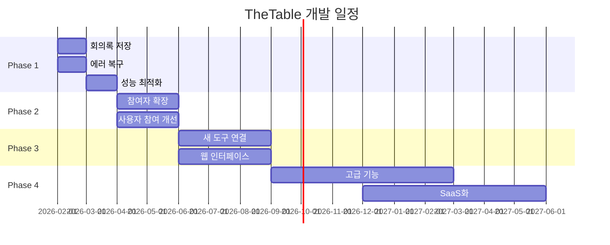

# 개발 로드맵

> TheTable이 어떤 순서로 발전할지 단계별로 알아봐요.

---

## 4단계 개발 계획

TheTable은 **4단계 (Phase)**로 나눠서 발전해요.



---

## Phase 1: 기본 기능 완성 (1-2개월)

> **목표**: 안정적이고 실용적인 다자간 회의 시스템

### ✅ 지금 완성된 것들

**회의 기본 기능**
- 3명 참여자 동시 회의 (Host, PM, TechLead)
- 안건 기반 진행
- 안건 상태 추적 (대기 → 진행 중 → 완료)
- 스트리밍 응답 (실시간으로 발언 보기)

**외부 도구 연결**
- GitHub 이슈/PR 조회
- 참여자별 도구 선택
- MCP 프로토콜 사용

**자동 기능**
- 대화 요약 (5개 메시지마다)
- 회의 종료 감지
- 동적 안건 생성/수정

**안전장치**
- 최대 1000번 턴 제한
- 연속 Host 위임 3번 제한
- 도구 사용 50번 제한

**비용 절약**
- 2개 AI 사용 (대화용, 분석용)
- 약 70% 비용 절감

> 💡 **쉽게 말하면...**
> 기본적인 회의 기능은 다 되는 상태예요. AI들이 모여서 안건을 논의하고, GitHub 정보도 확인하고, 자동으로 요약도 해요.

---

### 🔨 아직 부족한 것들

**회의록 저장**
- ❌ 회의 끝나면 모든 내용 사라짐
- ❌ 과거 회의록을 볼 수 없음
- ❌ 검색 기능 없음

**에러 처리**
- ❌ AI 실패 시 재시도 안 함
- ❌ 도구 실패 시 그냥 넘어감
- ❌ 대체 방법 없음

**참여자 관리**
- ❌ 회의 중 참여자 추가/제거 불가
- ❌ 5명 이상 확장 시 성능 미확인

**성능**
- ⚠️ 매 발언마다 AI를 여러 번 호출
- ⚠️ 불필요한 비용 발생

**테스트**
- ⚠️ 전체 흐름 테스트 부족
- ⚠️ 버그 발견이 늦음

---

### 📋 Phase 1에서 할 일

#### 1순위: 회의록 저장 (가장 중요!)

**목표**: 회의 내용을 잃어버리지 않기

**구현 내용**
- JSON 형식으로 저장 (컴퓨터가 읽기 좋음)
- Markdown 형식으로 저장 (사람이 읽기 좋음)
- 시작/종료 시간, 참여자, 안건, 결정사항 기록

**사용 방법**
```
# 과거 회의록 목록 보기
thetable --list-meetings

# 특정 회의록 보기
thetable --view-meeting 2026-02-10-morning
```

---

#### 2순위: 참여자 5명 확장

**목표**: 더 많은 참여자가 동시에 회의하기

**구현 내용**
- Backend, Frontend 참여자 활성화
- 발언 기회 공평하게 분배
- 성능 테스트 (처리 시간, 비용)

**확인 사항**
- 5명이어도 회의가 잘 진행되나요?
- 발언 기회가 공평한가요?
- 비용이 너무 많이 늘지 않나요?

---

#### 3순위: 에러 복구

**목표**: 문제가 생겨도 자동으로 해결하기

**구현 내용**
- AI 호출 실패 시 3번까지 재시도
- 도구 실패 시 재시도 정책
- 대체 AI 모델 사용 (Main → Task)

**작동 예시**
```
AI 호출 실패 → 1초 대기 → 재시도
또 실패 → 2초 대기 → 재시도
또 실패 → 4초 대기 → 재시도
그래도 실패 → 에러 기록하고 계속 진행
```

---

#### 4순위: 성능 최적화

**목표**: 불필요한 AI 호출 줄이기

**구현 내용**
- 멘션 찾기: 정규표현식 먼저 확인 (AI 안 씀)
- 안건 업데이트: 3번마다만 확인 (매번 안 함)

**효과**
- AI 호출 30% 감소
- 비용 추가 20% 절약
- 회의 속도 빨라짐

---

#### 5순위: 전체 흐름 테스트

**목표**: 버그를 미리 찾기

**테스트 시나리오**
1. 회의 시작 → 안건 3개 진행 → 종료
2. GitHub 이슈 조회/생성
3. AI 실패 시 복구
4. 무한루프 방지 확인

---

## Phase 2: 기능 고도화 (2-3개월)

> **목표**: 더 편리하고 강력한 회의 시스템

### 추가될 기능

**고급 안건 관리**
- 안건 우선순위 설정 (높음/중간/낮음)
- 안건 의존성 (A 완료 후 B 진행)
- 안건 투표 (찬성/반대/보류)
- 안건 템플릿 (반복 패턴 저장)

**회의록 자동 생성**
- 실시간 회의록 업데이트
- 안건별 요약 자동 생성
- 액션 아이템 자동 추출
- PDF, HTML 형식 변환

**참여자 성능 분석**
- 발언 품질 평가
- 기여도 분석
- 과거 데이터 기반 개선

**커스터마이징**
- 새 노드 추가 가능
- 라우팅 로직 변경 가능
- 프롬프트 템플릿 수정 가능

> 🤔 **이해했나요?**
> Q: 안건 의존성이 뭔가요?
> A: "먼저 예산 승인을 받아야 개발 계획을 세울 수 있다"처럼, 순서가 있는 안건이에요.

---

## Phase 3: 외부 연결 확장 (3-6개월)

> **목표**: 다양한 도구와 연결하고 웹에서 사용하기

### 주요 내용

**새 도구 연결**
- Jira, Slack, Confluence, Calendar, Linear, Notion 추가

**웹 인터페이스**
- 브라우저 기반 실시간 스트리밍
- 회의 관리 화면 및 대시보드
- 회의록 조회/검색 기능

**API 서버**
- REST API 및 WebSocket
- 인증 시스템 (OAuth2, JWT)

**병렬 회의**
- 여러 회의 동시 진행 (최대 10개)

**음성/화상 채팅**
- TTS/STT 기반 음성 회의
- WebRTC 기반 화상 회의

> 📖 **자세한 내용**: [future-direction.md](./future-direction.md)의 3-5번 확장 영역 참고

---

## Phase 4: 플랫폼 확장 (6-12개월)

> **목표**: 서비스화하고 고급 기능 추가

### 주요 내용

**LangGraph v1.0 활용**
- 회의 상태 자동 저장 및 체크포인트
- 공식 사람 참여 API

**MCP 생태계 확장**
- 더 많은 공식 서버 지원 (Atlassian, Workato 등)

**에이전트 프레임워크**
- CrewAI 패턴 적용 (역할 기반 위임)

**분산 아키텍처**
- A2A 프로토콜 및 메시지 큐

**SaaS 서비스화**
- 멀티테넌시, 예측 분석, 모니터링

> 📖 **자세한 내용**: [future-direction.md](./future-direction.md)의 우선순위 및 타임라인 섹션 참고

---

## 단계별 요약

| Phase | 기간 | 우선순위 | 주요 목표 |
|-------|------|----------|-----------|
| **Phase 1** | 1-2개월 | 🔥 높음 | 회의록 저장, 에러 복구, 성능 최적화 |
| **Phase 2** | 2-3개월 | 🔥 높음 | 고급 안건 관리, 참여자 분석 |
| **Phase 3** | 3-6개월 | 📌 중간 | 새 도구, 웹 UI, 음성/화상 |
| **Phase 4** | 6-12개월 | 💡 낮음 | LangGraph v1.0, SaaS화 |

---

## Phase 1 상세 일정

### 1개월차 (2월)

**1-2주: 회의록 저장**
- JSON/Markdown 저장 기능
- 메타데이터 추적
- 회의록 조회 CLI

**3-4주: 에러 복구**
- AI 호출 재시도
- 도구 재시도 정책
- 대체 모델 fallback

### 2개월차 (3월)

**1-2주: 성능 최적화**
- 멘션 정규표현식
- 안건 업데이트 주기 조정
- 측정 및 검증

**3-4주: 테스트 및 검증**
- 전체 흐름 테스트
- 5명 참여자 테스트
- 성능 벤치마크

---

## 진행 상황 확인

### ✅ Phase 1 - 기본 기능
- ✅ 3명 회의 시스템
- ✅ 안건 기반 진행
- ✅ GitHub 연동
- ✅ 대화 요약
- ✅ 안전장치
- ⏳ 회의록 저장 (미시작, #151 등록)
- ⏳ 에러 복구 (미시작)
- ⏳ 성능 최적화 (미시작)

### 📋 Phase 2 - 기능 고도화
- ⏳ 고급 안건 관리
- ⏳ 회의록 자동 생성
- ⏳ 참여자 분석

### 📋 Phase 3 - 외부 연결
- ⏳ 새 도구 연결
- ⏳ 웹 인터페이스
- ⏳ 음성/화상 채팅

### 📋 Phase 4 - 플랫폼
- ⏳ LangGraph v1.0
- ⏳ 분산 아키텍처
- ⏳ SaaS화

---

> 💡 **핵심 정리**
>
> - 4단계로 나눠서 발전해요
> - Phase 1 (지금): 기본 기능 완성
> - Phase 2-3: 편의 기능과 확장
> - Phase 4: 서비스화
> - 우선순위: 회의록 저장 > 에러 복구 > 성능

---

## 관련 문서

- [future-direction.md](./future-direction.md): 각 영역별 자세한 계획
- [architecture.md](./architecture.md): 현재 시스템 구조
- [configuration.md](./configuration.md): 설정 방법
