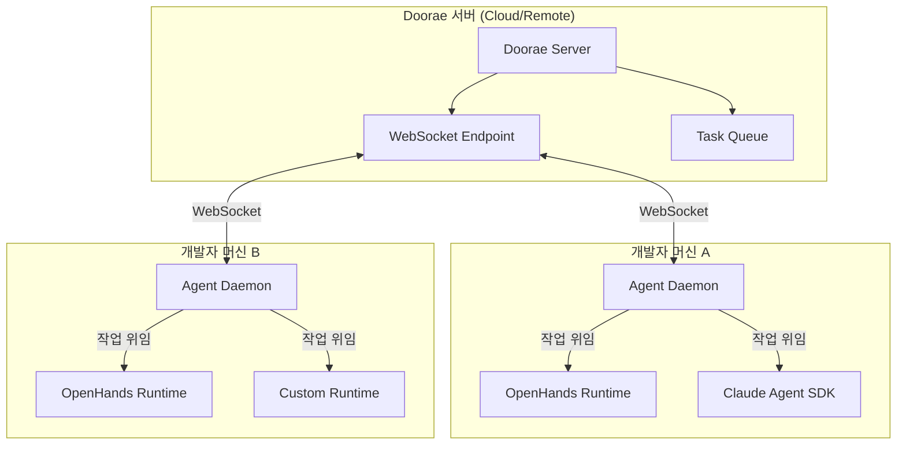
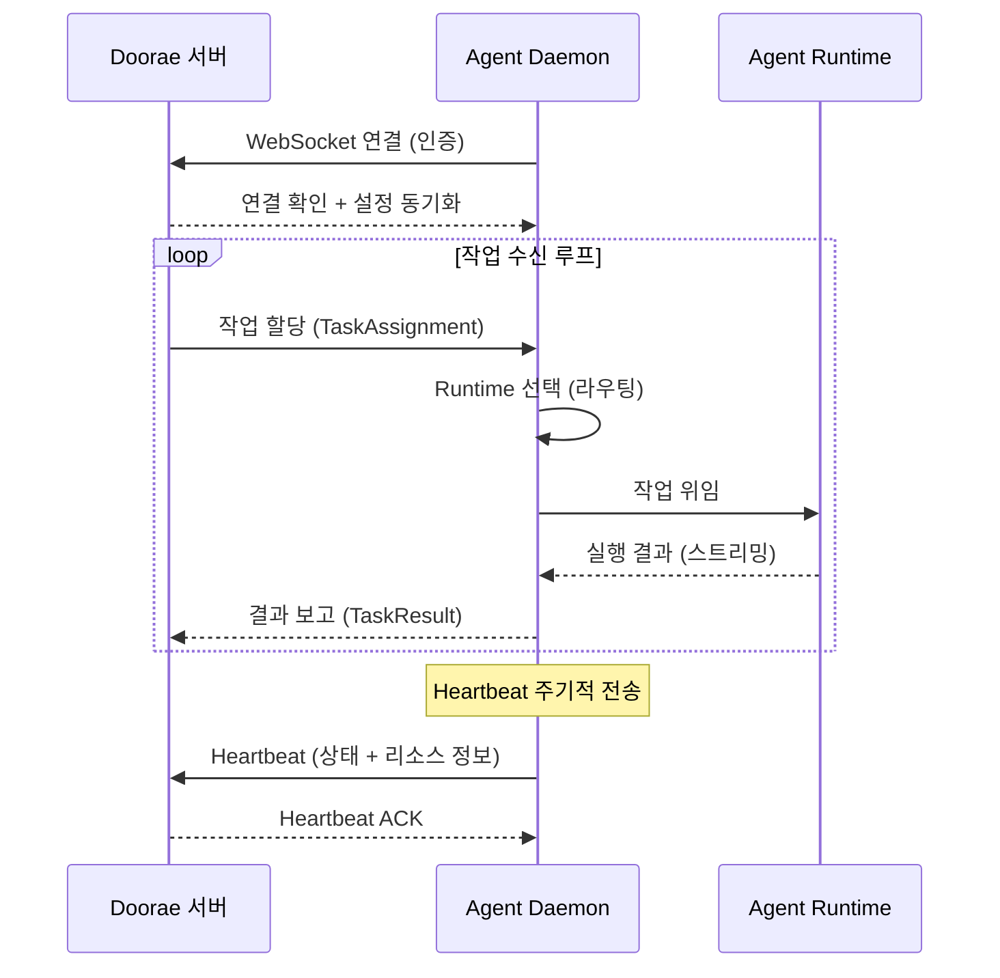
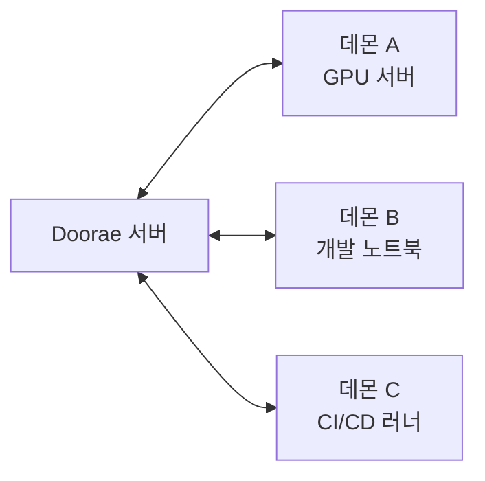

# Agent Daemon Bridge

!!! warning "계획된 기능 (미구현)"
    이 문서는 향후 구현 예정인 기능을 설명합니다. 현재 사용할 수 없습니다.

## 개요

Agent Daemon Bridge는 Doorae 서버와 로컬 AI agent runtime을 연결하는 **상주 데몬 프로세스**입니다.
기존 로컬 agent daemon 패턴과 유사한 개념이지만,
Doorae는 **오픈소스 runtime**을 대상으로 합니다.

- [OpenHands](https://github.com/All-Hands-AI/OpenHands) (구 OpenDevin)
- [Claude Agent SDK](https://docs.anthropic.com/en/docs/agents-sdk)
- 기타 LangChain 호환 agent runtime

데몬은 백그라운드에서 실행되며, Doorae 서버로부터 작업을 수신하고
로컬 agent runtime에 위임합니다.

## 아키텍처



## 동작 흐름



## 핵심 구성 요소

### 1. Daemon Process

데몬은 시스템 서비스 또는 사용자 프로세스로 실행됩니다.

```bash
# 설치 및 실행 (계획)
doorae daemon start --server wss://your-doorae-server.com
doorae daemon status
doorae daemon stop
```

!!! info "설정 파일"
    데몬 설정은 `~/.doorae/daemon.yaml` 또는 프로젝트의 `.doorae/daemon.yaml`에서 관리됩니다.

```yaml
# daemon.yaml (계획)
server:
  url: "wss://your-doorae-server.com"
  token: "${DOORAE_TOKEN}"
  reconnect_interval: 5s

runtimes:
  openhands:
    enabled: true
    workspace: "/home/user/projects"
    max_concurrent: 2
  claude-agent-sdk:
    enabled: true
    api_key: "${ANTHROPIC_API_KEY}"
    max_concurrent: 1

resources:
  max_memory: "4GB"
  max_cpu_percent: 80
```

### 2. Runtime Abstraction Layer

각 agent runtime은 공통 인터페이스를 구현합니다.

```python
# 계획된 인터페이스 (예시)
class AgentRuntime(Protocol):
    """Agent runtime 추상 인터페이스."""

    async def execute(self, task: TaskAssignment) -> AsyncIterator[TaskEvent]:
        """작업을 실행하고 이벤트를 스트리밍합니다."""
        ...

    async def cancel(self, task_id: str) -> None:
        """실행 중인 작업을 취소합니다."""
        ...

    def capabilities(self) -> RuntimeCapabilities:
        """이 runtime이 지원하는 기능 목록을 반환합니다."""
        ...
```

### 3. Task Router

수신된 작업의 특성에 따라 최적의 runtime을 선택합니다.

| 작업 유형 | 우선 Runtime | 대체 Runtime |
|----------|-------------|-------------|
| 코드 작성/수정 | OpenHands | Claude Agent SDK |
| 코드 리뷰 | Claude Agent SDK | OpenHands |
| 테스트 실행 | OpenHands | - |
| 문서 작성 | Claude Agent SDK | OpenHands |

## 주요 이점

### Multi-Machine 지원



여러 머신에서 데몬을 실행하여 **분산 작업 처리**가 가능합니다.
GPU가 필요한 작업은 GPU 서버로, 로컬 파일 접근이 필요한 작업은 개발 머신으로 라우팅됩니다.

### Runtime 추상화

특정 agent runtime에 종속되지 않습니다.
새로운 오픈소스 runtime이 등장하면 어댑터만 추가하여 지원할 수 있습니다.

### Always-On 기능

데몬은 백그라운드에서 상시 실행되므로, 사용자가 직접 CLI를 열지 않아도
Doorae 서버에서 작업을 할당받아 자동으로 처리합니다.

- 야간 코드 리뷰 자동 처리
- CI 실패 시 자동 수정 시도
- 정기적인 코드 품질 점검

### 보안 모델

!!! note "보안 고려사항"
    데몬은 로컬 머신에서 코드를 실행하므로 보안이 중요합니다.

- **인증**: Doorae 서버와의 WebSocket 연결은 JWT 토큰 기반 인증
- **권한 제어**: 데몬별로 허용된 작업 유형과 리소스 제한 설정
- **샌드박싱**: Agent runtime은 격리된 환경(Docker 컨테이너 등)에서 실행
- **감사 로그**: 모든 작업 실행 내역을 로컬 및 서버에 기록

## 관련 로드맵

- [Multi-Machine 지원](multi-machine.md) - 여러 머신에서의 agent 실행
- [Multi-Runtime 지원](multi-runtime.md) - 다양한 agent runtime 통합
- [Always-On Agents](always-on-agents.md) - 상시 실행 agent 기능
