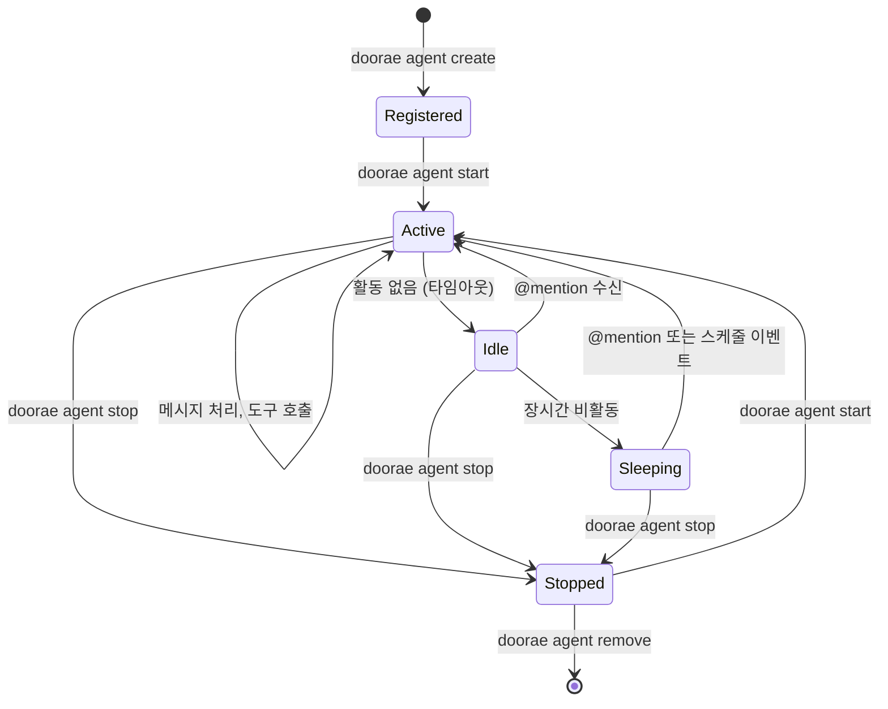
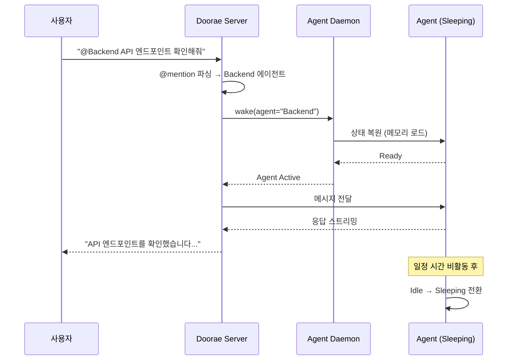
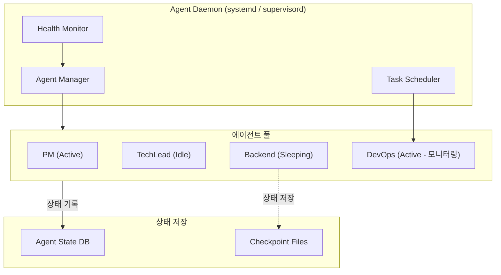

# Always-on 에이전트

!!! warning "계획된 기능 (미구현)"
    이 문서는 아직 구현되지 않은 기능의 설계 제안서입니다. 실제 구현은 설계와 다를 수 있으며, 커뮤니티 피드백을 바탕으로 변경될 수 있습니다.

## 동기

현재 Doorae 에이전트는 **회의 세션에 종속**됩니다. `doorae run` 명령으로 회의가 시작되면 에이전트가 생성되고, 회의가 끝나면 사라집니다. 이 모델에서는 에이전트가 할 수 있는 일이 "회의에 참석하는 것"으로 제한됩니다.

Always-on 에이전트는 회의 세션과 독립적으로 **상시 실행되는 에이전트**입니다. 마치 팀의 Slack에 항상 로그인되어 있는 동료처럼, 필요할 때 응답하고 백그라운드에서 모니터링을 수행합니다.

## 에이전트 생명주기



### 상태 정의

| 상태 | 설명 | 리소스 사용 | 응답 시간 |
|------|------|------------|-----------|
| **Active** | 메시지를 실시간으로 처리 중 | 높음 (LLM 호출 활성) | 즉시 |
| **Idle** | 대기 중, 메모리에 로드됨 | 중간 (프로세스 유지) | < 1초 |
| **Sleeping** | 디스크에 상태 저장, 프로세스 중단 | 낮음 (저장 공간만) | 5~30초 (wake 시간) |
| **Stopped** | 수동으로 중단됨 | 없음 | 수동 시작 필요 |

## @mention 기반 Wake

Sleeping 상태의 에이전트는 `@mention`을 받으면 자동으로 깨어납니다.



## 백그라운드 모니터링과 알림

Always-on 에이전트는 사용자의 명시적 요청 없이도 **백그라운드 작업**을 수행할 수 있습니다.

### 모니터링 시나리오

| 에이전트 | 모니터링 대상 | 알림 조건 | 알림 예시 |
|---------|-------------|-----------|-----------|
| **PM** | GitHub 이슈/PR | 새 이슈, 스프린트 마감 임박 | "Sprint 42 마감 2일 전, 미완료 이슈 3건" |
| **DevOps** | 서버 상태, CI/CD | 빌드 실패, 서버 다운 | "main 브랜치 CI 실패: test_auth.py" |
| **Security** | 의존성 취약점 | CVE 알림, 패키지 업데이트 | "critical CVE in lodash@4.17.20" |
| **TechLead** | 코드 리뷰 | 리뷰 대기 PR, 컨플릭트 | "PR #142 리뷰 대기 48시간 초과" |

### 모니터링 설정

```yaml
# agent_profiles.yaml (확장안)
agents:
  - name: PM
    role: project_manager
    always_on:
      enabled: true
      idle_timeout: 300        # 5분 비활동 → Idle
      sleep_timeout: 3600      # 1시간 비활동 → Sleeping
      monitors:
        - type: github_issues
          interval: 600        # 10분마다 확인
          conditions:
            - new_issues: true
            - sprint_deadline_hours: 48
      alerts:
        channel: "#general"
        mention_threshold: "high"  # high 이상만 @all
```

## Daemon 프로세스 생명주기

Always-on 에이전트는 **Agent Daemon Bridge**를 통해 관리됩니다.



### Daemon 관리 명령어 (안)

```bash
# 에이전트 생명주기
doorae agent start PM              # PM 에이전트 시작
doorae agent stop PM               # PM 에이전트 중지
doorae agent status                # 전체 에이전트 상태 확인
doorae agent wake Backend          # Sleeping 에이전트 수동 Wake

# Daemon 관리
doorae daemon start                # Daemon 프로세스 시작
doorae daemon status               # Daemon 상태 확인
doorae daemon logs --follow        # Daemon 로그 실시간 확인
```

## 기존 솔루션과의 비교

| 특성 | ChatGPT | GitHub Copilot | Devin | Doorae (계획) |
|------|---------|---------------|-------|--------------|
| **상시 실행** | 세션 기반 | IDE 연동 | 세션 기반 | Always-on |
| **@mention Wake** | X | X | X | O |
| **백그라운드 모니터링** | X | X | 제한적 | O |
| **멀티 에이전트** | X | X | 단일 에이전트 | O |
| **Hibernate/Wake** | X | X | X | O |
| **리소스 최적화** | N/A | 로컬 | 클라우드 | Idle/Sleep 단계별 관리 |

## 구현 고려사항

- **리소스 관리**: Sleeping 에이전트는 메모리 0에 가까운 상태로, checkpoint 파일만 유지
- **Wake 속도**: Sleeping → Active 전환 시간을 최소화하기 위한 상태 직렬화 최적화
- **스케줄러**: 백그라운드 모니터링 작업을 위한 경량 스케줄러 (cron 패턴)
- **Graceful Shutdown**: 시스템 종료 시 Active 에이전트의 상태를 안전하게 저장
- **보안**: 백그라운드 모니터링에 필요한 최소 권한만 부여 (API 토큰 스코프 제한)
