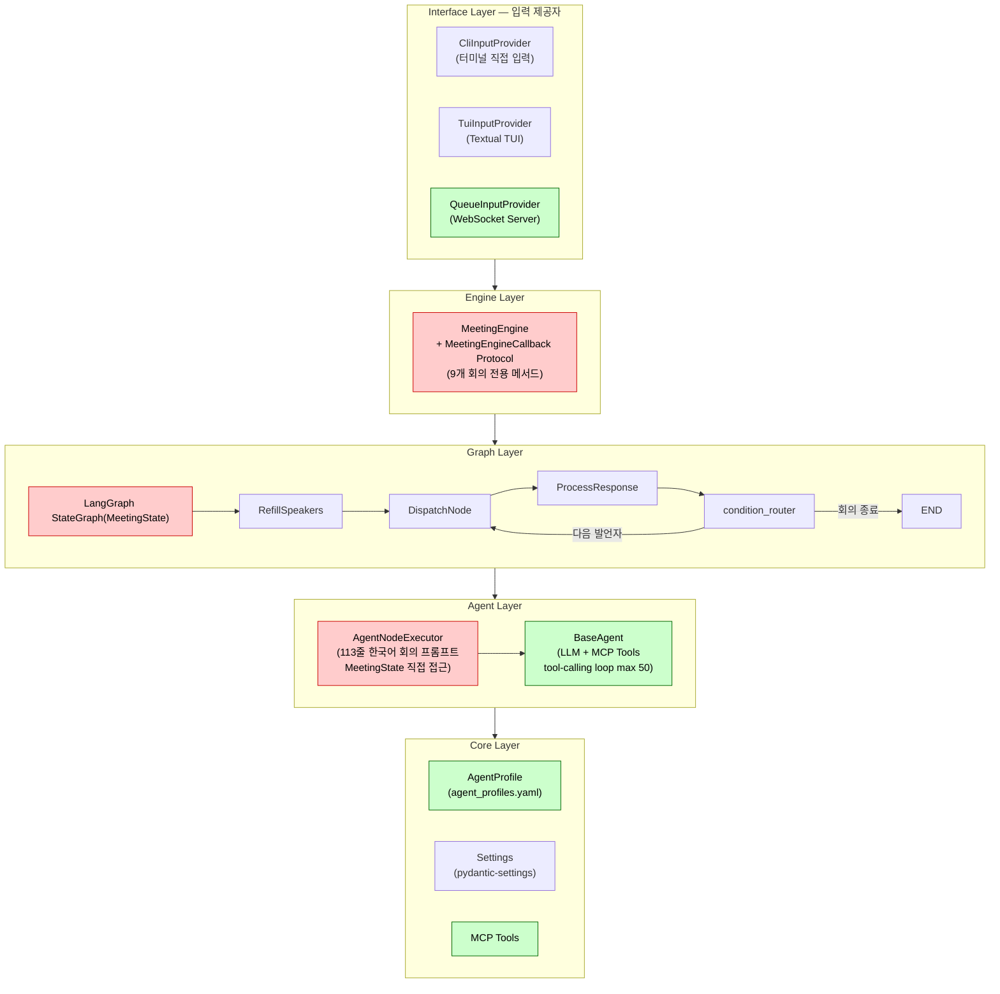
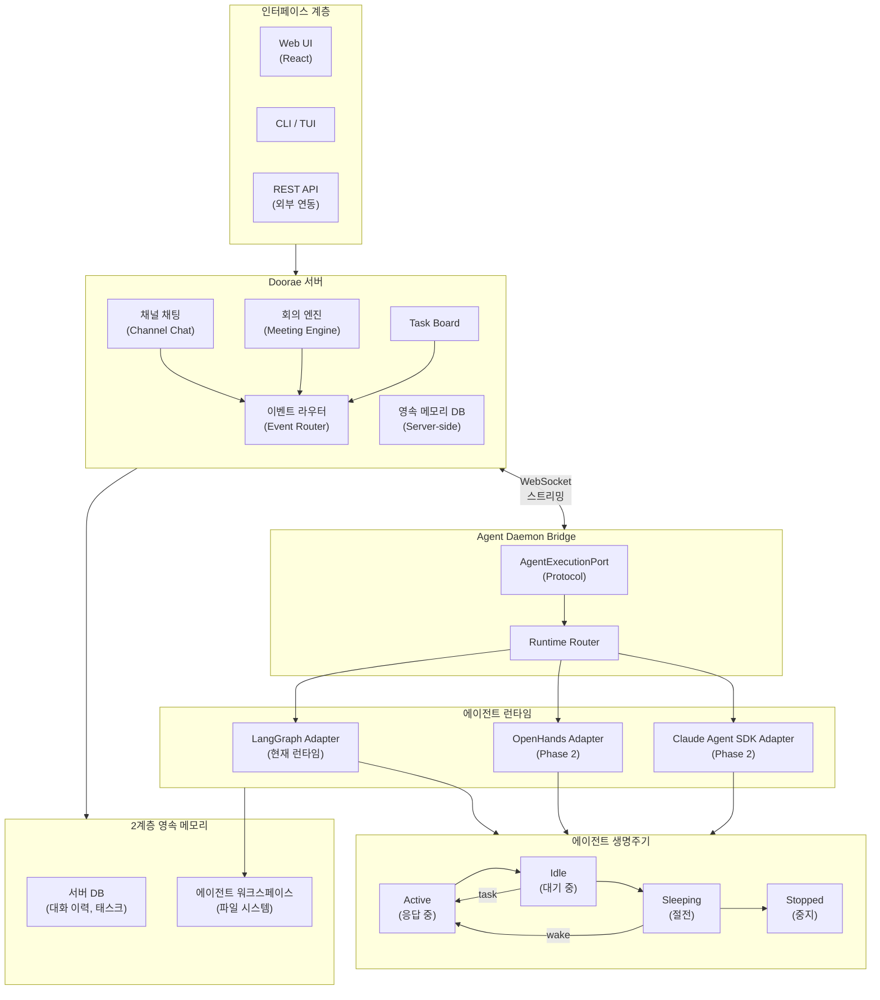
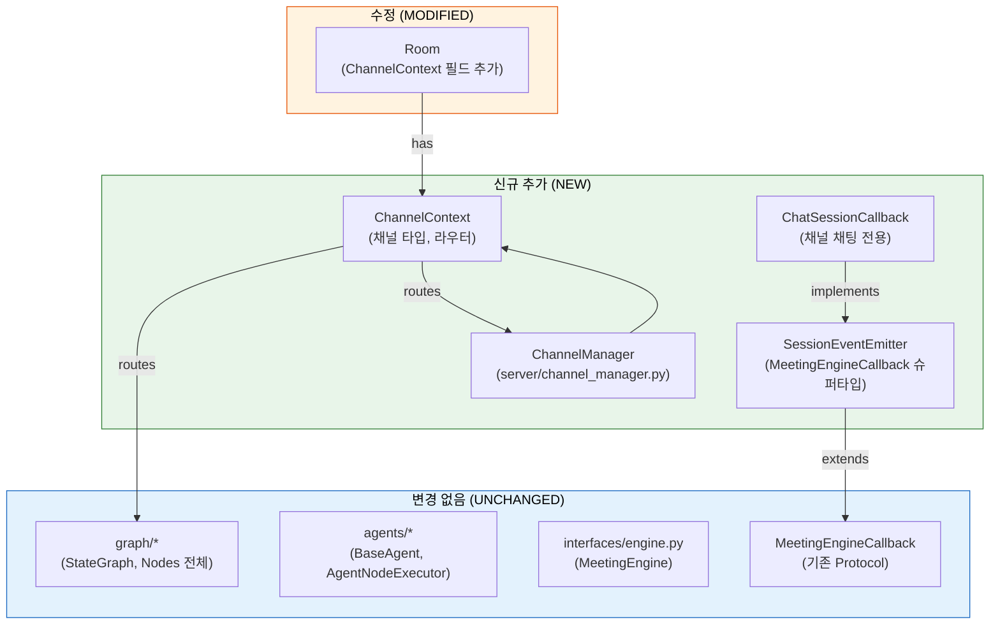
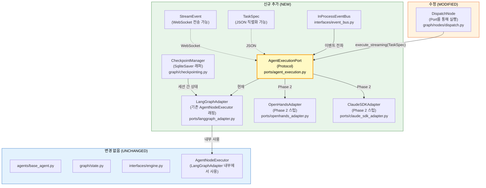
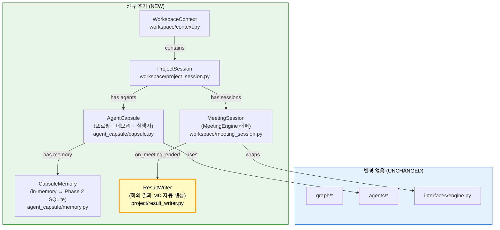
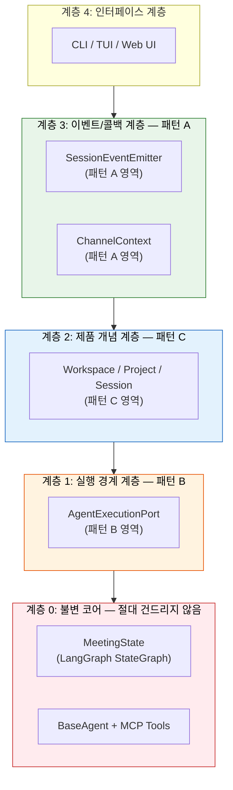
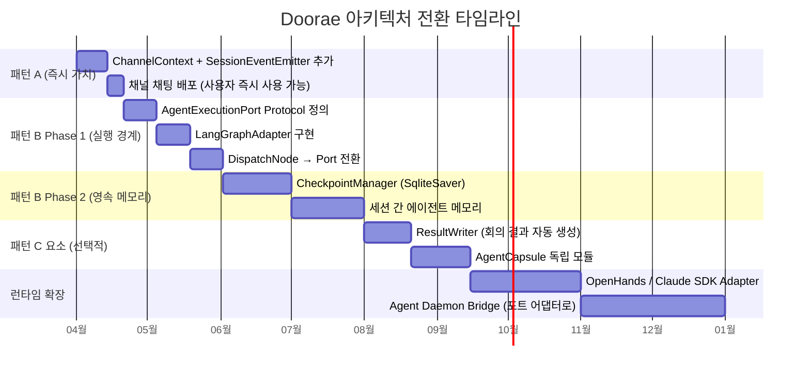
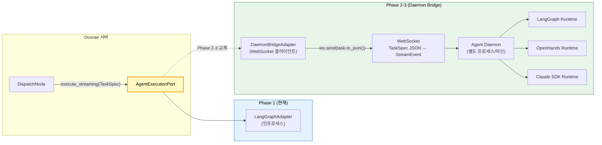
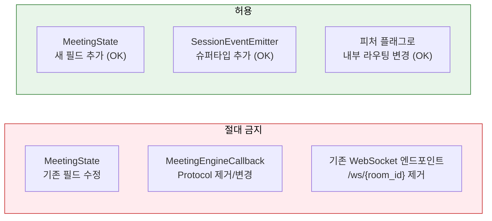

# 아키텍처 전환 전략

!!! info "설계 제안서"
    이 문서는 7인 전문가 패널(시스템 아키텍트, 채팅 서버 개발자, 에이전트 전문가, 최신 정보 제공자, 비평가, 프로덕트 전략가, DX 전문가)의 3라운드 토론을 통해 도출된 아키텍처 전환 전략입니다. 현재의 회의 중심 아키텍처에서 [로드맵](index.md)이 목표로 하는 AI 팀 워크스페이스로 전환하기 위한 구체적인 경로를 제시합니다.

---

## 1. 현재 아키텍처 (As-Is)

### 5계층 구조

Doorae의 현재 아키텍처는 명확한 5계층으로 구성되어 있습니다.



### 회의 결합 지점 (빨간색 — 높은 결합도)

현재 아키텍처에는 회의 로직에 깊게 결합된 5가지 핵심 지점이 있습니다.

| # | 위치 | 결합 내용 | 영향 범위 |
|---|------|-----------|-----------|
| 1 | `graph/state.py` — `MeetingState` | `MessagesState`를 상속하며 13개 이상의 회의 전용 필드 (`agendas`, `pending_speakers`, `speaker_counts` 등) | 전체 Graph, Agent 계층 |
| 2 | `interfaces/engine.py` — `MeetingEngineCallback` | `on_speaker_changed`, `on_agenda_updated`, `on_meeting_ended` 등 9개의 회의 전용 콜백 메서드 | MeetingEngine 전체 |
| 3 | `graph/nodes/dispatch.py` — `AgentNodeExecutor` | 113줄의 한국어 회의 전용 시스템 프롬프트 생성, `MeetingState` 직접 참조 | DispatchNode |
| 4 | 여러 노드 파일 | `HOST_ROLE_NAME` 상수가 3개 파일 11곳 이상에 하드코딩 | RefillSpeakers, Dispatch, Router |
| 5 | `server/room.py` — `Room` | `_current_active_human` 뮤텍스 (회의 발언 순서 전용) | WebSocket Room 관리 |

### 재사용 가능한 자산 (초록색 — 낮은 결합도)

동시에, 향후 전환에서 최대한 활용해야 할 잘 설계된 컴포넌트들도 존재합니다.

| 자산 | 파일 | 재사용성 | 이유 |
|------|------|---------|------|
| `BaseAgent` | `agents/base_agent.py` | ★★★★★ | 회의 의존성 제로. LLM + MCP 추상화가 깔끔함 |
| `InputProvider` Protocol | `interfaces/` | ★★★★★ | 가장 깔끔한 확장 시임(seam). 새 채널 추가 용이 |
| `ConnectionManager` | `server/connection_manager.py` | ★★★★ | 이미 `channel` 파라미터로 멀티플렉싱 준비됨 |
| `NodeRegistry` | `graph/node_registry.py` | ★★★★ | `@register_node()` 플러그인 데코레이터 (비회의용 미사용) |
| `ParticipantRegistry` | `server/participant_registry.py` | ★★★★ | 라이브 추가/제거 지원 |

---

## 2. 목표 아키텍처 (To-Be)

[로드맵](index.md)이 목표로 하는 AI 팀 워크스페이스의 전체 구조입니다.



### 현재 vs 목표 비교

| 영역 | 현재 (v0.1) | 목표 |
|------|-------------|------|
| **상호작용 모델** | 회의(Meeting) 단일 모드 | 채널 채팅 + 회의 + Task Board |
| **인터페이스** | CLI / TUI 터미널 | Web UI (React) + CLI + API |
| **에이전트 생명주기** | 회의 시작~종료 | Always-on (Active → Idle → Sleeping → Stopped) |
| **에이전트 런타임** | LangGraph 단일 | 멀티 런타임 (OpenHands, Claude SDK 등) |
| **메모리** | 세션 내 컨텍스트 | 2계층 영속 메모리 (서버 DB + 워크스페이스 파일) |
| **실행 환경** | 단일 머신 | 다중 머신 분산 실행 |
| **통신 방식** | 발언 순서 기반 | 비동기 채널 + DM + 위임 |
| **작업 관리** | 없음 | Kanban Task Board + 자동 분해/할당 |

---

## 3. 전환의 핵심 과제

### 근본적인 문제: 실행 경계의 부재

`MeetingState`, `MeetingEngine`, `AgentNodeExecutor`는 회의 로직과 깊게 결합되어 있습니다. 패널 토론에서 도출된 핵심 통찰은 다음과 같습니다.

!!! warning "핵심 과제"
    진짜 문제는 **실행 경계(Execution Boundary)가 없다**는 것이다. `AgentNodeExecutor.execute(MeetingState)` 시그니처로는 OpenHands나 Claude SDK를 끼워 넣을 위치가 없다.

현재 `AgentNodeExecutor`는 `MeetingState`를 직접 읽어서 회의 전용 프롬프트를 생성합니다. 이 구조에서는:

- **다른 런타임 교체 불가**: OpenHands, Claude SDK 등을 주입할 인터페이스가 없음
- **채널 채팅 추가 불가**: `MeetingState` 없이는 `AgentNodeExecutor`가 동작하지 않음
- **세션 간 메모리 불가**: `MeetingState`는 단일 LangGraph 실행에 묶여 있음

### 무엇을 건드리면 안 되는가

아래 세 가지는 **절대 불변 원칙**입니다. 어떤 패턴을 선택하더라도 이를 위반해서는 안 됩니다.

!!! danger "불변 원칙"
    1. **`MeetingState` 수정 금지** — LangGraph 타입 시스템은 컴파일 타임 바인딩입니다. 기존 필드 변경은 금지. 새 필드 추가는 허용.
    2. **`MeetingEngineCallback` Protocol 보존** — 현재 코드베이스에서 가장 잘 설계된 추상화 경계입니다.
    3. **기존 엔드포인트 피처 플래그** — `/ws/{room_id}` 엔드포인트는 반드시 유지. 내부 라우팅 변경만 허용. 하위 호환성 파괴는 기존 사용자 이탈로 이어집니다.

---

## 4. 3가지 아키텍처 패턴

패널은 3라운드 토론을 통해 세 가지 독립적인 아키텍처 패턴을 도출했습니다. 각 패턴은 서로 다른 계층을 다루며, 상호 보완적입니다.

---

### 패턴 A: SessionEventEmitter + ChannelContext

#### 전략 개요

`MeetingEngineCallback`을 `SessionEventEmitter`로 진화시키고, 채널 인식을 위한 `ChannelContext`를 추가합니다. **기존 코드를 건드리지 않고**, 채널 채팅을 기존 `BaseAgent`를 직접 사용하는 병렬 경로로 추가합니다.



#### 파일 구조

```
doorae/
├── interfaces/
│   ├── channel.py          # NEW: ChannelContext, ChannelType, ChannelRouter
│   ├── callbacks/
│   │   ├── base.py         # NEW: SessionEventEmitter (MeetingEngineCallback 슈퍼타입)
│   │   └── chat.py         # NEW: ChatSessionCallback
│   └── engine.py           # UNCHANGED
├── server/
│   ├── channel_manager.py  # NEW
│   └── room.py             # MODIFIED: ChannelContext 필드 추가
└── graph/                  # UNCHANGED 전체
```

#### 언제 선택하는가

!!! tip "패턴 A 선택 기준"
    - 팀 규모 1-3명
    - 사용자 확보가 최우선 과제
    - Phase 3 런타임 변경이 12개월 이상 후
    - 기여자 접근성이 중요한 오픈소스 프로젝트

- **MVP 소요**: 4-6주
- **코드 보존율**: 95% 이상

#### Kill Switch (패턴 A 포기 시점)

!!! warning "Kill Switch 조건"
    다음 중 하나라도 해당되면 패턴 B로 전환을 시작하세요.
    - 콜백 메서드가 20개 초과
    - 3개 이상의 런타임 지원 요청
    - `AgentNodeExecutor` 내 런타임 분기가 3곳 이상

---

### 패턴 B: AgentExecutionPort + Checkpoint

#### 전략 개요

`AgentExecutionPort.execute_streaming(TaskSpec) → AsyncIterator[StreamEvent]` 인터페이스를 삽입하여 **실행 경계**를 만듭니다. LangGraph는 이 포트 뒤에 있는 하나의 어댑터가 됩니다.

#### 핵심 Protocol

```python
class AgentExecutionPort(Protocol):
    async def execute_streaming(
        self,
        task: TaskSpec
    ) -> AsyncIterator[StreamEvent]: ...

    async def get_capability(self) -> AgentCapability:  # A2A Agent Card
        ...

    async def get_lifecycle_state(self) -> AgentLifecycleState:
        ...
```



#### 파일 구조

```
doorae/
├── ports/
│   ├── agent_execution.py    # NEW: AgentExecutionPort, TaskSpec, StreamEvent
│   ├── langgraph_adapter.py  # NEW: 기존 AgentNodeExecutor 래핑
│   ├── openhands_adapter.py  # NEW: Phase 2 스텁
│   └── claude_sdk_adapter.py # NEW: Phase 2 스텁
├── graph/
│   ├── checkpointing.py      # NEW: SqliteSaver 래퍼
│   └── nodes/
│       └── dispatch.py       # MODIFIED: Port를 통해 실행
└── interfaces/
    └── event_bus.py          # NEW: InProcessEventBus
```

#### 언제 선택하는가

!!! tip "패턴 B 선택 기준"
    - 팀 규모 3-7명
    - LangGraph 전문가 보유
    - 6-12개월 이내 멀티 런타임 지원 확정
    - A2A/MCP 표준 정렬이 중요한 경우

- **MVP 소요**: 6-8주
- **코드 보존율**: 85% 이상
- **A2A/MCP 정렬**: 8/10

#### Kill Switch (패턴 B 위험 신호)

!!! warning "Kill Switch 조건"
    - `dispatch.py` 수정 후 3건 이상의 회의 회귀 버그
    - `TaskSpec` 스키마 파괴적 변경 5회 이상
    - 팀이 Port를 우회하여 `AgentNodeExecutor` 직접 호출

---

### 패턴 C: Workspace 제품 계층 + AgentCapsule

#### 전략 개요

제품 개념 계층(Workspace → Project → Session)을 코드 구조에 직접 매핑합니다. `AgentCapsule`은 세션 간 에이전트 메모리를 보존합니다. `ResultWriter`로 2주 만에 첫 번째 사용자 가치를 제공합니다.

!!! tip "패턴 C의 핵심 원칙"
    코드 구조 = 제품 구조. 새 팀원이 코드를 보면 제품이 이해됩니다.



#### 파일 구조

```
doorae/
├── workspace/
│   ├── context.py           # NEW: WorkspaceContext
│   ├── project_session.py   # NEW: ProjectSession
│   └── meeting_session.py   # NEW: MeetingSession (MeetingEngine 래퍼)
├── agent_capsule/
│   ├── capsule.py           # NEW: AgentCapsule (프로필 + 메모리 + 실행자)
│   └── memory.py            # NEW: CapsuleMemory (in-memory → Phase 2 SQLite)
└── project/
    └── result_writer.py     # NEW: 회의 결과 MD 자동 생성
```

#### 언제 선택하는가

!!! tip "패턴 C 선택 기준"
    - 팀 규모 5명 이상
    - "AI 워크스페이스"가 핵심 비전
    - 세션 간 에이전트 메모리가 Day 1 요구사항
    - DX와 기여자 온보딩이 최우선

- **첫 번째 가치 제공**: 2주 (ResultWriter)
- **코드 보존율**: 85% 이상

#### Kill Switch (패턴 C 위험 신호)

!!! warning "Kill Switch 조건"
    - "Session이란 무엇인가" 정의 충돌이 지속될 경우
    - `WorkspaceManager`가 `MeetingEngine`을 복제하기 시작할 경우
    - 6개월 내 새로운 Session 타입이 0개인 경우

---

## 5. 핵심 발견: 3패턴은 서로 다른 계층

!!! info "Round 3의 핵심 통찰"
    세 패턴은 **경쟁 관계가 아닙니다.** 서로 다른 계층을 다루는 **상호 보완적** 패턴입니다. 모두 함께 적용할 수 있습니다.



| 계층 | 패턴 | 담당 영역 | 핵심 컴포넌트 |
|------|------|-----------|--------------|
| 이벤트/콜백 | **패턴 A** | 회의 이벤트 → 세션 이벤트 일반화 | `SessionEventEmitter`, `ChannelContext` |
| 제품 개념 | **패턴 C** | Workspace/Project/Session 매핑 | `WorkspaceContext`, `AgentCapsule` |
| 실행 경계 | **패턴 B** | 런타임 교체 가능한 경계 | `AgentExecutionPort`, `TaskSpec` |
| 불변 코어 | **(없음)** | 절대 수정 금지 | `MeetingState`, LangGraph, `BaseAgent` |

---

## 6. 패턴 비교표

| 평가 기준 | 패턴 A | 패턴 B | 패턴 C |
|-----------|--------|--------|--------|
| **Phase 1 MVP 속도** | ★★★★★ 4-6주 | ★★★★ 6-8주 | ★★★★ 2주(첫 가치) |
| **코드 보존율** | ★★★★★ 95%+ | ★★★★ 85%+ | ★★★★ 85%+ |
| **런타임 교체 가능성** | ★★ | ★★★★★ | ★★★ |
| **A2A/MCP 정렬** | ★★ (4/10) | ★★★★ (8/10) | ★★ (4/10) |
| **Phase 3 준비도** | ★★ | ★★★★★ | ★★★ |
| **v0.1 목표 정렬** | ★★★ | ★★★ | ★★★★★ |
| **DX/기여자 접근성** | ★★★★★ | ★★★ | ★★★★★ |
| **회의 회귀 위험** | ★★★★★ 없음 | ★★★ dispatch 변경 | ★★★★ 래퍼만 |

---

## 7. 권장 전략: A → B 순차 적용

패널의 최종 권고안은 **패턴 A로 시작하여 패턴 B로 진화**하는 순차 적용 전략입니다. 패턴 C의 요소는 독립 모듈로 선택적 추가됩니다.



### 단계별 상세 계획

#### Week 1-2: 패턴 A Day 1

**목표**: 채널 채팅 즉시 배포. 사용자 가치 Day 1.

- `interfaces/channel.py` 생성: `ChannelContext`, `ChannelType`, `ChannelRouter`
- `interfaces/callbacks/base.py`: `SessionEventEmitter` (`MeetingEngineCallback`의 슈퍼타입 alias)
- `server/room.py`: `ChannelContext` 필드 추가
- `server/channel_manager.py` 생성
- **기존 코드 변경 없음**, 기존 테스트 100% 통과

#### Week 3-6: 패턴 B Phase 1

**목표**: 실행 경계 삽입. 런타임 교체 가능한 구조 완성.

- `ports/agent_execution.py`: `AgentExecutionPort` Protocol, `TaskSpec`, `StreamEvent` 정의
- `ports/langgraph_adapter.py`: 기존 `AgentNodeExecutor` 래핑
- `ports/openhands_adapter.py`, `ports/claude_sdk_adapter.py`: Phase 2 스텁
- `graph/nodes/dispatch.py`: `AgentNodeExecutor` 직접 호출 → Port 사용으로 변경
- **위험 완화**: DispatchNode 변경 전 회의 회귀 테스트 스위트 작성

#### Month 2-3: 패턴 B Phase 2

**목표**: 세션 간 에이전트 메모리.

- `graph/checkpointing.py`: LangGraph `SqliteSaver` 래퍼
- `interfaces/event_bus.py`: `InProcessEventBus`
- 세션 재시작 후 에이전트 컨텍스트 복원 검증

#### Month 4-5: 패턴 C 요소 (선택적)

**목표**: 즉각적인 사용자 가치 + DX 개선.

- `project/result_writer.py`: 회의 종료 시 마크다운 결과 자동 생성
- `agent_capsule/capsule.py`: 프로필 + 메모리 + 실행자를 하나의 캡슐로
- 이 단계는 팀/비전에 따라 건너뛸 수 있음

#### Month 6+: 런타임 확장

**목표**: 멀티 런타임 지원.

- `ports/openhands_adapter.py` 실제 구현
- `ports/claude_sdk_adapter.py` 실제 구현
- Agent Daemon Bridge: `DaemonBridgeAdapter implements AgentExecutionPort`

#### Phase 3: Agent Daemon Bridge + 다중 머신

**목표**: 분산 에이전트 실행 환경.

- Daemon Bridge가 `AgentExecutionPort` 어댑터로 자연스럽게 삽입됨
- 네트워크 투명성: `TaskSpec` JSON 직렬화, `StreamEvent` WebSocket 스트리밍

---

## 8. Agent Daemon Bridge 전략

### 3라운드 토론의 쟁점

Agent Daemon Bridge는 패널 전체 3라운드에서 가장 뜨거운 논쟁 주제였습니다.

| 입장 | 주체 | 논거 |
|------|------|------|
| Phase 1 포함 | [Agent] + [Trend] | 조기 멀티 런타임 지원, A2A 표준 정렬 |
| Phase 2-3 지연 | [PM] + [Critic] | 사용자에게 보이는 가치 없음, 6개월 생존이 우선 |
| **타협안** | 전원 합의 | **AgentExecutionPort (Week 3-6)가 삽입 지점 생성. Bridge는 Phase 2-3에 Port 어댑터로** |

### 핵심 통찰: Port 시그니처는 이미 네트워크 투명

`AgentExecutionPort`의 시그니처 `execute_streaming(TaskSpec) → AsyncIterator[StreamEvent]`는 이미 네트워크 투명합니다.

- `TaskSpec` → JSON 직렬화
- `StreamEvent` → WebSocket으로 스트리밍

```python
class DaemonBridgeAdapter:
    """AgentExecutionPort를 구현하는 Daemon Bridge 어댑터"""

    async def execute_streaming(
        self, task: TaskSpec
    ) -> AsyncIterator[StreamEvent]:
        await self.ws.send(task.to_json())
        async for msg in self.ws:
            yield StreamEvent.from_json(msg)
```



이 구조 덕분에 Phase 1에서는 인프로세스 `LangGraphAdapter`를 사용하고, Phase 2-3에서는 코드 변경 없이 `DaemonBridgeAdapter`로 교체만 하면 됩니다. `DispatchNode`는 이 차이를 알 필요가 없습니다.

---

## 9. 패널 투표 결과

3라운드 토론 후 각 패널 전문가의 최종 선택과 근거:

| 전문가 | 1차 선택 | 핵심 근거 |
|--------|---------|-----------|
| **[Arch] 시스템 아키텍트** | 패턴 B | 실행 경계 부재가 지금 가장 큰 기술 부채 |
| **[Chat] 채팅 서버 개발자** | 패턴 A | 채널 채팅이 즉시 가능한 유일한 패턴 |
| **[Agent] 에이전트 전문가** | 패턴 B | AgentExecutionPort가 런타임 교체의 핵심 |
| **[Trend] 최신 정보 제공자** | 패턴 B | Agent-as-MCP-Server 트렌드와 최고 정렬 |
| **[Critic] 비평가** | A → B | 패턴 A로 시작, B로 진화. 단독 B는 위험 |
| **[PM] 프로덕트 전략가** | 패턴 A | 6개월 생존이 우선. `dispatch.py` 위험 회피 |
| **[DX] DX 전문가** | 패턴 A | 기여자 접근성이 압도적 |

!!! success "최종 합의"
    초기 투표: **A 지지 4표 vs B 지지 3표** → 타협안 제시 후 **A → B 순차 적용 전략으로 전원 만장일치**

    - **[Chat]**, **[PM]**, **[DX]**: "B의 실행 경계 삽입이 Week 3-6에 자연스럽게 이어지므로 A부터 시작해도 B를 포기하는 것이 아니다"
    - **[Arch]**, **[Agent]**, **[Trend]**: "A가 `BaseAgent`를 직접 사용하는 채널 채팅 경로를 열면, Port 삽입은 그다음 논리적 단계"
    - **[Critic]**: "이것이 내가 처음부터 원했던 것이다"

---

## 10. 보수적 전환 원칙 (재정의)

아래 세 가지는 더 이상 절대 금지 규칙이 아니라, **회귀 위험이 높아 보수적으로 다뤄야 하는 영역**입니다. 기본 원칙은 외부 계약은 최대한 안정적으로 유지하고, 내부 진실 원천은 점진적으로 `channel/session` 중심으로 옮기는 것입니다.



!!! danger "왜 이 원칙이 중요한가"
    1. **`MeetingState` 불변**: LangGraph `StateGraph(MeetingState)`는 컴파일 타임에 타입이 바인딩됩니다. 기존 필드를 수정하면 Graph 전체가 깨집니다. 새 필드 추가는 안전합니다.

    2. **`MeetingEngineCallback` 보존**: 이것은 현재 코드베이스에서 가장 잘 설계된 추상화 경계입니다. 9개의 명확한 메서드는 "회의에서 무슨 일이 일어나는가"의 완전한 계약입니다. 이를 깨뜨리면 모든 콜백 구현체가 한 번에 깨집니다.

    3. **엔드포인트 피처 플래그**: 기존 사용자는 `/ws/{room_id}`로 접속합니다. 이 엔드포인트가 사라지면 기존 사용자는 즉시 이탈합니다. 내부 라우팅은 바꿔도 되지만, 외부 계약은 유지합니다.

---

## 11. ADR — Delivery-First Ordered Channel Kernel 채택

### 상태

- **Accepted** — 2026-03-25

### 배경

- 현재 코드베이스의 실제 live authority는 `MeetingEngine`보다 `Room`에 더 가깝습니다. `Room`이 연결, 재접속, queue, broadcast, active human gating을 사실상 소유하고 있기 때문입니다.
- 반면 durable product model은 아직 약합니다. 채널 채팅, offline catch-up, replay, mention wake, always-on handoff를 설명할 수 있는 **서버 소유의 delivery/resume contract**가 없습니다.
- 따라서 문제의 핵심은 "회의를 어떻게 일반화할 것인가"보다 "**어떤 서버 코어가 채널 메시지의 수락, 순서, fanout, replay를 소유할 것인가**"로 봐야 합니다.

### 결정

최종 아키텍처 패턴으로 **Delivery-First Ordered Channel Kernel**을 채택합니다.

- **durable truth**: `Channel`, `Message`, `Membership`
- **live truth**: `Connection`/`Subscription`/`DeliveryCursor` 또는 이에 준하는 `ChannelSession`/`ChannelLane`
- **derived state**: `Presence`
- **overlay**: `Meeting`, `MeetingState`, `MeetingEngine`, `MeetingEngineCallback`
- **runtime seam**: channel append path 뒤에 놓이는 thin `AgentExecutionPort`
- **later additions**: capability/state registry, inbox/work projections, task board projections

이 패턴에서 가장 중요한 점은 `channel-first`만으로 충분하지 않다는 것입니다. **메시지 수락, 순서 부여, delivery cursor, resume semantics**가 서버 코어의 일부여야 합니다. mailbox/lane discipline은 이 ordered kernel의 live-layer 규율이며, 별도 플랫폼 패턴이 아닙니다.

### 결과

- `Room`은 최종적으로 product domain이 아니라 **compatibility ingress facade**로 내려갑니다.
- `MeetingState`는 서버 truth가 아니라 **meeting overlay compatibility state**로 제한됩니다.
- `MeetingEngineCallback`은 미래의 일반 세션 API가 아니라 **meeting adapter contract**로 유지됩니다.
- `DispatchNode`와 runtime invocation은 `MeetingState` 직접 의존에서 벗어나, channel append path 뒤의 thin execution seam으로 이동해야 합니다.
- `capability registry`, `inbox/work graph`, `task projection`은 유효한 후속 구조이지만, durable channel path가 안정화되기 전의 core truth가 되어서는 안 됩니다.

### 기각한 대안

- **Plain Channel Kernel**: 방향은 맞지만 ordering, replay, reconnect authority가 너무 느슨합니다.
- **Event Platform / Event Bus first**: 너무 이른 추상화이며, 제품보다 인프라가 먼저 중심이 됩니다.
- **Workspace / Work Graph first**: 장기 비전에는 유용하지만, 채널 채팅이라는 1차 제품 목표를 흐립니다.
- **Compatibility Monolith / Room-first**: 변경량은 적지만 회의 중심성과 hidden authority를 그대로 보존합니다.

---

!!! info "다음 단계"
    이 전환 전략을 실제 구현으로 옮기려면:

    1. **호환 ingress 유지**: `/ws/{room_id}`는 유지하되, 내부 라우팅을 `channel/session` 기준으로 재배치
    2. **durable 채널 경로 확립**: `Channel`/`Message`/`Membership`와 delivery/resume cursor를 서버 truth로 수립
    3. **live authority 이동**: `Room`의 queue/broadcast/reconnect 책임을 `ChannelSession`/`Subscription`/`ChannelLane` 쪽으로 이동
    4. **meeting overlay 격리**: `MeetingState`와 `MeetingEngine`를 overlay adapter로 제한하고, 새 surface의 truth로 쓰지 않기
    5. **thin runtime seam 삽입**: ordered channel path 뒤에 `AgentExecutionPort`를 두고 LangGraph를 첫 구현체로 래핑
    6. **후속 projection 추가**: task/inbox/work projection과 capability/state registry는 durable channel path 안정화 이후에 추가

    각 로드맵 기능과의 관계는 [채널 기반 채팅](channel-chat.md), [멀티 런타임](multi-runtime.md), [에이전트 영속 메모리](persistent-memory.md), [Agent Daemon Bridge](agent-daemon-bridge.md) 문서를 참조하세요.

---

## 12. 문서 히스토리

| 날짜 | 변경 내용 | 비고 |
|------|----------|------|
| 2026-03-25 | `불변 원칙`을 `보수적 전환 원칙`으로 재정의 | 절대 규칙에서 회귀 위험이 큰 영역으로 해석 변경 |
| 2026-03-25 | ADR 챕터 추가 | 최종 권고안을 `Delivery-First Ordered Channel Kernel`로 명시 |
| 2026-03-25 | `다음 단계` 섹션 갱신 | channel delivery/resume, ordered live authority, meeting overlay 격리 순서로 조정 |
| 2026-03-25 | 하단 history 섹션 추가 | 이후 문서 갱신 이력을 누적 기록 |
