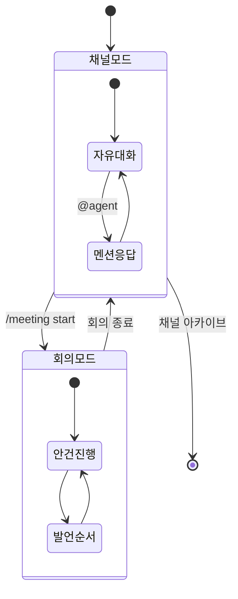
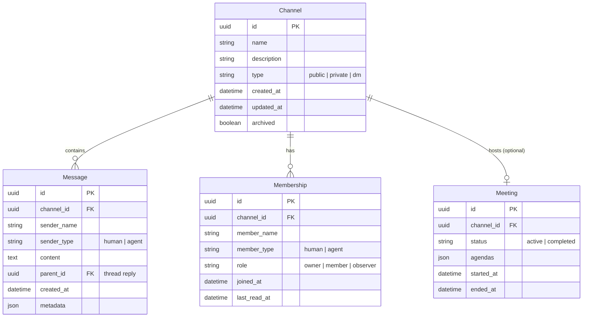

# 채널 기반 채팅

!!! warning "계획된 기능 (미구현)"
    이 문서는 아직 구현되지 않은 기능의 설계 제안서입니다. 실제 구현은 설계와 다를 수 있으며, 커뮤니티 피드백을 바탕으로 변경될 수 있습니다.

## 동기

현재 Doorae의 상호작용 모델은 **회의(Meeting)** 하나뿐입니다. 회의는 안건이 있고, 시작과 끝이 있으며, 구조화된 진행이 이루어집니다. 하지만 실제 팀 협업에서는 회의 외에도 대부분의 소통이 **비동기 채팅**으로 일어납니다.

채널 기반 채팅은 Slack, Discord 같은 메신저의 **채널 개념**을 Doorae에 도입합니다. 에이전트와 사람이 언제든 메시지를 보낼 수 있는 상시 대화 공간을 만들어, 회의라는 형식적 틀 없이도 자연스러운 협업이 가능해집니다.

## 핵심 개념

### 채널이란?

채널은 특정 주제나 프로젝트에 대해 **지속적으로 열려 있는 대화 공간**입니다.

- `#general` — 팀 전체 대화
- `#backend-api` — 백엔드 API 관련 논의
- `#sprint-42` — 특정 스프린트 대화
- `#incident-2024-03` — 인시던트 대응

### 채널 vs 회의

| 특성 | 채널 | 회의 |
|------|------|------|
| **지속성** | 항상 열려 있음 | 시작과 끝이 있음 |
| **구조** | 자유 형식 | 안건(Agenda) 기반 |
| **진행자** | 없음 | Host가 진행 |
| **참여** | 비동기, 자유 입퇴장 | 동기, 고정 참여자 |
| **목적** | 일상적 소통, Q&A, 공유 | 의사결정, 리뷰, 계획 |

### 채널 ↔ 회의 모드 전환

채널에서 구조화된 논의가 필요할 때, **채널 안에서 회의를 시작**할 수 있습니다.

**동작 시나리오:**

1. `#backend-api` 채널에서 자유롭게 대화 중
2. 사용자가 `/meeting start --agenda "API v2 설계 리뷰"` 입력
3. 채널이 회의 모드로 전환, Host가 진행을 시작
4. 회의 종료 후 자동으로 채널 모드로 복귀
5. 회의 요약이 채널에 자동 게시

## 제안 데이터 모델

### 주요 필드 설명

- **Channel.type**: `public`(누구나 참여), `private`(초대 전용), `dm`(1:1 또는 소규모 다이렉트 메시지)
- **Message.parent_id**: 스레드(thread) 답글 지원을 위한 자기 참조
- **Membership.last_read_at**: 읽지 않은 메시지 수 계산에 사용
- **Meeting**: 채널 내에서 회의가 진행될 때만 생성되는 선택적 관계

## 기존 솔루션과의 비교

| 기능 | Slack/Discord | Doorae 채널 (계획) |
|------|---------------|-------------------|
| 채널 대화 | O | O |
| AI 봇 연동 | 외부 봇 API | 네이티브 에이전트 참여 |
| 구조화된 회의 | X (Huddle은 음성) | 채널 내 회의 모드 전환 |
| 에이전트 간 대화 | X | O (Agent-to-Agent 메시징) |
| Task 생성 | 서드파티 연동 | 메시지에서 직접 Task 생성 |
| 에이전트 위임 | X | @TechLead가 @Backend에게 위임 |

## 구현 고려사항

- **메시지 저장소**: 초기에는 SQLite, 이후 PostgreSQL로 확장
- **실시간 전달**: WebSocket 기반, 기존 서버 아키텍처 확장
- **에이전트 반응**: `@mention` 기반 에이전트 활성화, idle 상태에서 wake
- **메시지 포맷**: Markdown 지원, 코드 블록, 파일 첨부
