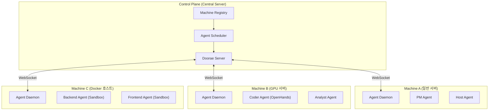
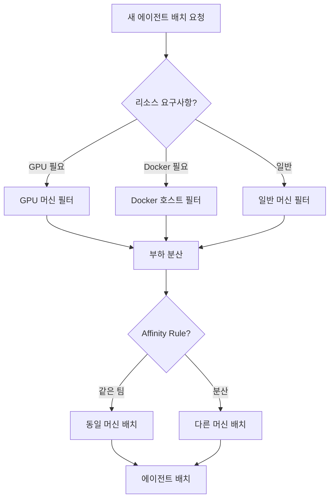
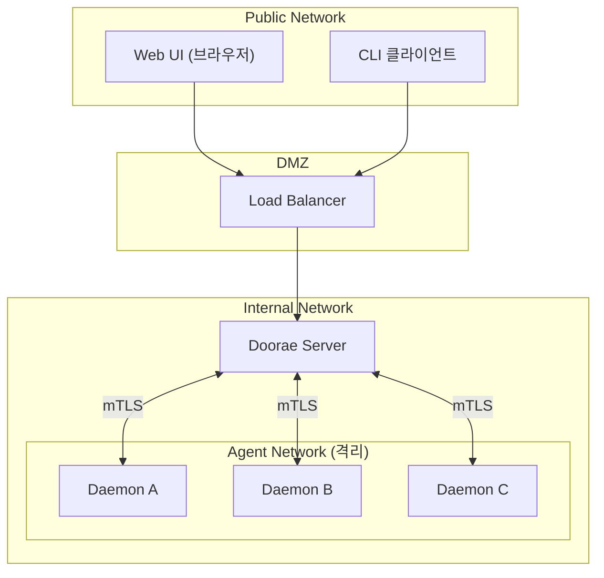

# 다중 머신 지원

!!! warning "계획된 기능 (미구현)"
    이 문서는 아직 구현되지 않은 기능의 설계 제안서입니다. 실제 구현은 설계와 다를 수 있으며, 커뮤니티 피드백을 바탕으로 변경될 수 있습니다.

## 동기

현재 Doorae는 **단일 머신**에서 모든 구성요소(서버, 에이전트, Daemon)를 실행합니다. 이 구조는 시작하기 쉽지만, 팀 규모가 커지거나 에이전트의 워크로드가 늘어나면 한계에 부딪힙니다.

다중 머신 지원은 Doorae의 에이전트 실행을 **여러 물리/가상 머신에 분산**하여, 규모 확장과 리소스 격리를 가능하게 합니다.

### 필요한 이유

- **리소스 격리**: GPU가 필요한 에이전트는 GPU 머신에서, 코드 실행이 필요한 에이전트는 Docker 호스트에서 실행
- **확장성**: 에이전트 수 증가에 따른 수평 확장
- **가용성**: 하나의 머신이 다운되어도 다른 머신의 에이전트는 계속 동작
- **비용 최적화**: 경량 에이전트는 저렴한 머신에, 무거운 에이전트는 고성능 머신에 배치

## 아키텍처



## Machine Registry

중앙 서버가 관리하는 머신 목록으로, 각 머신의 상태와 능력을 추적합니다.

### 머신 등록 정보

```yaml
# machine_registry 예시
machines:
  - id: machine-a
    hostname: agent-host-01.internal
    address: 192.168.1.10:9090
    labels:
      type: general
      location: office
    resources:
      cpu_cores: 8
      memory_gb: 16
      gpu: false
      docker: false
    status: online
    agents:
      - PM
      - Host

  - id: machine-b
    hostname: gpu-host-01.internal
    address: 192.168.1.20:9090
    labels:
      type: gpu
      location: cloud
    resources:
      cpu_cores: 16
      memory_gb: 64
      gpu: true
      gpu_model: "NVIDIA A100"
      docker: true
    status: online
    agents:
      - Coder
      - Analyst
```

## Agent-to-Machine 매핑

에이전트를 적절한 머신에 배치하는 전략입니다.

### 배치 전략



### 배치 규칙

| 규칙 | 설명 | 예시 |
|------|------|------|
| **리소스 기반** | 에이전트 요구사항과 머신 자원 매칭 | GPU 에이전트 → GPU 머신 |
| **Affinity** | 관련 에이전트를 가까이 배치 | TechLead + Backend → 같은 머신 |
| **Anti-Affinity** | 같은 역할을 분산 배치 | PM 레플리카 → 다른 머신 |
| **Label 기반** | 머신 라벨로 필터링 | `location: cloud` 조건 |

## 네트워크 토폴로지



### 네트워크 요구사항

| 연결 | 프로토콜 | 인증 | 암호화 |
|------|---------|------|--------|
| Client → Server | WebSocket (wss) | JWT | TLS |
| Server → Daemon | WebSocket (wss) | mTLS (상호 인증서) | TLS |
| Daemon → Runtime | 로컬 또는 gRPC | 런타임 특정 | TLS (원격 시) |
| Daemon → Daemon | 직접 통신 없음 | N/A | N/A |

## 보안 고려사항

### 인증 및 인가

- **Machine Identity**: 각 머신은 고유한 인증서 (mTLS)로 서버에 인증
- **Agent Token**: 에이전트별 scoped token으로 API 접근 제한
- **Network Policy**: Agent Network는 외부 접근 차단, 서버를 통해서만 통신

### 데이터 보안

- **전송 중 암호화**: 모든 머신 간 통신은 TLS
- **저장 시 암호화**: 에이전트 워크스페이스의 민감 데이터 암호화
- **Secret 관리**: API 키 등 민감 정보는 중앙 Secret Store에서 관리

### 격리

- **프로세스 격리**: 각 에이전트는 독립 프로세스로 실행
- **네트워크 격리**: Agent Network와 Public Network 분리
- **리소스 제한**: cgroups/Docker로 에이전트별 CPU/메모리 제한

## 운영 명령어 (안)

```bash
# 머신 관리
doorae machine list                        # 등록된 머신 목록
doorae machine register <address>          # 새 머신 등록
doorae machine status <machine-id>         # 머신 상태 확인
doorae machine drain <machine-id>          # 머신에서 에이전트 이동 (유지보수)

# 에이전트 배치
doorae agent deploy PM --machine machine-a          # 특정 머신에 배치
doorae agent migrate Backend --to machine-b         # 에이전트 이동
doorae agent scale Backend --replicas 2             # 에이전트 복제 (로드 분산)
```

## 기존 솔루션과의 비교

| 특성 | Kubernetes | Docker Swarm | Doorae Multi-Machine (계획) |
|------|-----------|-------------|---------------------------|
| **오케스트레이션** | 범용 컨테이너 | 범용 컨테이너 | 에이전트 특화 |
| **스케줄링** | Pod 스케줄러 | Service 스케줄러 | Agent-aware 스케줄러 |
| **설정 복잡도** | 높음 | 중간 | 낮음 (Doorae 통합) |
| **에이전트 인식** | 없음 (범용) | 없음 (범용) | 역할/전문성 인식 배치 |
| **Hibernate 지원** | X (항상 실행) | X | O (Sleeping 상태) |

## 구현 고려사항

- **점진적 도입**: 단일 머신에서 시작 → 2대 → N대 순서로 확장
- **호환성**: 단일 머신 모드가 기본, 다중 머신은 opt-in 설정
- **장애 복구**: 머신 다운 시 해당 머신의 에이전트를 자동으로 다른 머신에 재배치
- **모니터링**: 머신별 리소스 사용량, 에이전트 상태, 네트워크 지연 시간 대시보드
- **설정 관리**: 중앙 서버에서 모든 머신의 설정을 통합 관리
