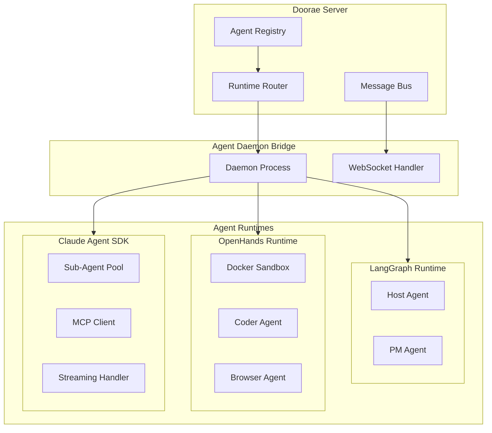
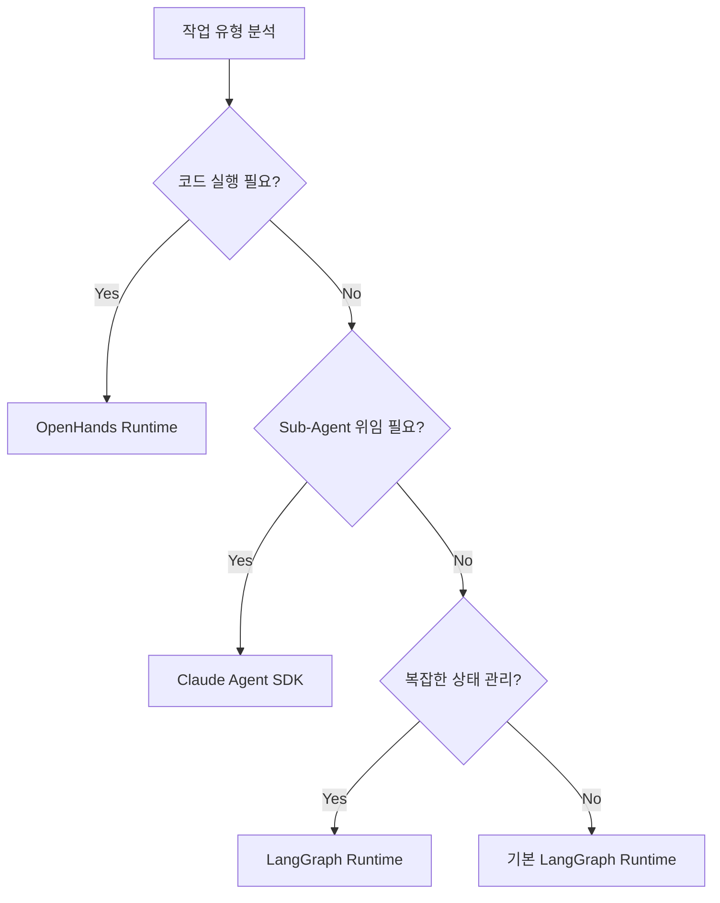

# 멀티 런타임

!!! warning "계획된 기능 (미구현)"
    이 문서는 아직 구현되지 않은 기능의 설계 제안서입니다. 실제 구현은 설계와 다를 수 있으며, 커뮤니티 피드백을 바탕으로 변경될 수 있습니다.

## 동기

현재 Doorae는 **LangGraph 단일 런타임**에서 모든 에이전트를 실행합니다. LangGraph는 상태 기반 워크플로우에 강력하지만, 모든 에이전트 시나리오에 최적은 아닙니다.

멀티 런타임은 하나의 Doorae 서버가 **여러 에이전트 실행 백엔드**를 동시에 사용할 수 있게 합니다. 코드를 작성하는 에이전트는 Docker sandbox가 있는 OpenHands에서, 대화와 분석을 담당하는 에이전트는 Claude Agent SDK에서 실행하는 식입니다.

### 왜 멀티 런타임인가?

- **모델 자유도**: 런타임마다 다른 LLM 제공자와 모델 사용 가능
- **샌드박싱**: 코드 실행이 필요한 에이전트는 격리된 환경에서 안전하게 실행
- **비용 최적화**: 작업 특성에 맞는 가장 비용 효율적인 런타임 선택
- **기능 특화**: 각 런타임의 고유 강점을 활용 (브라우저, MCP, sub-agent 등)

## 아키텍처

### Server ↔ Daemon ↔ Runtime 계층

| 계층 | 역할 | 구현체 |
|------|------|--------|
| **Server** | 채널/회의 관리, 메시지 라우팅, 사용자 인터페이스 | Doorae FastAPI Server |
| **Daemon** | 런타임 생명주기 관리, 메시지 중계, heartbeat | Agent Daemon Bridge |
| **Runtime** | 에이전트 실행, LLM 호출, 도구 사용 | LangGraph / OpenHands / Claude SDK |

## 런타임 비교

### OpenHands

[OpenHands](https://github.com/All-Hands-AI/OpenHands)는 코드 작성과 실행에 특화된 에이전트 프레임워크입니다.

**강점:**

- **Docker Sandbox**: 코드 실행이 격리된 컨테이너에서 이루어져 안전
- **멀티 LLM**: OpenAI, Anthropic, 로컬 모델 등 다양한 LLM 지원
- **코드 실행**: Python, JavaScript, shell 명령어 등 직접 실행
- **브라우저 자동화**: Playwright 기반 웹 브라우저 조작

**적합한 에이전트 역할:**

- Backend Engineer: API 구현, 테스트 코드 작성
- Frontend Engineer: UI 컴포넌트 구현
- DevOps: 인프라 스크립트, CI/CD 설정

### Claude Agent SDK

[Claude Agent SDK](https://docs.anthropic.com/en/docs/agents)는 Anthropic의 에이전트 개발 도구입니다.

**강점:**

- **Sub-Agent 시스템**: 에이전트가 하위 에이전트를 생성하고 위임
- **MCP 네이티브**: Model Context Protocol 도구를 자연스럽게 사용
- **스트리밍**: 토큰 단위 실시간 스트리밍 지원
- **안전성**: Constitutional AI 기반 안전 장치 내장

**적합한 에이전트 역할:**

- Host: 회의 진행, 안건 관리
- PM: 프로젝트 상태 분석, 이슈 추적
- TechLead: 아키텍처 리뷰, 기술 의사결정

### 런타임 비교표

| 특성 | LangGraph (현재) | OpenHands | Claude Agent SDK |
|------|-----------------|-----------|-----------------|
| **코드 실행** | 제한적 (MCP 도구) | Docker sandbox | 제한적 (MCP 도구) |
| **LLM 지원** | OpenAI 호환 전체 | 다양한 제공자 | Anthropic Claude |
| **샌드박싱** | 없음 | Docker 격리 | 프로세스 격리 |
| **상태 관리** | StateGraph 내장 | 세션 기반 | 대화 컨텍스트 |
| **도구 생태계** | LangChain Tools + MCP | 자체 도구 + 코드 실행 | MCP 네이티브 |
| **Sub-Agent** | 계층적 노드 | AgentController | 네이티브 sub-agent |
| **스트리밍** | LangGraph 이벤트 | 웹소켓 | 토큰 스트리밍 |
| **비용** | LLM 호출 비용만 | LLM + 컴퓨팅 | LLM 호출 비용만 |
| **설정 복잡도** | 낮음 | 중간 (Docker 필요) | 낮음 |

## 런타임 선택 전략

## 구현 고려사항

- **통합 메시지 포맷**: 모든 런타임이 동일한 메시지 스키마를 사용
- **런타임 설정**: `agent_profiles.yaml`에 per-agent runtime 지정 가능
- **Fallback**: 지정된 런타임 사용 불가 시 LangGraph로 자동 fallback
- **모니터링**: 런타임별 성능 메트릭 수집 (응답 시간, 토큰 사용량, 에러율)
- **점진적 도입**: LangGraph를 기본으로 유지하면서 OpenHands, Claude SDK를 선택적으로 추가
