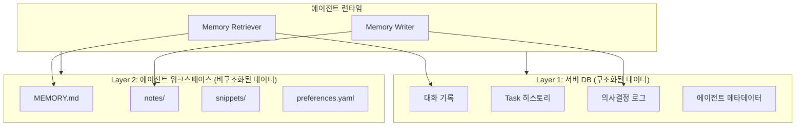
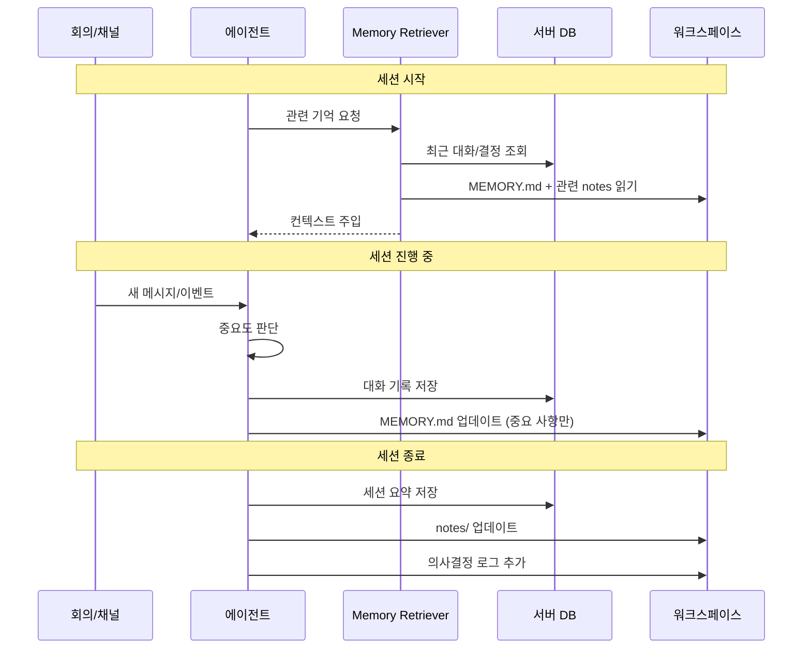

# 에이전트 영속 메모리

!!! warning "계획된 기능 (미구현)"
    이 문서는 아직 구현되지 않은 기능의 설계 제안서입니다. 실제 구현은 설계와 다를 수 있으며, 커뮤니티 피드백을 바탕으로 변경될 수 있습니다.

## 동기

현재 Doorae 에이전트의 메모리는 **단일 세션**에 한정됩니다. 회의가 끝나면 에이전트는 대화 내용을 잊어버리고, 다음 회의에서 처음부터 다시 시작합니다. `langmem`을 통한 대화 요약 기능이 있지만, 이는 세션 내 컨텍스트 윈도우 관리를 위한 것이지 세션 간 기억 유지를 위한 것이 아닙니다.

실제 팀원은 지난 회의에서 논의된 내용, 과거의 의사결정, 프로젝트의 히스토리를 기억합니다. 에이전트도 마찬가지여야 합니다.

## 2-Layer 메모리 아키텍처

에이전트 영속 메모리는 **서버 DB 계층**과 **에이전트 워크스페이스 계층**, 두 가지 계층으로 구성됩니다.



### Layer 1: 서버 DB (구조화된 데이터)

서버가 관리하는 중앙 데이터베이스에 저장되는 구조화된 정보입니다.

| 데이터 | 설명 | 예시 |
|--------|------|------|
| **대화 기록** | 채널/회의의 메시지 히스토리 | "3월 15일 스프린트 회의에서 API v2 설계를 확정함" |
| **Task 히스토리** | 작업의 생성, 할당, 완료 이력 | "AUTH-42: OAuth 구현, Backend에게 할당, 완료" |
| **의사결정 로그** | 회의에서 내린 의사결정과 근거 | "PostgreSQL 채택: 이유 — JSON 지원, 확장성" |
| **에이전트 메타데이터** | 에이전트의 학습된 선호도와 패턴 | "PM은 스프린트 리뷰 시 GitHub 이슈를 먼저 확인" |

### Layer 2: 에이전트 워크스페이스 (비구조화된 데이터)

각 에이전트가 자신만의 워크스페이스에 파일 형태로 관리하는 정보입니다.

```
.doorae/agents/{agent_name}/
├── MEMORY.md           # 핵심 기억 (자동 + 수동 업데이트)
├── notes/              # 주제별 노트
│   ├── api-design.md
│   └── sprint-42.md
├── snippets/           # 자주 사용하는 코드/텍스트
└── preferences.yaml    # 에이전트 개인 설정
```

**MEMORY.md 예시:**

```markdown
# PM Agent Memory

## 프로젝트 컨텍스트
- 현재 스프린트: Sprint 42 (3/18 ~ 3/31)
- 팀 크기: Backend 2, Frontend 1, DevOps 1

## 주요 의사결정
- 2026-03-15: API v2는 REST 유지, GraphQL은 Phase 2
- 2026-03-10: 인증 시스템 OAuth2 + JWT 조합 채택

## 진행 중인 이슈
- #142: 로그인 속도 개선 (Backend 담당)
- #155: 대시보드 리디자인 (Frontend 담당)
```

## 메모리 생명주기



## 메모리 검색 전략

에이전트가 과거 기억을 검색할 때, 다음 전략을 조합합니다:

| 전략 | 설명 | 활용 시나리오 |
|------|------|--------------|
| **시간 기반** | 최근 N일/N세션의 기록 | "지난 회의에서 뭘 논의했지?" |
| **키워드 기반** | 특정 주제/이름으로 검색 | "OAuth 관련 결정 사항은?" |
| **의미 기반** | 벡터 유사도 검색 | "비슷한 문제를 겪은 적이 있나?" |
| **관계 기반** | 에이전트/Task/채널 연결 | "Backend가 담당했던 작업들은?" |

## 디자인 참고

최근 에이전트 시스템에서 널리 쓰이는 메모리 패턴을 참고합니다:

- **자동 메모리 추출**: 대화에서 중요한 정보를 자동으로 식별하고 저장
- **컨텍스트 주입**: 새 세션 시작 시 관련 기억을 시스템 프롬프트에 자동 포함
- **메모리 편집**: 사용자가 에이전트의 기억을 직접 수정하거나 삭제 가능

Doorae의 차별점은 **2-Layer 구조**를 통해 구조화된 DB와 비구조화된 파일을 동시에 활용하는 것입니다.

## 외부 런타임 메모리 시스템과의 통합

멀티 런타임 환경에서 각 런타임의 기존 메모리 시스템과 Doorae 메모리를 연동합니다:

| 런타임 | 기존 메모리 시스템 | Doorae 통합 방식 |
|--------|-------------------|-----------------|
| **LangGraph** | `langmem` 인라인 요약 | DB Layer로 요약 결과 저장 |
| **OpenHands** | 세션 히스토리 | workspace 파일 동기화 |
| **Claude Agent SDK** | 대화 컨텍스트 | MEMORY.md 기반 컨텍스트 주입 |

## 구현 고려사항

- **저장소**: Layer 1은 SQLite → PostgreSQL, Layer 2는 로컬 파일시스템
- **메모리 크기 관리**: MEMORY.md는 최대 크기 제한, 오래된 기억은 자동 아카이브
- **프라이버시**: 에이전트 간 메모리 공유 범위를 설정 가능 (public / team / private)
- **버전 관리**: workspace 파일은 git으로 히스토리 추적 가능
- **기존 `langmem` 활용**: 현재 대화 요약 기능을 영속 메모리의 기반으로 확장
