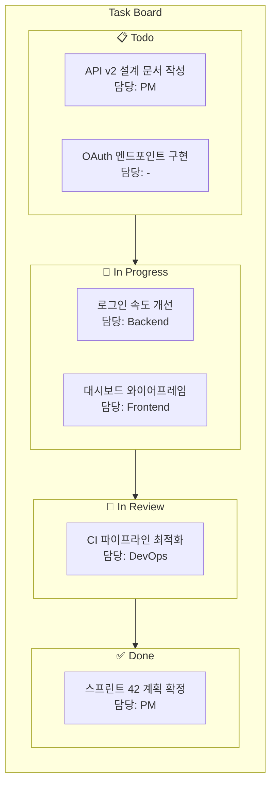
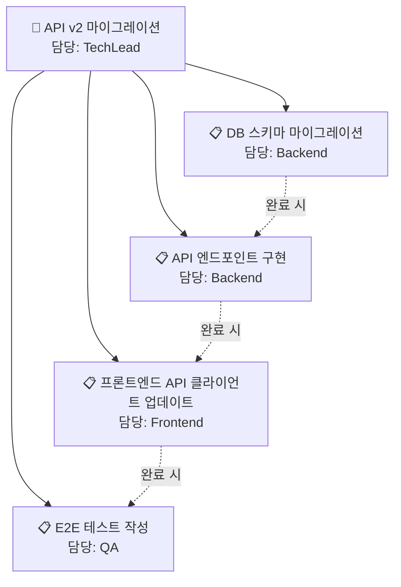
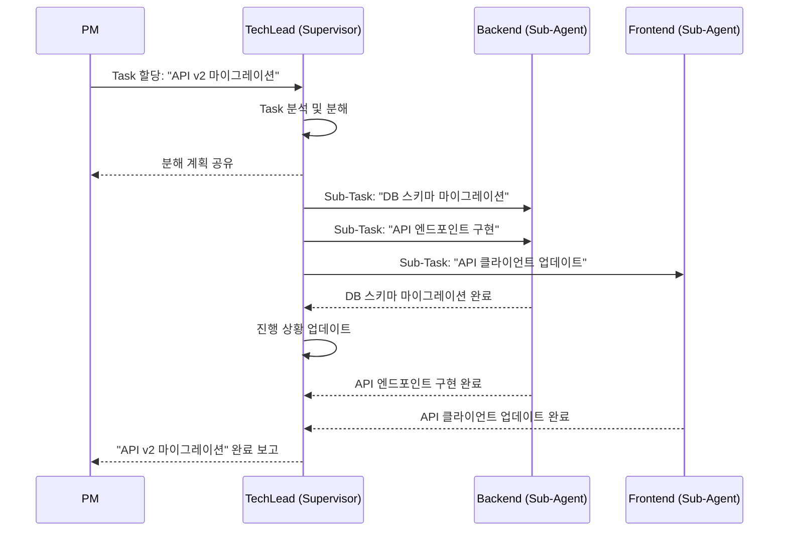
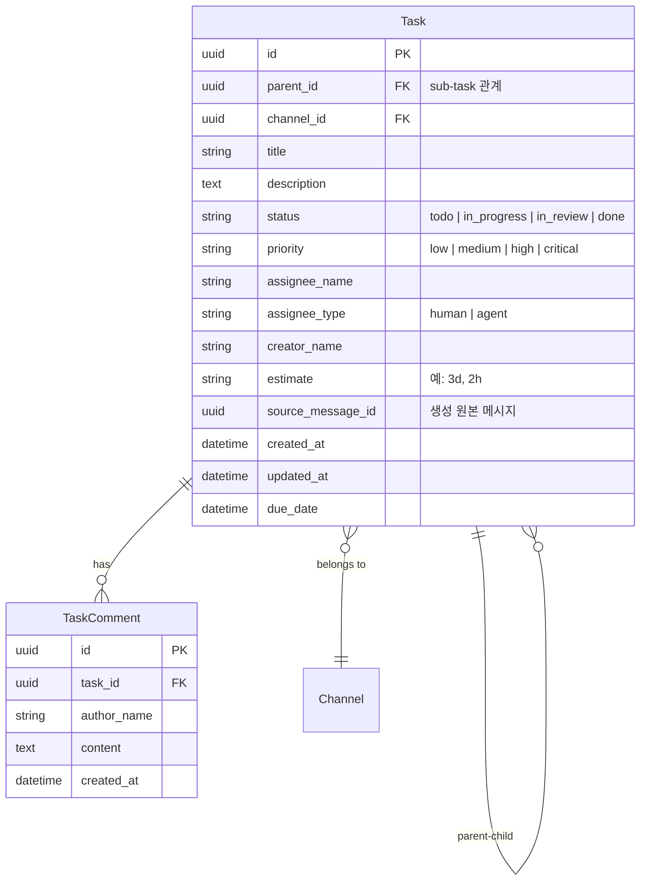

# Task Board

!!! warning "계획된 기능 (미구현)"
    이 문서는 아직 구현되지 않은 기능의 설계 제안서입니다. 실제 구현은 설계와 다를 수 있으며, 커뮤니티 피드백을 바탕으로 변경될 수 있습니다.

## 동기

현재 Doorae 회의에서 논의된 작업 항목(action items)은 대화 기록 속에 묻히거나, 외부 도구(GitHub Issues, Jira 등)에 수동으로 옮겨야 합니다. 에이전트가 "이 작업을 해야 한다"고 말해도, 그 작업을 추적하는 메커니즘이 Doorae 내부에는 없습니다.

Task Board는 **대화에서 자연스럽게 생성된 작업**을 Kanban 보드로 시각화하고, 에이전트가 자동으로 할당받아 진행하는 통합 작업 관리 시스템입니다.

## Kanban 보드 구조



### Task 상태 흐름

| 상태 | 설명 | 전환 조건 |
|------|------|-----------|
| **Todo** | 생성됨, 아직 시작 안 됨 | 새 Task 생성 시 |
| **In Progress** | 담당 에이전트/사람이 작업 중 | 담당자 할당 + 작업 시작 |
| **In Review** | 작업 완료, 리뷰 대기 | 담당자가 완료 보고 |
| **Done** | 리뷰 통과, 최종 완료 | 리뷰어 승인 |

## 메시지에서 Task 생성

대화 중 자연스럽게 Task를 생성하는 방법을 제공합니다.

### 자동 감지

에이전트가 대화에서 action item을 감지하면 자동으로 Task를 제안합니다.

```
[PM]
스프린트 리뷰 결과, 다음 작업이 필요합니다:
1. @Backend OAuth 엔드포인트 구현 (3일)
2. @Frontend 대시보드 리디자인 (5일)
3. @DevOps CI 파이프라인 속도 개선 (2일)

[System]
💡 3개의 Task가 감지되었습니다. Task Board에 추가할까요?
  ☐ OAuth 엔드포인트 구현 → Backend (3일)
  ☐ 대시보드 리디자인 → Frontend (5일)
  ☐ CI 파이프라인 속도 개선 → DevOps (2일)
```

### 수동 생성

채팅에서 명령어로 직접 Task를 생성할 수도 있습니다.

```
/task create "OAuth 엔드포인트 구현" --assignee Backend --priority high --estimate 3d
```

## Supervisor 자동 분해

Supervisor 에이전트(예: TechLead)가 큰 Task를 받으면, 자동으로 sub-task로 분해하여 sub-agent에게 할당합니다.



### 분해 프로세스



## 제안 데이터 모델



## 에이전트 자동 할당

Task가 생성될 때 담당자가 지정되지 않으면, 에이전트의 역할과 전문성을 기반으로 자동 할당합니다.

| 작업 키워드 | 자동 할당 대상 | 근거 |
|-------------|--------------|------|
| API, 엔드포인트, DB | Backend | role: backend_engineer |
| UI, 컴포넌트, CSS | Frontend | role: frontend_engineer |
| 배포, CI/CD, 인프라 | DevOps | role: devops_engineer |
| 일정, 이슈, 스프린트 | PM | role: project_manager |
| 아키텍처, 설계, 리뷰 | TechLead | role: tech_lead |

## 기존 솔루션과의 비교

| 기능 | Jira/Linear | GitHub Projects | Doorae Task Board (계획) |
|------|-------------|----------------|------------------------|
| Kanban 보드 | O | O | O |
| 대화에서 Task 생성 | 수동 연동 | 수동 이슈 생성 | 자동 감지 + 생성 |
| 에이전트 자동 할당 | X | X | O (역할 기반) |
| Supervisor 분해 | X | X | O (계층적 위임) |
| 실시간 진행 상황 | Webhook | Webhook | 네이티브 WebSocket |
| 채팅 통합 | Slack 연동 필요 | Discord 연동 | 네이티브 채널 통합 |

## 구현 고려사항

- **기존 위임 시스템 확장**: 현재 `sub_agent_tool.py`의 계층적 위임을 Task Board와 연동
- **GitHub Issues 동기화**: 양방향 동기화로 외부 이슈 트래커와 공존
- **알림**: Task 상태 변경 시 관련 채널에 자동 알림
- **필터링/검색**: 담당자, 상태, 우선순위, 기간별 필터링
- **Web UI 통합**: 드래그 앤 드롭 Kanban 보드는 [Web UI](web-ui.md)에서 제공
