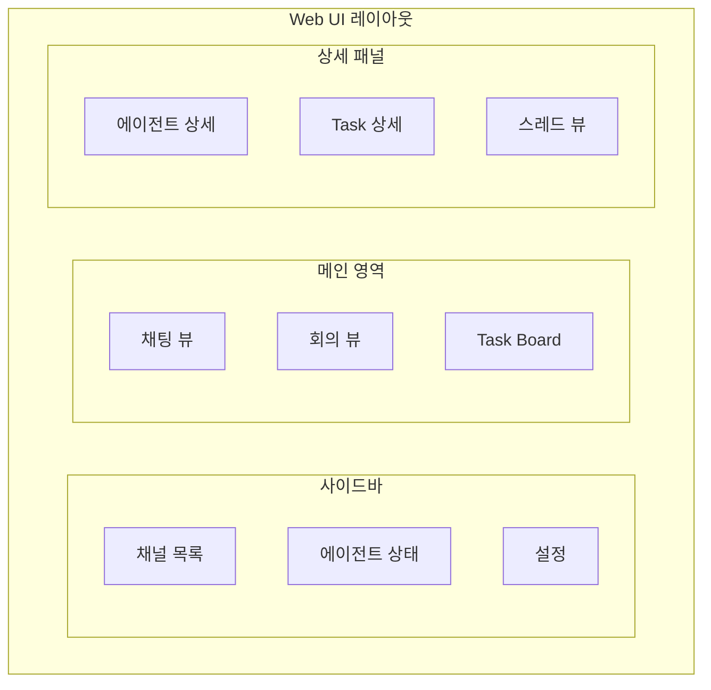
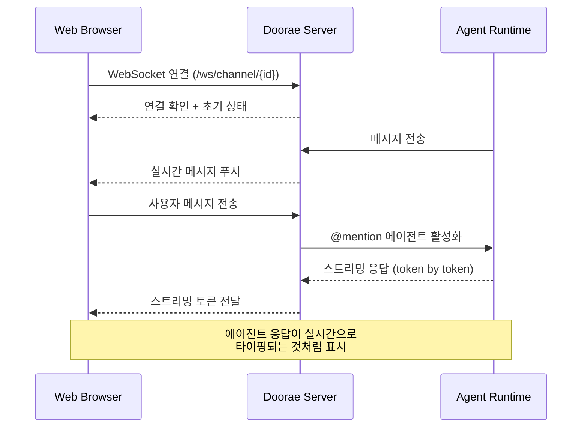

# Web UI

!!! warning "계획된 기능 (미구현)"
    이 문서는 아직 구현되지 않은 기능의 설계 제안서입니다. 실제 구현은 설계와 다를 수 있으며, 커뮤니티 피드백을 바탕으로 변경될 수 있습니다.

## 동기

현재 Doorae는 CLI와 TUI(Textual 기반)를 통해 터미널에서 동작합니다. 이 인터페이스는 개발자에게 친숙하지만, 다음과 같은 한계가 있습니다:

- **접근성**: 터미널에 익숙하지 않은 팀원은 참여하기 어려움
- **시각적 표현**: 에이전트 상태, Task 진행 상황, 대화 히스토리를 직관적으로 파악하기 어려움
- **동시 작업**: 여러 채널과 회의를 동시에 모니터링하기 어려움
- **모바일 접근**: 터미널 UI로는 모바일 환경에서 사용 불가

Web UI는 이러한 한계를 극복하고, Doorae의 모든 기능을 **직관적인 웹 인터페이스**로 제공합니다.

## 핵심 화면 구성

### 주요 뷰

| 뷰 | 설명 |
|----|------|
| **채널 목록** | 참여 중인 채널, 읽지 않은 메시지 수, 활성 회의 표시 |
| **채팅 뷰** | 메시지 타임라인, 스레드, @mention 입력, 에이전트 응답 스트리밍 |
| **회의 뷰** | 안건 진행 상황, 발언자 큐, 실시간 타이머, 회의 요약 |
| **에이전트 관리** | 에이전트 목록, 상태(active/idle/sleeping), 역할/전문성 편집 |
| **Task Board** | Kanban 보드, 드래그 앤 드롭, 에이전트 할당, 진행률 |

## 실시간 WebSocket 통합

Web UI는 기존 Doorae 서버의 WebSocket 아키텍처를 확장하여 실시간 통신을 구현합니다.

### 주요 WebSocket 이벤트

| 이벤트 | 방향 | 설명 |
|--------|------|------|
| `message.new` | Server → Client | 새 메시지 도착 |
| `message.send` | Client → Server | 사용자 메시지 전송 |
| `agent.stream_token` | Server → Client | 에이전트 응답 스트리밍 |
| `agent.status_change` | Server → Client | 에이전트 상태 변경 (idle → speaking 등) |
| `meeting.agenda_update` | Server → Client | 안건 상태 변경 |
| `task.update` | Server → Client | Task 상태 변경 |

## 기술 스택 (안)

| 계층 | 기술 | 선정 이유 |
|------|------|-----------|
| **Framework** | React 18+ | 컴포넌트 기반 UI, 풍부한 생태계 |
| **상태 관리** | Zustand | 경량, WebSocket 상태 관리에 적합 |
| **스타일링** | Tailwind CSS | 빠른 프로토타이핑, 일관된 디자인 시스템 |
| **실시간 통신** | Native WebSocket | 기존 서버 프로토콜과 호환 |
| **빌드** | Vite | 빠른 HMR, 간결한 설정 |
| **타입 안전** | TypeScript | API 타입 공유, 런타임 에러 감소 |

## 디자인 참고

기존 에이전트 채팅 UI 패턴을 참고하되, Doorae만의 차별점을 추가합니다:

| 요소 | 일반적인 단일 에이전트 UI | Doorae Web UI (계획) |
|------|---------------------------|---------------------|
| 에이전트 대화 | 단일 에이전트 채팅 | 다중 에이전트 채널 대화 |
| 작업 추적 | 에이전트 내부 Task | 공유 Task Board |
| 회의 모드 | 없음 | 채널 내 구조화된 회의 모드 |
| 위임 시각화 | 없음 | TechLead → Backend 위임 흐름 표시 |
| 에이전트 상태 | 단일 상태 | idle / speaking / tool_calling / sleeping |

## 구현 고려사항

- **점진적 구현**: 채팅 뷰 → 에이전트 관리 → 회의 뷰 → Task Board 순서로 개발
- **API 우선**: REST + WebSocket API를 먼저 정의하고, 프론트엔드는 API 위에 구축
- **기존 서버 확장**: 현재 FastAPI 서버(`doorae/server/`)의 라우트를 확장
- **반응형 디자인**: 데스크톱 우선, 태블릿/모바일 대응
- **접근성**: WCAG 2.1 AA 준수, 키보드 내비게이션, 스크린 리더 지원
