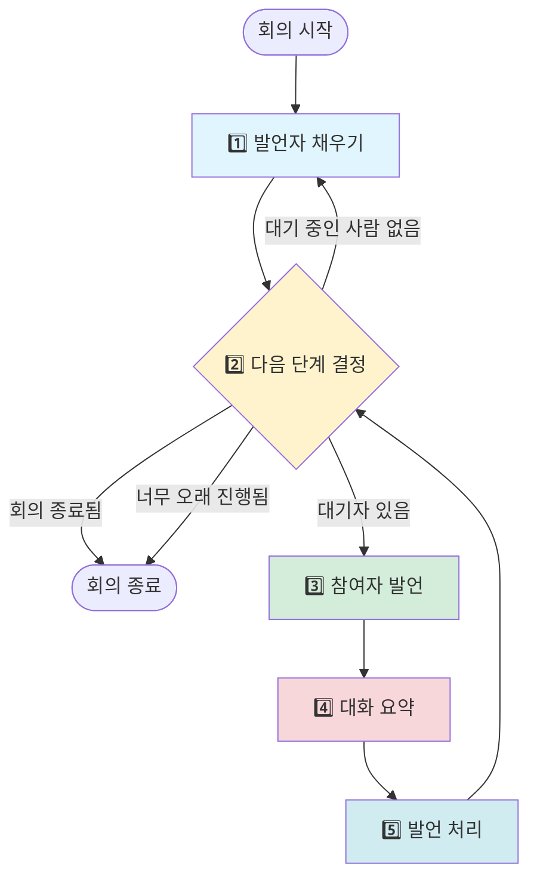

# 회의 진행 방식

> 회의가 어떻게 단계별로 진행되는지 알아봐요.

---

## 회의록 노트 (MeetingState)

회의를 진행하면서 모든 내용을 **회의록 노트**에 기록해요.

### 📝 회의록 노트에 적히는 내용

#### 안건 관련
- **안건 목록**: 오늘 논의할 주제 카드들이에요
- **현재 안건 번호**: 지금 몇 번째 안건을 논의하는지 기록해요

#### 발언 관련
- **대기 중인 발언자**: 다음에 누가 말할지 줄 서 있어요
- **발언 횟수**: 각 참여자가 몇 번 말했는지 세어요
- **메시지 목록**: 누가 뭐라고 말했는지 모두 기록해요

#### 안전장치
- **연속 위임 횟수**: Host가 계속 다른 사람에게만 시키면 회의가 끝나지 않으니까 세어요
- **전체 턴 수**: 회의가 너무 길어지면 자동으로 끝내요 (최대 1000번)
- **회의 종료 플래그**: 회의가 끝났는지 표시해요

#### 요약
- **대화 요약**: 메시지가 너무 많으면 요약해서 저장해요

> 💡 **쉽게 말하면...**
> 회의록 노트는 회의 중에 일어나는 모든 일을 기록하는 공책이에요. 누가 뭐라고 말했는지, 지금 무슨 안건을 논의하는지 다 적혀 있어요.

---

## 전체 회의 흐름

회의는 큰 순환 구조로 진행돼요. 계속 돌면서 안건을 처리해요.



> 🤔 **이해했나요?**
> Q: 회의는 어떻게 계속 돌아가나요?
> A: 5번 단계(발언 처리)가 끝나면 다시 2번 단계(다음 단계 결정)로 돌아가요. 이렇게 계속 순환하면서 안건을 처리해요.

---

## 5단계 상세 설명

### 1️⃣ 발언자 채우기

**역할**: 다음에 말할 사람을 정해요.

**어떻게 하나요?**
- 현재 안건의 필수 발언자 목록을 봐요
- 아직 말하지 않은 사람을 찾아요
- 최대 2명까지 대기 명단에 추가해요
- 모두 말했으면 Host에게 다시 기회를 줘요

**안전장치**
- Host에게만 계속 시키면 (3번 연속) 강제로 진행해요
- 무한 반복을 막아줘요

> 💡 **쉽게 말하면...**
> 안건마다 "꼭 말해야 하는 사람" 목록이 있어요. 그 사람들이 모두 말할 때까지 차례차례 발언 기회를 줘요.

---

### 2️⃣ 다음 단계 결정

**역할**: 교통 경찰처럼 다음에 무엇을 할지 결정해요.

**우선순위 순서**
1. 회의가 끝났으면 → 종료
2. 너무 오래 진행했으면 (1000번 초과) → 종료
3. 대기 중인 사람이 없으면 → 1단계로 가서 사람 채우기
4. 대기 중인 사람이 있으면 → 그 사람이 발언하기
5. 그 외 → 종료

**특징**
- AI를 사용하지 않아요 (빠르게 결정)
- 회의록 노트만 보고 판단해요

> 🤔 **이해했나요?**
> Q: 왜 AI를 사용하지 않나요?
> A: 단순히 규칙만 따르면 되니까, AI를 쓰면 시간과 비용이 낭비돼요. 회의록 노트만 보고 빠르게 결정해요.

---

### 3️⃣ 참여자 발언

**역할**: 정해진 참여자가 실제로 발언해요.

**어떻게 하나요?**
1. 참여자의 역할과 책임을 알려줘요
2. 현재 안건 내용을 보여줘요
3. 지금까지의 대화 요약을 전달해요
4. 사용할 수 있는 외부 도구 목록을 알려줘요
5. 대화용 AI (Main LLM)가 발언을 생성해요

**외부 도구 사용 (Tool-Calling)**
- 참여자가 도구를 사용하고 싶으면 요청해요
- 도구를 실행하고 결과를 받아요
- 결과를 보고 다시 발언을 만들어요
- 최대 50번까지 반복할 수 있어요

> 💡 **쉽게 말하면...**
> 참여자가 발언할 때 GitHub 같은 도구를 사용할 수 있어요. "이슈 목록 보여줘"라고 하면 실제로 GitHub에서 이슈를 가져와서 보고 발언해요.

---

### 4️⃣ 대화 요약

**역할**: 메시지가 너무 많으면 요약해요.

**언제 요약하나요?**
- 메시지가 5개를 넘으면 자동으로 요약해요
- 분석용 AI (Task LLM)가 요약을 만들어요

**왜 요약하나요?**
- 메시지가 너무 많으면 AI가 읽는 데 시간이 오래 걸려요
- 요약하면 중요한 내용만 남아서 빨라져요
- 비용도 절약돼요

**어떻게 요약하나요?**
- 최근 대화를 짧게 정리해요
- 최대 3000 단어 조각(토큰)까지만 사용해요
- 최근 3개 메시지는 그대로 유지해요

> 🤔 **이해했나요?**
> Q: 요약하면 정보가 사라지지 않나요?
> A: 중요한 내용은 요약문에 남아있고, 최근 메시지 3개는 그대로 있어서 맥락을 잃지 않아요.

---

### 5️⃣ 발언 처리

**역할**: 발언 내용을 분석하고 다음 단계를 준비해요.

**하는 일들**

#### ① 발언자 정리
- 방금 말한 사람을 대기 명단에서 제거해요
- 발언 횟수를 1 증가시켜요

#### ② 멘션 찾기
- 발언에서 다른 참여자 이름이 언급됐는지 찾아요
- 분석용 AI (Task LLM)가 찾아줘요
- 언급된 사람을 대기 명단에 추가해요

**예시**
> Host: "PM에게 상황을 물어보고 싶어요."
→ PM이 대기 명단에 추가됨

#### ③ 안건 완료 감지
- Host가 특정 키워드를 말하면 안건이 끝나요
- **키워드**: "다음 안건", "마무리", "정리하면", "결론"
- 현재 안건을 완료로 표시하고 다음 안건으로 넘어가요

#### ④ 회의 종료 감지
- Host가 회의를 끝내려는 의도를 파악해요
- **1단계**: 키워드 확인 ("회의를 마치겠습니다", "여기까지")
- **2단계**: 안건 80% 이상 완료 시 AI가 의도 분석

**왜 2단계로 하나요?**
- 키워드만으로 확실하면 AI를 안 써서 빨라요
- 애매하면 AI가 판단해서 정확도를 높여요

#### ⑤ 안건 동적 업데이트
- 매 발언마다 새로운 안건이 생겼는지 확인해요
- 최근 10개 메시지를 분석해요
- 분석용 AI (Task LLM)가 판단해요

**업데이트 규칙**
- 구체적인 논의 주제만 안건으로 등록해요
- 기존 안건은 절대 삭제 안 해요 (수정만 가능)
- 담당자는 명시적으로 언급된 경우만 기록해요

> 💡 **쉽게 말하면...**
> 발언이 끝나면 여러 가지를 확인해요: ① 누가 말했는지, ② 다른 사람을 언급했는지, ③ 안건이 끝났는지, ④ 회의를 종료할지, ⑤ 새 안건이 생겼는지

---

## 안건 관리

안건은 회의에서 논의할 주제 카드예요.

### 📝 안건이란?

**비유**: 회의 주제 카드

**포함되는 내용**
- **제목**: 무엇을 논의할지 (예: "프로젝트 현황 공유")
- **설명**: 자세한 내용
- **필수 발언자**: 이 안건에서 꼭 말해야 하는 사람들
- **상태**: 대기 중, 진행 중, 완료, 보류
- **담당자**: 안건을 책임지는 사람
- **결정사항**: 회의에서 결정된 내용

### 정적 안건 (미리 준비)

- 설정 파일(agendas.yaml)에 미리 적어둬요
- 회의 시작할 때 읽어와요

**예시**
```
제목: 프로젝트 현황 공유
설명: 현재 진행 상황 및 이슈 사항 공유
필수 발언자: PM, TechLead
```

### 동적 안건 (회의 중 생성)

- 회의하다가 새로운 주제가 나오면 자동으로 추가돼요
- 매 발언마다 AI가 확인해요

**예시**
> TechLead: "데이터베이스 성능 문제가 심각해요. 이것도 논의해야 할 것 같아요."
→ "데이터베이스 성능 개선" 안건이 자동으로 추가됨

> 🤔 **이해했나요?**
> Q: 동적 안건은 누가 만드나요?
> A: 분석용 AI (Task LLM)가 최근 대화를 보고 새로운 주제가 나왔는지 판단해서 자동으로 만들어요.

---

## 안전장치 3가지

회의가 무한 반복되거나 문제가 생기지 않도록 안전장치가 있어요.

### ⚠️ 1. 최대 턴 수 제한

- **제한**: 최대 1000번까지만 발언 가능해요
- **이유**: 회의가 끝나지 않고 계속 돌면 문제가 생겨요
- **동작**: 1000번 넘으면 자동으로 회의 종료

### ⚠️ 2. 연속 Host 위임 제한

- **제한**: Host에게만 3번 연속 시키면 강제 진행
- **이유**: Host만 계속 말하면 다른 사람이 말할 기회가 없어요
- **동작**: 3번째부터는 강제로 다른 사람에게 기회를 줘요

### ⚠️ 3. 도구 사용 반복 제한

- **제한**: 최대 50번까지만 도구 사용 가능
- **이유**: 도구를 계속 쓰면 끝나지 않을 수 있어요
- **동작**: 50번 넘으면 발언 생성 중단

> 💡 **쉽게 말하면...**
> 안전장치는 회의가 이상하게 진행되거나 끝나지 않는 것을 막아줘요. 숫자 제한을 두어서 자동으로 멈추게 해요.

---

## 회의 진행 예시

실제 회의가 어떻게 진행되는지 예시를 봐요.

### 시작

1. **발언자 채우기**: Host를 대기 명단에 추가
2. **다음 단계 결정**: Host가 있으니 발언 시작
3. **Host 발언**: "안녕하세요, 오늘 회의를 시작하겠습니다. 첫 번째 안건은..."

### 진행

4. **대화 요약**: (메시지가 5개 미만이라 아직 안 함)
5. **발언 처리**:
   - Host를 대기 명단에서 제거
   - "PM"이 언급되어 PM을 대기 명단에 추가
6. **다음 단계 결정**: PM이 있으니 발언 시작
7. **PM 발언**: "현재 프로젝트는 80% 진행되었습니다..."

### 반복

- 3번 → 4번 → 5번 → 2번 → 3번... 계속 반복
- 안건이 끝나면 다음 안건으로 넘어감
- Host가 "회의를 마치겠습니다"라고 하면 종료

---

> 💡 **핵심 정리**
>
> - 회의는 5단계를 계속 반복하면서 진행돼요
> - 회의록 노트에 모든 내용을 기록해요
> - 안건은 미리 준비하거나 회의 중에 생성돼요
> - 3가지 안전장치가 문제를 막아줘요
> - 대화가 많아지면 자동으로 요약돼요

---

## 다음 문서

- [llm-architecture.md](./llm-architecture.md): 2개의 AI 두뇌가 어떻게 협력하는지 알아봐요
- [mcp-integration.md](./mcp-integration.md): 외부 도구를 어떻게 사용하는지 배워요
